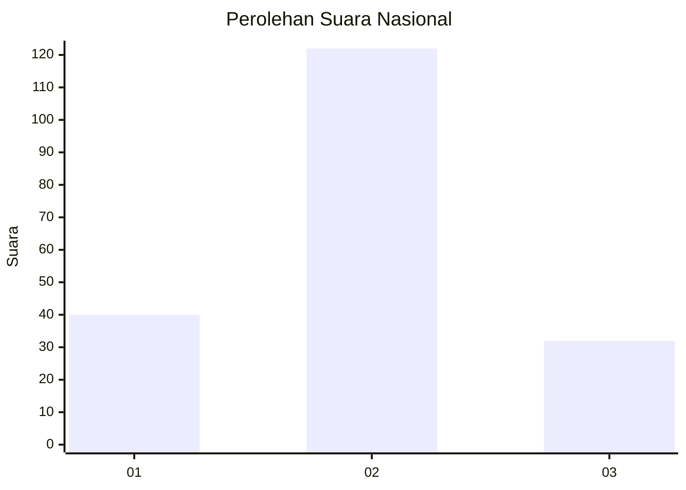

# Hasil

## Grafik

## Tabel

| No. | Nama Paslon    | Suara | Suara (raw) | Persentase |
|:--- |:-------------- | -----:| -----------:| ----------:|
| 1   | ANIES MUHAIMIN | 40    | [40][p-1]   | 20,62      |
| 2   | PRABOWO GIBRAN | 122   | [122][p-2]  | 62,89      |
| 3   | GANJAR MAHFUD  | 32    | [32][p-3]   | 16,49      |

[p-1]: https://github.com/gigit-pemilu/pemilu-2024/blob/main/pilpres/hitung-suara/sub/34-di-yogyakarta/sub/02-bantul/sub/04-pundong/sub/2001-seloharjo/sub/011-tps/sub/paslon-1.txt
[p-2]: https://github.com/gigit-pemilu/pemilu-2024/blob/main/pilpres/hitung-suara/sub/34-di-yogyakarta/sub/02-bantul/sub/04-pundong/sub/2001-seloharjo/sub/011-tps/sub/paslon-2.txt
[p-3]: https://github.com/gigit-pemilu/pemilu-2024/blob/main/pilpres/hitung-suara/sub/34-di-yogyakarta/sub/02-bantul/sub/04-pundong/sub/2001-seloharjo/sub/011-tps/sub/paslon-3.txt

## Foto C Plano

https://sirekap-obj-formc.kpu.go.id/10ca/pemilu/ppwp/34/02/04/20/01/3402042001011-20240214-210854--f780414d-f1e2-47f2-b441-9a7c30784060.jpg

https://sirekap-obj-formc.kpu.go.id/10ca/pemilu/ppwp/34/02/04/20/01/3402042001011-20240214-214117--bc5450c3-1730-45d8-811d-4a7ecbdffba1.jpg

https://sirekap-obj-formc.kpu.go.id/10ca/pemilu/ppwp/34/02/04/20/01/3402042001011-20240214-214429--72bdf3fc-2ccd-4ab6-95f8-c2c23ceb420a.jpg

## Metadata

| Key        | Value               |
| ---------- | ------------------- |
| Time Stamp | 2024-02-22 16:00:00 |

