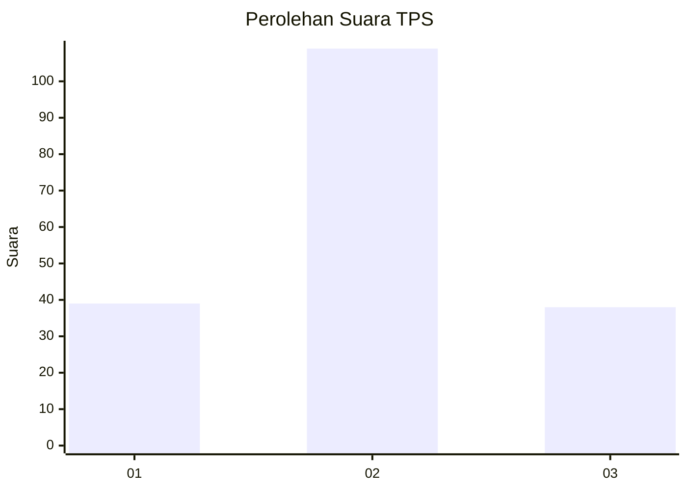
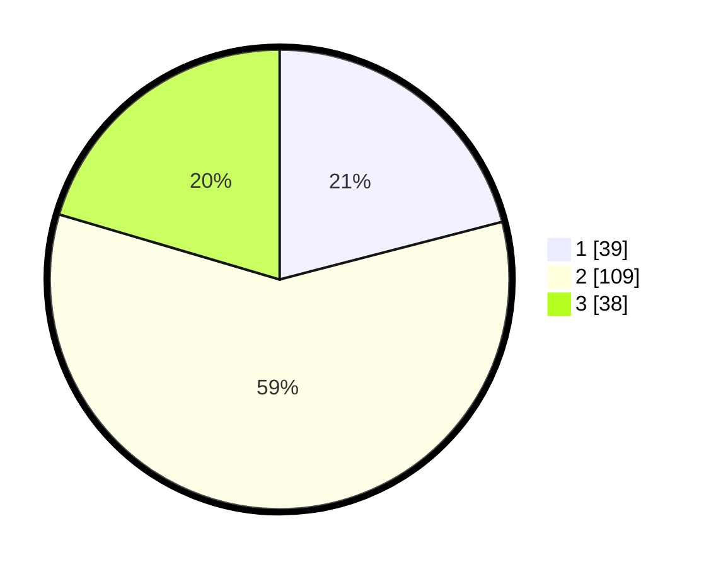

# Hasil

## Grafik

## Tabel

| No. | Nama Paslon    | Suara | Suara (raw) | Persentase |
|:--- |:-------------- | -----:| -----------:| ----------:|
| 1   | ANIES MUHAIMIN | 39    | [39][p-1]   | 20,97      |
| 2   | PRABOWO GIBRAN | 109   | [109][p-2]  | 58,60      |
| 3   | GANJAR MAHFUD  | 38    | [38][p-3]   | 20,43      |

[p-1]: https://github.com/gigit-pemilu/pemilu-2024-34-di-yogyakarta/blob/main/pilpres/hitung-suara/sub/34-di-yogyakarta/sub/02-bantul/sub/04-pundong/sub/2001-seloharjo/sub/013-tps/sub/paslon-1.txt
[p-2]: https://github.com/gigit-pemilu/pemilu-2024-34-di-yogyakarta/blob/main/pilpres/hitung-suara/sub/34-di-yogyakarta/sub/02-bantul/sub/04-pundong/sub/2001-seloharjo/sub/013-tps/sub/paslon-2.txt
[p-3]: https://github.com/gigit-pemilu/pemilu-2024-34-di-yogyakarta/blob/main/pilpres/hitung-suara/sub/34-di-yogyakarta/sub/02-bantul/sub/04-pundong/sub/2001-seloharjo/sub/013-tps/sub/paslon-3.txt

## Foto C Plano

https://sirekap-obj-formc.kpu.go.id/f912/pemilu/ppwp/34/02/04/20/01/3402042001013-20240216-005118--4af1ff29-dfdc-419f-b81d-5723d5c2725b.jpg

https://sirekap-obj-formc.kpu.go.id/f912/pemilu/ppwp/34/02/04/20/01/3402042001013-20240216-004817--c0c781f6-50c6-4b80-9d1e-94341dfb7d6e.jpg

https://sirekap-obj-formc.kpu.go.id/f912/pemilu/ppwp/34/02/04/20/01/3402042001013-20240216-004815--84fab5f3-c12b-48bd-9e83-e03f342f5340.jpg

## Metadata

| Key        | Value               |
| ---------- | ------------------- |
| Time Stamp | 2024-02-16 13:00:29 |

## DATA PEMILIH TETAP

Jumlah pemilih dalam DPT: **208**.
 * L: **112**.
 * P: **96**.

## DATA PENGGUNA HAK PILIH

Jumlah pengguna hak pilih dalam DPT: **192**.
 * L: **105**.
 * P: **87**.

Jumlah pengguna hak pilih dalam DPTb: **1**.
 * L: **1**.
 * P: **0**.

Jumlah pengguna hak pilih dalam DPK: **3**.
 * L: **1**.
 * P: **2**.

Jumlah pengguna hak pilih: **196**.
 * L: **107**.
 * P: **89**.

## JUMLAH SUARA SAH DAN TIDAK SAH

JUMLAH SELURUH SUARA SAH: **186**.

JUMLAH SUARA TIDAK SAH: **10**.

JUMLAH SELURUH SUARA SAH DAN SUARA TIDAK SAH: **196**.

