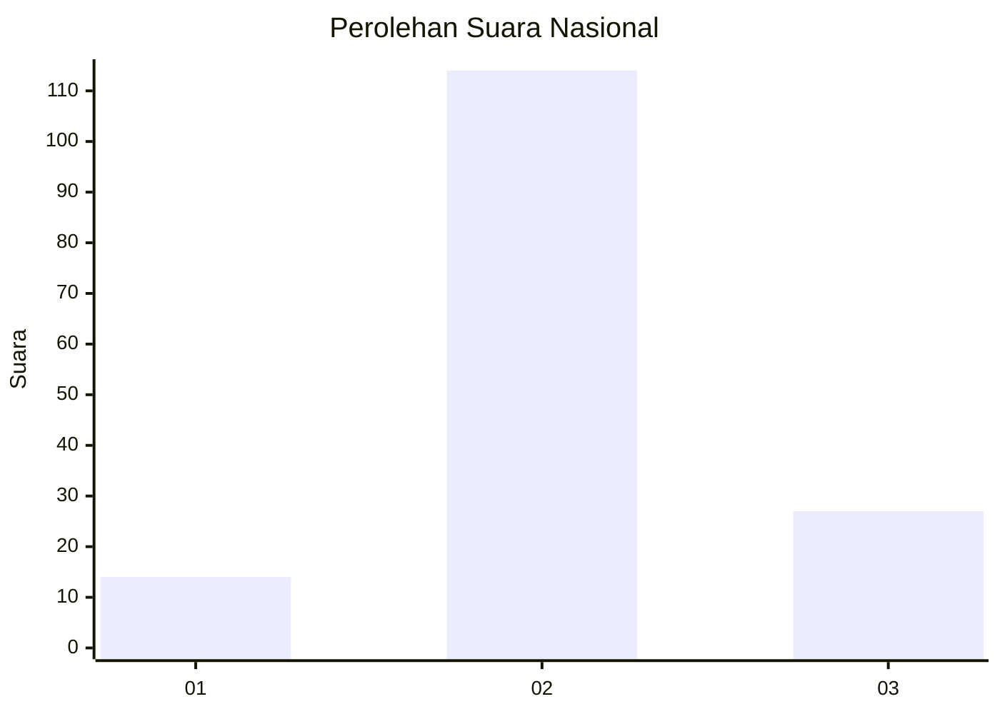
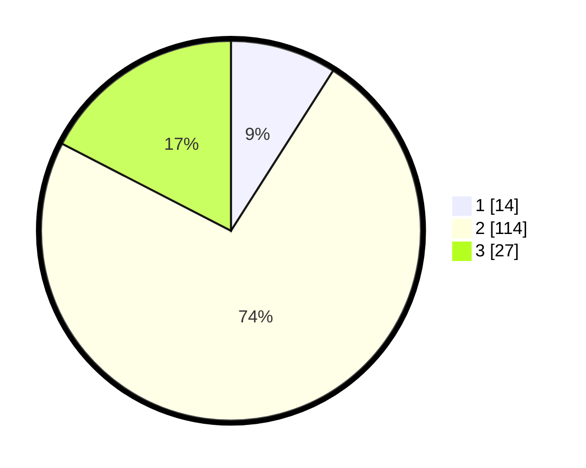

# Hasil

## Grafik

## Tabel

| No. | Nama Paslon    | Suara | Suara (raw) | Persentase |
|:--- |:-------------- | -----:| -----------:| ----------:|
| 1   | ANIES MUHAIMIN | 14    | [14][p-1]   | 9,03       |
| 2   | PRABOWO GIBRAN | 114   | [114][p-2]  | 73,55      |
| 3   | GANJAR MAHFUD  | 27    | [27][p-3]   | 17,42      |

[p-1]: https://github.com/gigit-pemilu/pemilu-2024/blob/main/pilpres/hitung-suara/sub/34-di-yogyakarta/sub/02-bantul/sub/04-pundong/sub/2001-seloharjo/sub/017-tps/sub/paslon-1.txt
[p-2]: https://github.com/gigit-pemilu/pemilu-2024/blob/main/pilpres/hitung-suara/sub/34-di-yogyakarta/sub/02-bantul/sub/04-pundong/sub/2001-seloharjo/sub/017-tps/sub/paslon-2.txt
[p-3]: https://github.com/gigit-pemilu/pemilu-2024/blob/main/pilpres/hitung-suara/sub/34-di-yogyakarta/sub/02-bantul/sub/04-pundong/sub/2001-seloharjo/sub/017-tps/sub/paslon-3.txt

## Foto C Plano

https://sirekap-obj-formc.kpu.go.id/de17/pemilu/ppwp/34/02/04/20/01/3402042001017-20240216-044645--f65324c2-d280-4d8b-af05-532e5f6f0bd8.jpg

https://sirekap-obj-formc.kpu.go.id/de17/pemilu/ppwp/34/02/04/20/01/3402042001017-20240216-044647--295cf32c-bdfd-46aa-a11c-2a906a9969fb.jpg

https://sirekap-obj-formc.kpu.go.id/de17/pemilu/ppwp/34/02/04/20/01/3402042001017-20240216-044646--a39da6db-9bc0-4703-81d0-d90724b8604d.jpg

## Metadata

| Key        | Value               |
| ---------- | ------------------- |
| Time Stamp | 2024-02-16 13:00:29 |

## DATA PEMILIH TETAP

Jumlah pemilih dalam DPT: **172**.
 * L: **86**.
 * P: **86**.

## DATA PENGGUNA HAK PILIH

Jumlah pengguna hak pilih dalam DPT: **155**.
 * L: **76**.
 * P: **79**.

Jumlah pengguna hak pilih dalam DPTb: **0**.
 * L: **0**.
 * P: **0**.

Jumlah pengguna hak pilih dalam DPK: **0**.
 * L: **0**.
 * P: **0**.

Jumlah pengguna hak pilih: **155**.
 * L: **76**.
 * P: **79**.

## JUMLAH SUARA SAH DAN TIDAK SAH

JUMLAH SELURUH SUARA SAH: **155**.

JUMLAH SUARA TIDAK SAH: **0**.

JUMLAH SELURUH SUARA SAH DAN SUARA TIDAK SAH: **155**.

