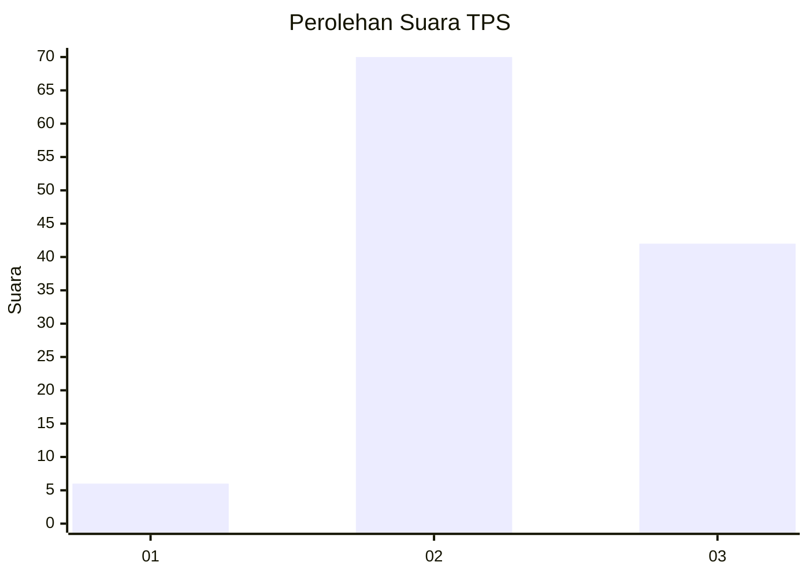
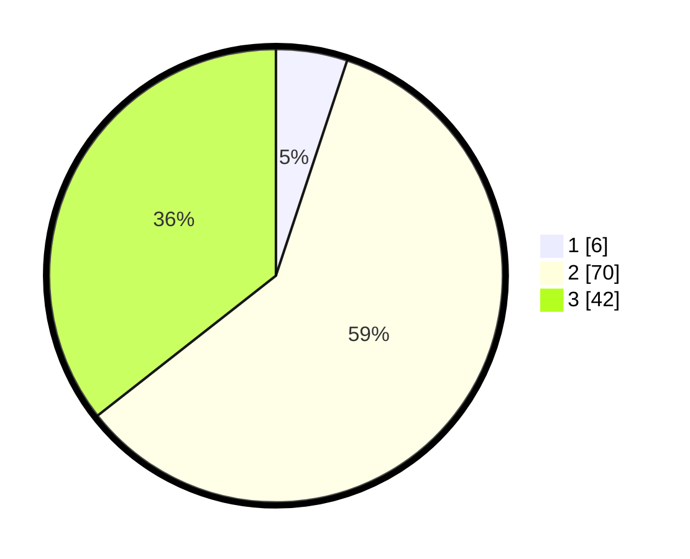

# Hasil

## Grafik

## Tabel

| No. | Nama Paslon    | Suara | Suara (raw) | Persentase |
|:--- |:-------------- | -----:| -----------:| ----------:|
| 1   | ANIES MUHAIMIN | 6     | [6][p-1]    | 5,08       |
| 2   | PRABOWO GIBRAN | 70    | [70][p-2]   | 59,32      |
| 3   | GANJAR MAHFUD  | 42    | [42][p-3]   | 35,59      |

[p-1]: https://github.com/gigit-pemilu/pemilu-2024-34-di-yogyakarta/blob/main/pilpres/hitung-suara/sub/34-di-yogyakarta/sub/02-bantul/sub/04-pundong/sub/2001-seloharjo/sub/018-tps/sub/paslon-1.txt
[p-2]: https://github.com/gigit-pemilu/pemilu-2024-34-di-yogyakarta/blob/main/pilpres/hitung-suara/sub/34-di-yogyakarta/sub/02-bantul/sub/04-pundong/sub/2001-seloharjo/sub/018-tps/sub/paslon-2.txt
[p-3]: https://github.com/gigit-pemilu/pemilu-2024-34-di-yogyakarta/blob/main/pilpres/hitung-suara/sub/34-di-yogyakarta/sub/02-bantul/sub/04-pundong/sub/2001-seloharjo/sub/018-tps/sub/paslon-3.txt

## Foto C Plano

https://sirekap-obj-formc.kpu.go.id/7790/pemilu/ppwp/34/02/04/20/01/3402042001018-20240216-072406--381de6c0-4472-4b8d-a2a2-220707be6073.jpg

https://sirekap-obj-formc.kpu.go.id/7790/pemilu/ppwp/34/02/04/20/01/3402042001018-20240216-072407--b965197a-f4e7-4f01-b0e4-3e48376867c2.jpg

https://sirekap-obj-formc.kpu.go.id/7790/pemilu/ppwp/34/02/04/20/01/3402042001018-20240216-072406--f92fed35-9535-45bf-82e1-f7cb0b6c9e37.jpg

## Metadata

| Key        | Value               |
| ---------- | ------------------- |
| Time Stamp | 2024-02-16 13:00:29 |

## DATA PEMILIH TETAP

Jumlah pemilih dalam DPT: **123**.
 * L: **62**.
 * P: **61**.

## DATA PENGGUNA HAK PILIH

Jumlah pengguna hak pilih dalam DPT: **116**.
 * L: **59**.
 * P: **57**.

Jumlah pengguna hak pilih dalam DPTb: **1**.
 * L: **1**.
 * P: **0**.

Jumlah pengguna hak pilih dalam DPK: **1**.
 * L: **1**.
 * P: **0**.

Jumlah pengguna hak pilih: **118**.
 * L: **61**.
 * P: **0**.

## JUMLAH SUARA SAH DAN TIDAK SAH

JUMLAH SELURUH SUARA SAH: **118**.

JUMLAH SUARA TIDAK SAH: **0**.

JUMLAH SELURUH SUARA SAH DAN SUARA TIDAK SAH: **118**.

