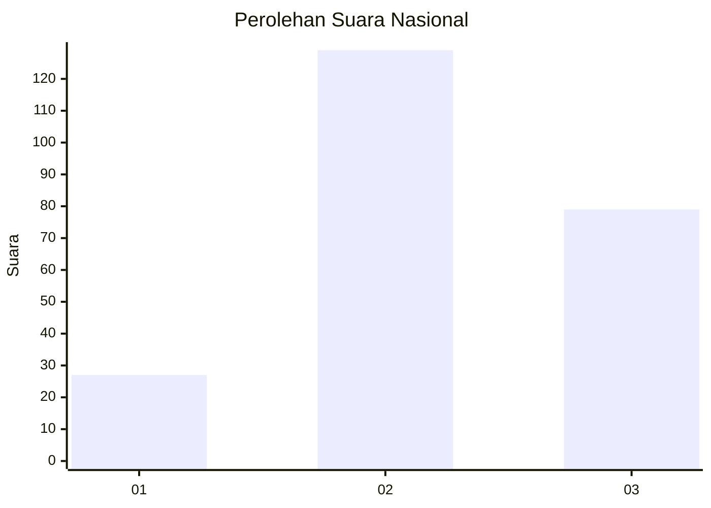
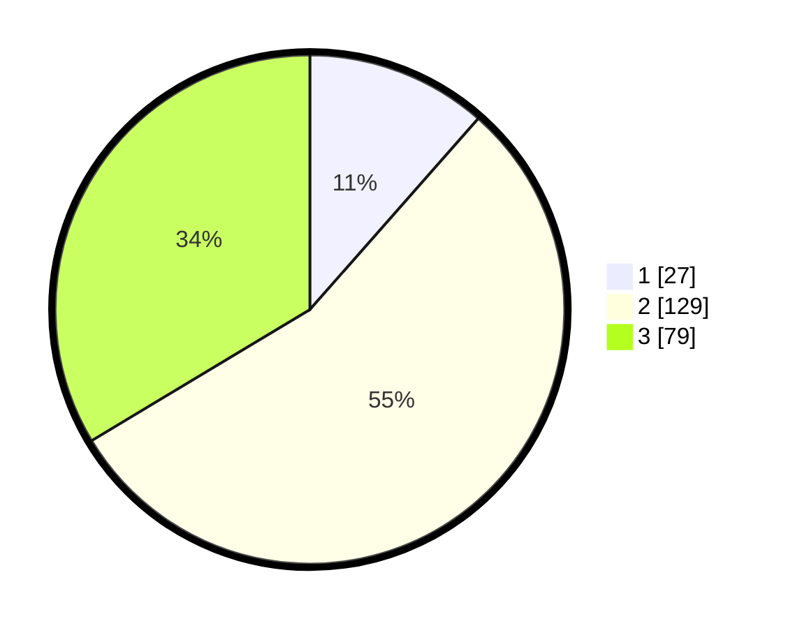

# Hasil

## Grafik

## Tabel

| No. | Nama Paslon    | Suara | Suara (raw) | Persentase |
|:--- |:-------------- | -----:| -----------:| ----------:|
| 1   | ANIES MUHAIMIN | 27    | [27][p-1]   | 11,49      |
| 2   | PRABOWO GIBRAN | 129   | [129][p-2]  | 54,89      |
| 3   | GANJAR MAHFUD  | 79    | [79][p-3]   | 33,62      |

[p-1]: https://github.com/gigit-pemilu/pemilu-2024/blob/main/pilpres/hitung-suara/sub/34-di-yogyakarta/sub/02-bantul/sub/04-pundong/sub/2001-seloharjo/sub/023-tps/sub/paslon-1.txt
[p-2]: https://github.com/gigit-pemilu/pemilu-2024/blob/main/pilpres/hitung-suara/sub/34-di-yogyakarta/sub/02-bantul/sub/04-pundong/sub/2001-seloharjo/sub/023-tps/sub/paslon-2.txt
[p-3]: https://github.com/gigit-pemilu/pemilu-2024/blob/main/pilpres/hitung-suara/sub/34-di-yogyakarta/sub/02-bantul/sub/04-pundong/sub/2001-seloharjo/sub/023-tps/sub/paslon-3.txt

## Foto C Plano

https://sirekap-obj-formc.kpu.go.id/be43/pemilu/ppwp/34/02/04/20/01/3402042001023-20240216-141654--277480ee-0f38-436a-8e32-6deffcd7388e.jpg

https://sirekap-obj-formc.kpu.go.id/be43/pemilu/ppwp/34/02/04/20/01/3402042001023-20240215-002537--0e927866-cc57-45e5-ad3f-a0877aab61a5.jpg

https://sirekap-obj-formc.kpu.go.id/be43/pemilu/ppwp/34/02/04/20/01/3402042001023-20240215-002622--4951d266-154e-4991-86ca-5303aca51aeb.jpg

## Metadata

| Key        | Value               |
| ---------- | ------------------- |
| Time Stamp | 2024-02-16 14:30:33 |

