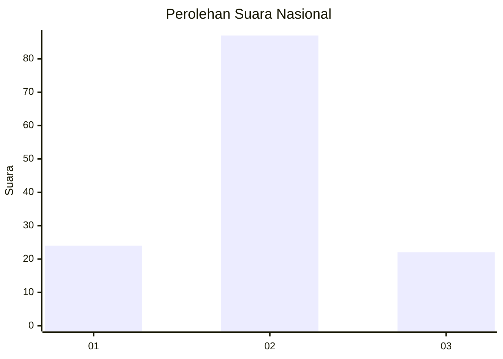
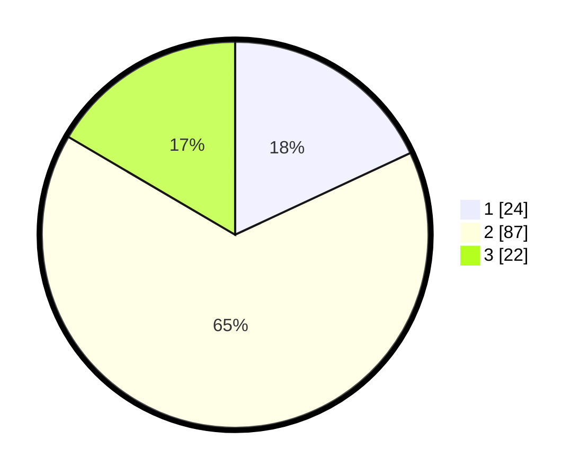

# Hasil

## Grafik

## Tabel

| No. | Nama Paslon    | Suara | Suara (raw) | Persentase |
|:--- |:-------------- | -----:| -----------:| ----------:|
| 1   | ANIES MUHAIMIN | 24    | [24][p-1]   | 18,05      |
| 2   | PRABOWO GIBRAN | 87    | [87][p-2]   | 65,41      |
| 3   | GANJAR MAHFUD  | 22    | [22][p-3]   | 16,54      |

[p-1]: https://github.com/gigit-pemilu/pemilu-2024/blob/main/pilpres/hitung-suara/sub/34-di-yogyakarta/sub/02-bantul/sub/04-pundong/sub/2002-panjangrejo/sub/005-tps/sub/paslon-1.txt
[p-2]: https://github.com/gigit-pemilu/pemilu-2024/blob/main/pilpres/hitung-suara/sub/34-di-yogyakarta/sub/02-bantul/sub/04-pundong/sub/2002-panjangrejo/sub/005-tps/sub/paslon-2.txt
[p-3]: https://github.com/gigit-pemilu/pemilu-2024/blob/main/pilpres/hitung-suara/sub/34-di-yogyakarta/sub/02-bantul/sub/04-pundong/sub/2002-panjangrejo/sub/005-tps/sub/paslon-3.txt

## Foto C Plano

https://sirekap-obj-formc.kpu.go.id/4810/pemilu/ppwp/34/02/04/20/02/3402042002005-20240214-234052--3e1a9929-866f-4b33-8c73-dc8c2a0da488.jpg

https://sirekap-obj-formc.kpu.go.id/4810/pemilu/ppwp/34/02/04/20/02/3402042002005-20240214-234134--4b4c9ff2-15f9-4dd0-a6b9-da5d79aa3790.jpg

https://sirekap-obj-formc.kpu.go.id/4810/pemilu/ppwp/34/02/04/20/02/3402042002005-20240215-004734--cb8fd2d6-fcc2-4411-a520-b321a11057ae.jpg

## Metadata

| Key        | Value               |
| ---------- | ------------------- |
| Time Stamp | 2024-02-24 22:31:28 |

