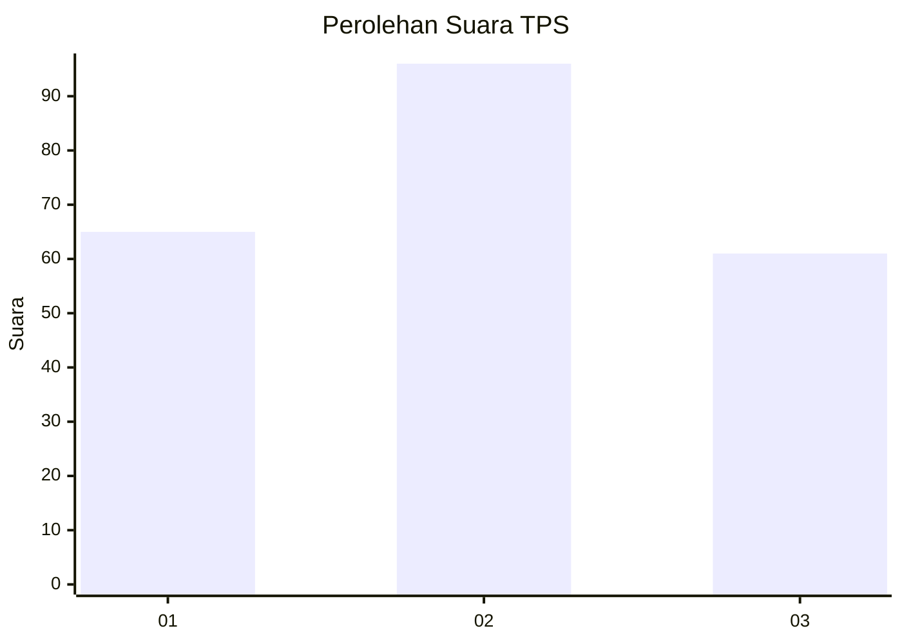
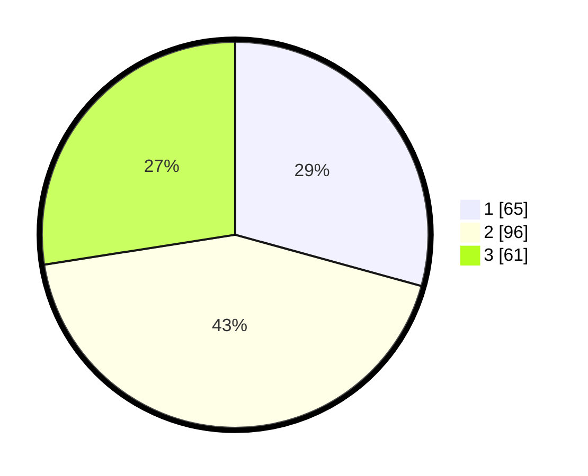

# Hasil

## Grafik

## Tabel

| No. | Nama Paslon    | Suara | Suara (raw) | Persentase |
|:--- |:-------------- | -----:| -----------:| ----------:|
| 1   | ANIES MUHAIMIN | 65    | [65][p-1]   | 29,28      |
| 2   | PRABOWO GIBRAN | 96    | [96][p-2]   | 43,24      |
| 3   | GANJAR MAHFUD  | 61    | [61][p-3]   | 27,48      |

[p-1]: https://github.com/gigit-pemilu/pemilu-2024-34-di-yogyakarta/blob/main/pilpres/hitung-suara/sub/34-di-yogyakarta/sub/02-bantul/sub/04-pundong/sub/2002-panjangrejo/sub/006-tps/sub/paslon-1.txt
[p-2]: https://github.com/gigit-pemilu/pemilu-2024-34-di-yogyakarta/blob/main/pilpres/hitung-suara/sub/34-di-yogyakarta/sub/02-bantul/sub/04-pundong/sub/2002-panjangrejo/sub/006-tps/sub/paslon-2.txt
[p-3]: https://github.com/gigit-pemilu/pemilu-2024-34-di-yogyakarta/blob/main/pilpres/hitung-suara/sub/34-di-yogyakarta/sub/02-bantul/sub/04-pundong/sub/2002-panjangrejo/sub/006-tps/sub/paslon-3.txt

## Foto C Plano

https://sirekap-obj-formc.kpu.go.id/642d/pemilu/ppwp/34/02/04/20/02/3402042002006-20240214-230720--f3e2d8fe-e446-467f-bcac-30671736a4f9.jpg

https://sirekap-obj-formc.kpu.go.id/642d/pemilu/ppwp/34/02/04/20/02/3402042002006-20240219-114641--1d76a0d4-3afc-4477-a46a-321a7fc466ac.jpg

https://sirekap-obj-formc.kpu.go.id/642d/pemilu/ppwp/34/02/04/20/02/3402042002006-20240219-114553--8a98611b-bcc8-4c5a-82d4-a4d8d969bc04.jpg

## Metadata

| Key        | Value               |
| ---------- | ------------------- |
| Time Stamp | 2024-02-24 22:31:28 |

