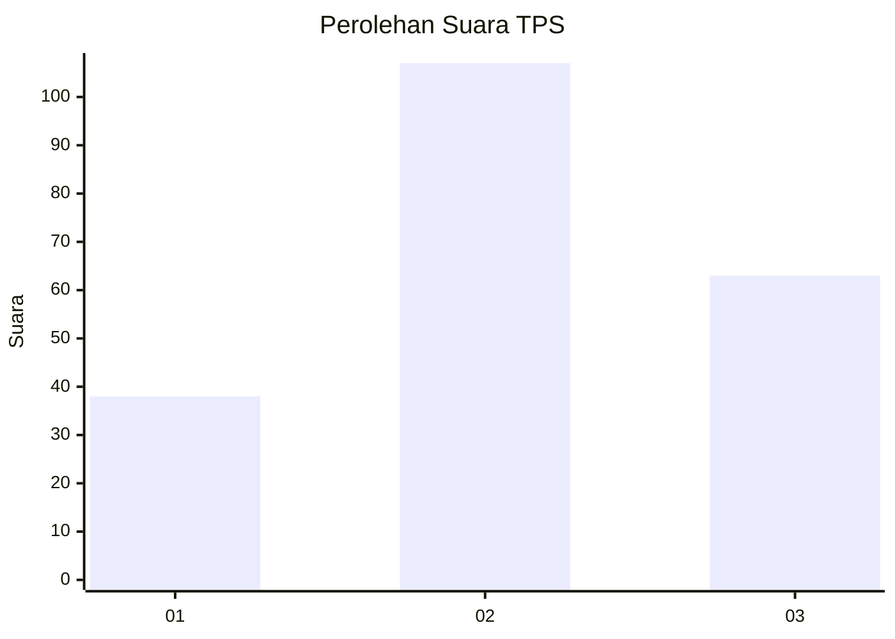
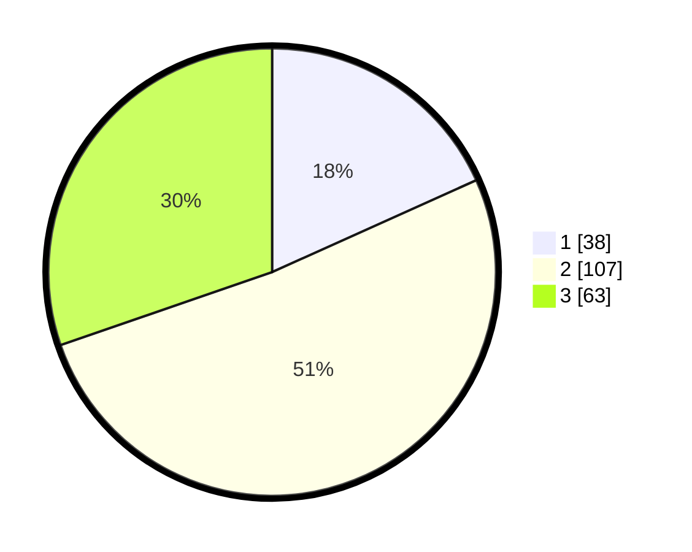

# Hasil

## Grafik

## Tabel

| No. | Nama Paslon    | Suara | Suara (raw) | Persentase |
|:--- |:-------------- | -----:| -----------:| ----------:|
| 1   | ANIES MUHAIMIN | 38    | [38][p-1]   | 18,27      |
| 2   | PRABOWO GIBRAN | 107   | [107][p-2]  | 51,44      |
| 3   | GANJAR MAHFUD  | 63    | [63][p-3]   | 30,29      |

[p-1]: https://github.com/gigit-pemilu/pemilu-2024-34-di-yogyakarta/blob/main/pilpres/hitung-suara/sub/34-di-yogyakarta/sub/02-bantul/sub/04-pundong/sub/2002-panjangrejo/sub/011-tps/sub/paslon-1.txt
[p-2]: https://github.com/gigit-pemilu/pemilu-2024-34-di-yogyakarta/blob/main/pilpres/hitung-suara/sub/34-di-yogyakarta/sub/02-bantul/sub/04-pundong/sub/2002-panjangrejo/sub/011-tps/sub/paslon-2.txt
[p-3]: https://github.com/gigit-pemilu/pemilu-2024-34-di-yogyakarta/blob/main/pilpres/hitung-suara/sub/34-di-yogyakarta/sub/02-bantul/sub/04-pundong/sub/2002-panjangrejo/sub/011-tps/sub/paslon-3.txt

## Foto C Plano

https://sirekap-obj-formc.kpu.go.id/6286/pemilu/ppwp/34/02/04/20/02/3402042002011-20240217-154642--3beda5ba-2abd-4ff8-bfd3-aeb4bd82c4c2.jpg

https://sirekap-obj-formc.kpu.go.id/6286/pemilu/ppwp/34/02/04/20/02/3402042002011-20240217-155734--228f97f4-e4c8-426f-a65d-a766cf99bf4e.jpg

https://sirekap-obj-formc.kpu.go.id/6286/pemilu/ppwp/34/02/04/20/02/3402042002011-20240217-160504--7d4791b7-f373-42f4-80c7-d46aed8f7f88.jpg

## Metadata

| Key        | Value               |
| ---------- | ------------------- |
| Time Stamp | 2024-02-20 15:00:00 |

