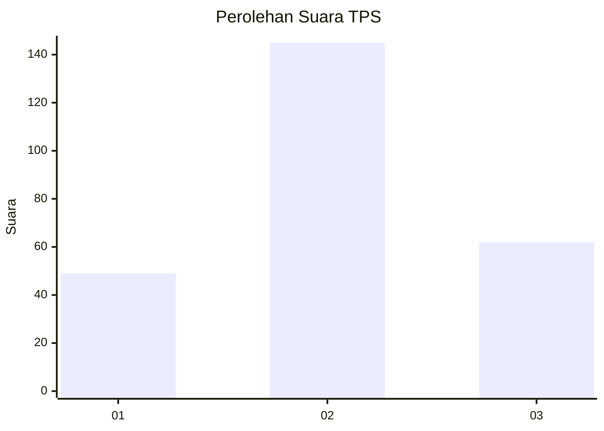
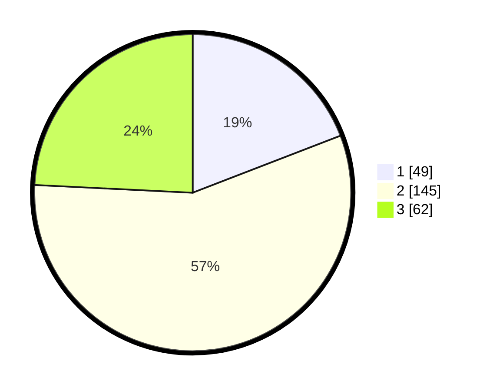

# Hasil

## Grafik

## Tabel

| No. | Nama Paslon    | Suara | Suara (raw) | Persentase |
|:--- |:-------------- | -----:| -----------:| ----------:|
| 1   | ANIES MUHAIMIN | 49    | [49][p-1]   | 19,14      |
| 2   | PRABOWO GIBRAN | 145   | [145][p-2]  | 56,64      |
| 3   | GANJAR MAHFUD  | 62    | [62][p-3]   | 24,22      |

[p-1]: https://github.com/gigit-pemilu/pemilu-2024-34-di-yogyakarta/blob/main/pilpres/hitung-suara/sub/34-di-yogyakarta/sub/02-bantul/sub/04-pundong/sub/2002-panjangrejo/sub/015-tps/sub/paslon-1.txt
[p-2]: https://github.com/gigit-pemilu/pemilu-2024-34-di-yogyakarta/blob/main/pilpres/hitung-suara/sub/34-di-yogyakarta/sub/02-bantul/sub/04-pundong/sub/2002-panjangrejo/sub/015-tps/sub/paslon-2.txt
[p-3]: https://github.com/gigit-pemilu/pemilu-2024-34-di-yogyakarta/blob/main/pilpres/hitung-suara/sub/34-di-yogyakarta/sub/02-bantul/sub/04-pundong/sub/2002-panjangrejo/sub/015-tps/sub/paslon-3.txt

## Foto C Plano

https://sirekap-obj-formc.kpu.go.id/d01e/pemilu/ppwp/34/02/04/20/02/3402042002015-20240219-120424--aa5ed467-3c59-42c3-805b-fff1a52e51b4.jpg

https://sirekap-obj-formc.kpu.go.id/d01e/pemilu/ppwp/34/02/04/20/02/3402042002015-20240219-120509--271f9a08-f1a5-4d95-a939-471711b8f16d.jpg

https://sirekap-obj-formc.kpu.go.id/d01e/pemilu/ppwp/34/02/04/20/02/3402042002015-20240219-120710--96b6397d-6382-41fe-9ec9-334c523bd03c.jpg

## Metadata

| Key        | Value               |
| ---------- | ------------------- |
| Time Stamp | 2024-02-24 22:31:28 |

