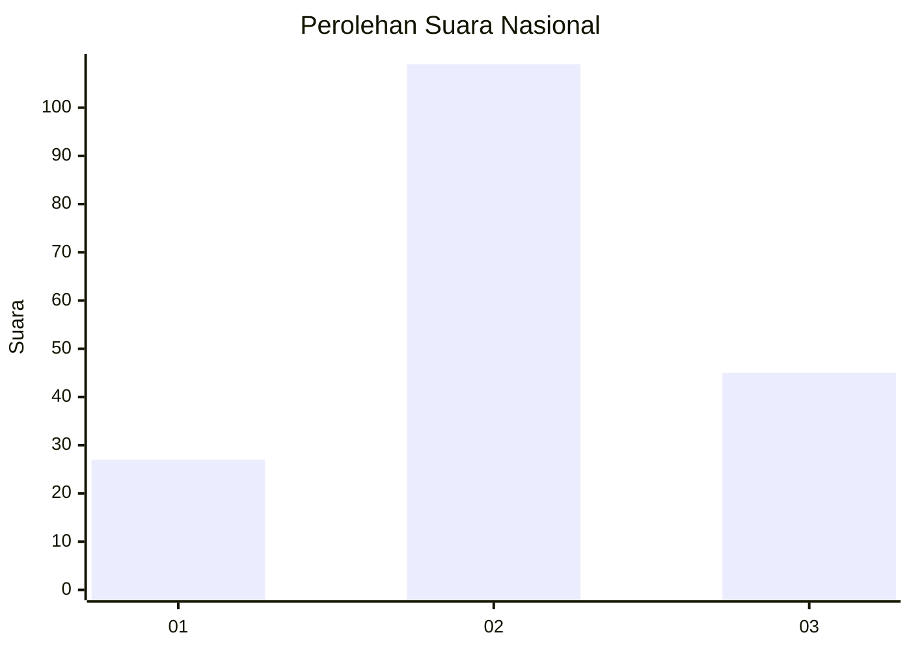
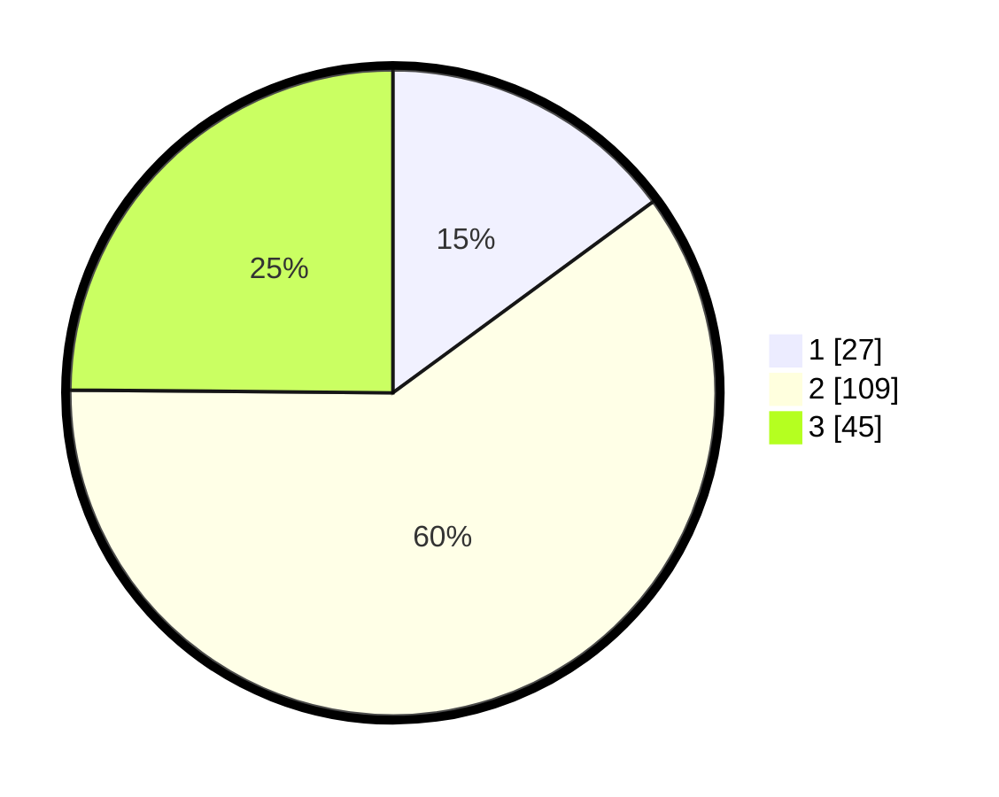

# Hasil

## Grafik

## Tabel

| No. | Nama Paslon    | Suara | Suara (raw) | Persentase |
|:--- |:-------------- | -----:| -----------:| ----------:|
| 1   | ANIES MUHAIMIN | 27    | [27][p-1]   | 14,92      |
| 2   | PRABOWO GIBRAN | 109   | [109][p-2]  | 60,22      |
| 3   | GANJAR MAHFUD  | 45    | [45][p-3]   | 24,86      |

[p-1]: https://github.com/gigit-pemilu/pemilu-2024/blob/main/pilpres/hitung-suara/sub/34-di-yogyakarta/sub/02-bantul/sub/04-pundong/sub/2002-panjangrejo/sub/018-tps/sub/paslon-1.txt
[p-2]: https://github.com/gigit-pemilu/pemilu-2024/blob/main/pilpres/hitung-suara/sub/34-di-yogyakarta/sub/02-bantul/sub/04-pundong/sub/2002-panjangrejo/sub/018-tps/sub/paslon-2.txt
[p-3]: https://github.com/gigit-pemilu/pemilu-2024/blob/main/pilpres/hitung-suara/sub/34-di-yogyakarta/sub/02-bantul/sub/04-pundong/sub/2002-panjangrejo/sub/018-tps/sub/paslon-3.txt

## Foto C Plano

https://sirekap-obj-formc.kpu.go.id/7269/pemilu/ppwp/34/02/04/20/02/3402042002018-20240219-122722--51fbff43-3119-436d-bbf3-43c49112c027.jpg

https://sirekap-obj-formc.kpu.go.id/7269/pemilu/ppwp/34/02/04/20/02/3402042002018-20240219-122130--ba3eb988-7f01-448d-bea3-ccf36b297143.jpg

https://sirekap-obj-formc.kpu.go.id/7269/pemilu/ppwp/34/02/04/20/02/3402042002018-20240219-122357--3b21ab7b-cafa-461f-b1b7-08ab1bd5cf5e.jpg

## Metadata

| Key        | Value               |
| ---------- | ------------------- |
| Time Stamp | 2024-02-25 15:00:00 |

