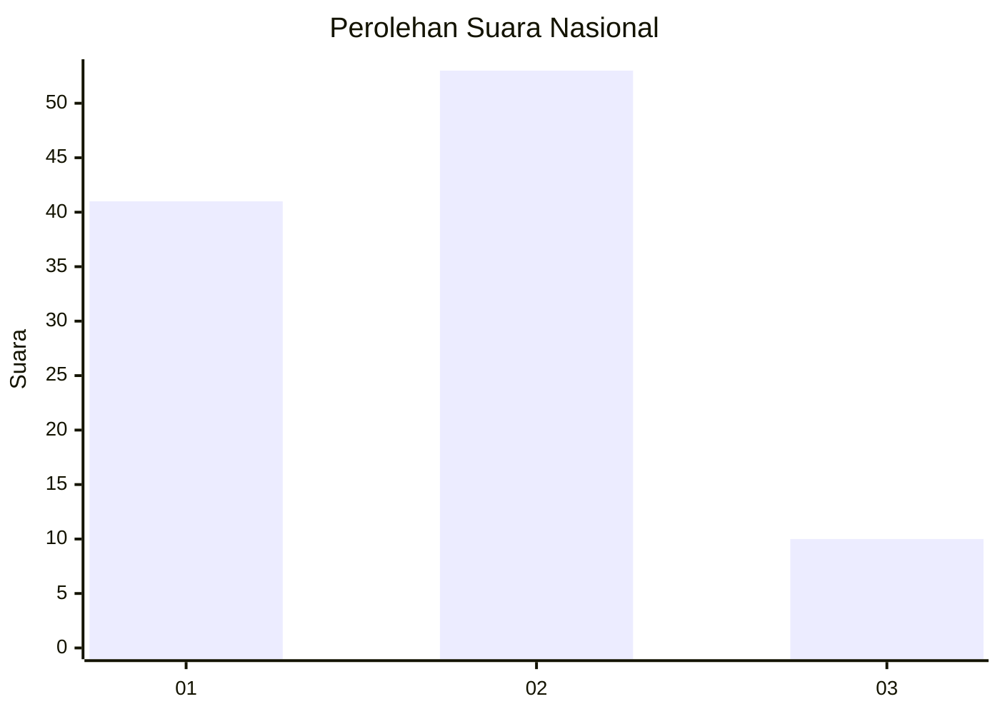
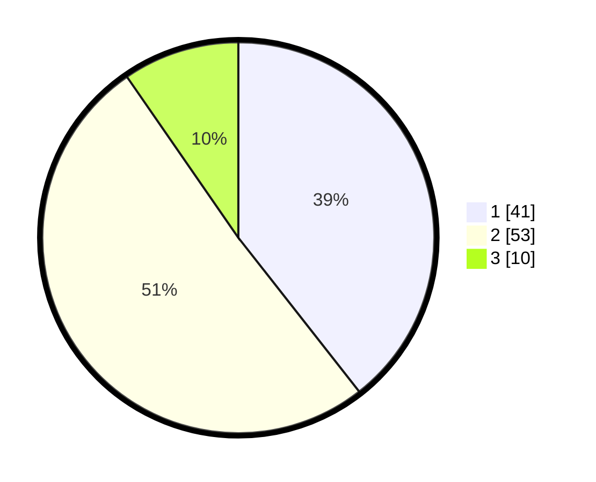

# Hasil

## Grafik

## Tabel

| No. | Nama Paslon    | Suara | Suara (raw) | Persentase |
|:--- |:-------------- | -----:| -----------:| ----------:|
| 1   | ANIES MUHAIMIN | 41    | [41][p-1]   | 39,42      |
| 2   | PRABOWO GIBRAN | 53    | [53][p-2]   | 50,96      |
| 3   | GANJAR MAHFUD  | 10    | [10][p-3]   | 9,62       |

[p-1]: https://github.com/gigit-pemilu/pemilu-2024/blob/main/pilpres/hitung-suara/sub/34-di-yogyakarta/sub/02-bantul/sub/04-pundong/sub/2002-panjangrejo/sub/021-tps/sub/paslon-1.txt
[p-2]: https://github.com/gigit-pemilu/pemilu-2024/blob/main/pilpres/hitung-suara/sub/34-di-yogyakarta/sub/02-bantul/sub/04-pundong/sub/2002-panjangrejo/sub/021-tps/sub/paslon-2.txt
[p-3]: https://github.com/gigit-pemilu/pemilu-2024/blob/main/pilpres/hitung-suara/sub/34-di-yogyakarta/sub/02-bantul/sub/04-pundong/sub/2002-panjangrejo/sub/021-tps/sub/paslon-3.txt

## Foto C Plano

https://sirekap-obj-formc.kpu.go.id/9964/pemilu/ppwp/34/02/04/20/02/3402042002021-20240216-184813--54d89d4e-6783-48c8-ac72-4fcd274444f4.jpg

https://sirekap-obj-formc.kpu.go.id/9964/pemilu/ppwp/34/02/04/20/02/3402042002021-20240216-184815--6d167667-aff8-4d91-afd9-8620154116e9.jpg

https://sirekap-obj-formc.kpu.go.id/9964/pemilu/ppwp/34/02/04/20/02/3402042002021-20240216-184814--38c5e21f-4ce2-4c8c-b488-758751266251.jpg

## Metadata

| Key        | Value               |
| ---------- | ------------------- |
| Time Stamp | 2024-02-20 09:00:00 |

## DATA PEMILIH TETAP

Jumlah pemilih dalam DPT: **117**.
 * L: **51**.
 * P: **66**.

## DATA PENGGUNA HAK PILIH

Jumlah pengguna hak pilih dalam DPT: **105**.
 * L: **47**.
 * P: **58**.

Jumlah pengguna hak pilih dalam DPTb: **2**.
 * L: **1**.
 * P: **1**.

Jumlah pengguna hak pilih dalam DPK: **0**.
 * L: **0**.
 * P: **0**.

Jumlah pengguna hak pilih: **107**.
 * L: **48**.
 * P: **59**.

## JUMLAH SUARA SAH DAN TIDAK SAH

JUMLAH SELURUH SUARA SAH: **104**.

JUMLAH SUARA TIDAK SAH: **3**.

JUMLAH SELURUH SUARA SAH DAN SUARA TIDAK SAH: **107**.

