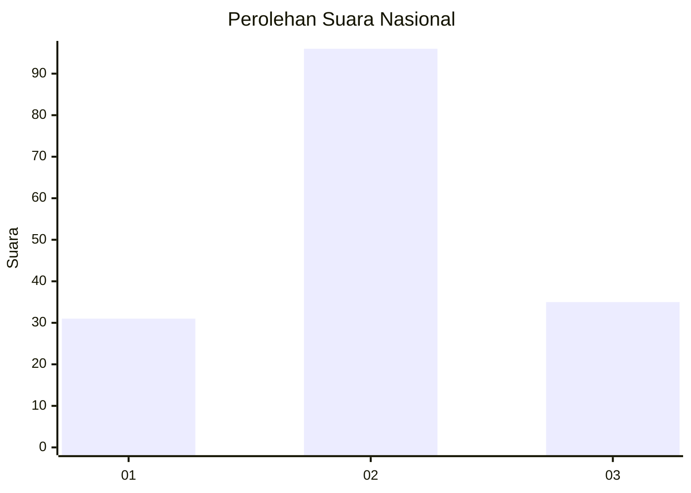
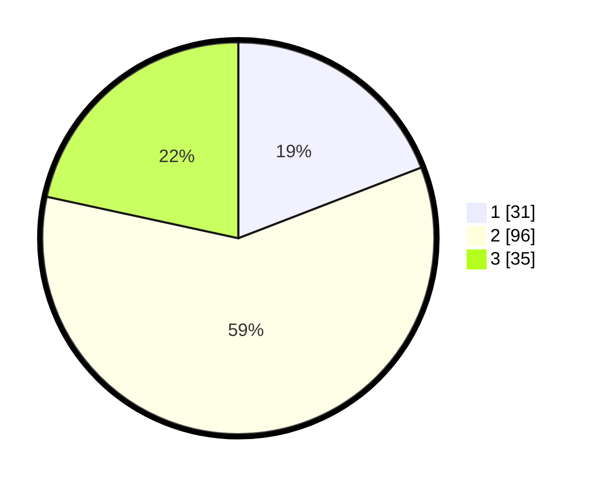

# Hasil

## Grafik

## Tabel

| No. | Nama Paslon    | Suara | Suara (raw) | Persentase |
|:--- |:-------------- | -----:| -----------:| ----------:|
| 1   | ANIES MUHAIMIN | 31    | [31][p-1]   | 19,14      |
| 2   | PRABOWO GIBRAN | 96    | [96][p-2]   | 59,26      |
| 3   | GANJAR MAHFUD  | 35    | [35][p-3]   | 21,60      |

[p-1]: https://github.com/gigit-pemilu/pemilu-2024/blob/main/pilpres/hitung-suara/sub/34-di-yogyakarta/sub/02-bantul/sub/04-pundong/sub/2003-srihardono/sub/007-tps/sub/paslon-1.txt
[p-2]: https://github.com/gigit-pemilu/pemilu-2024/blob/main/pilpres/hitung-suara/sub/34-di-yogyakarta/sub/02-bantul/sub/04-pundong/sub/2003-srihardono/sub/007-tps/sub/paslon-2.txt
[p-3]: https://github.com/gigit-pemilu/pemilu-2024/blob/main/pilpres/hitung-suara/sub/34-di-yogyakarta/sub/02-bantul/sub/04-pundong/sub/2003-srihardono/sub/007-tps/sub/paslon-3.txt

## Foto C Plano

https://sirekap-obj-formc.kpu.go.id/c4fb/pemilu/ppwp/34/02/04/20/03/3402042003007-20240216-020747--5151a721-9762-4ea6-be14-072e9e59a34f.jpg

https://sirekap-obj-formc.kpu.go.id/c4fb/pemilu/ppwp/34/02/04/20/03/3402042003007-20240214-204944--649b07d2-875f-4529-b7c5-5e46e051b585.jpg

https://sirekap-obj-formc.kpu.go.id/c4fb/pemilu/ppwp/34/02/04/20/03/3402042003007-20240216-020756--185c14b8-4be4-4e9c-b6c4-9de2960d482f.jpg

## Metadata

| Key        | Value               |
| ---------- | ------------------- |
| Time Stamp | 2024-02-16 02:30:27 |

## DATA PEMILIH TETAP

Jumlah pemilih dalam DPT: **181**.
 * L: **87**.
 * P: **94**.

## DATA PENGGUNA HAK PILIH

Jumlah pengguna hak pilih dalam DPT: **164**.
 * L: **78**.
 * P: **86**.

Jumlah pengguna hak pilih dalam DPTb: **4**.
 * L: **2**.
 * P: **2**.

Jumlah pengguna hak pilih dalam DPK: **1**.
 * L: **1**.
 * P: **0**.

Jumlah pengguna hak pilih: **169**.
 * L: **81**.
 * P: **88**.

## JUMLAH SUARA SAH DAN TIDAK SAH

JUMLAH SELURUH SUARA SAH: **162**.

JUMLAH SUARA TIDAK SAH: **7**.

JUMLAH SELURUH SUARA SAH DAN SUARA TIDAK SAH: **169**.

