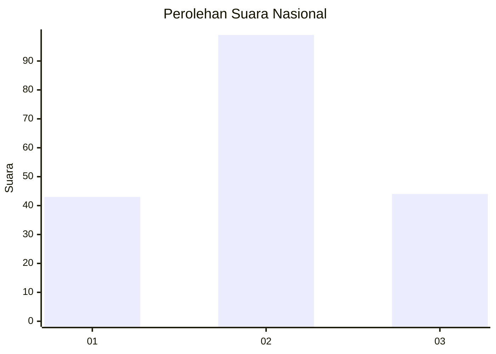
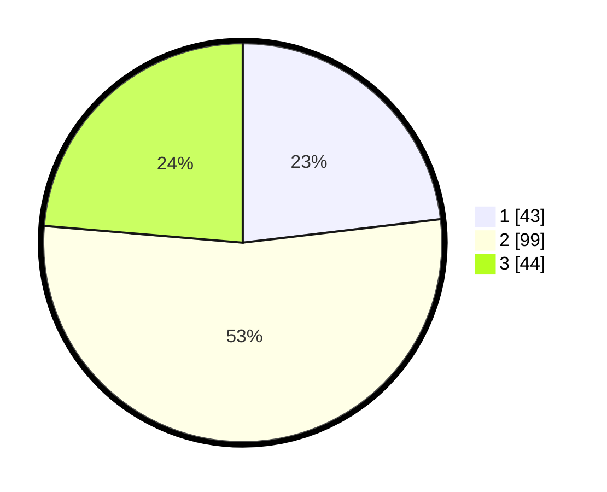

# Hasil

## Grafik

## Tabel

| No. | Nama Paslon    | Suara | Suara (raw) | Persentase |
|:--- |:-------------- | -----:| -----------:| ----------:|
| 1   | ANIES MUHAIMIN | 43    | [43][p-1]   | 23,12      |
| 2   | PRABOWO GIBRAN | 99    | [99][p-2]   | 53,23      |
| 3   | GANJAR MAHFUD  | 44    | [44][p-3]   | 23,66      |

[p-1]: https://github.com/gigit-pemilu/pemilu-2024/blob/main/pilpres/hitung-suara/sub/34-di-yogyakarta/sub/02-bantul/sub/04-pundong/sub/2003-srihardono/sub/008-tps/sub/paslon-1.txt
[p-2]: https://github.com/gigit-pemilu/pemilu-2024/blob/main/pilpres/hitung-suara/sub/34-di-yogyakarta/sub/02-bantul/sub/04-pundong/sub/2003-srihardono/sub/008-tps/sub/paslon-2.txt
[p-3]: https://github.com/gigit-pemilu/pemilu-2024/blob/main/pilpres/hitung-suara/sub/34-di-yogyakarta/sub/02-bantul/sub/04-pundong/sub/2003-srihardono/sub/008-tps/sub/paslon-3.txt

## Foto C Plano

https://sirekap-obj-formc.kpu.go.id/3cdd/pemilu/ppwp/34/02/04/20/03/3402042003008-20240214-155337--3715310d-96b3-424b-a41c-86f0597a5c73.jpg

https://sirekap-obj-formc.kpu.go.id/3cdd/pemilu/ppwp/34/02/04/20/03/3402042003008-20240214-195251--772939bd-5fba-40f2-8c31-3de3d3f89b88.jpg

https://sirekap-obj-formc.kpu.go.id/3cdd/pemilu/ppwp/34/02/04/20/03/3402042003008-20240214-230203--8755d6d8-4565-4ff6-ab0f-594bc2b656c0.jpg

## Metadata

| Key        | Value               |
| ---------- | ------------------- |
| Time Stamp | 2024-02-15 15:00:29 |

