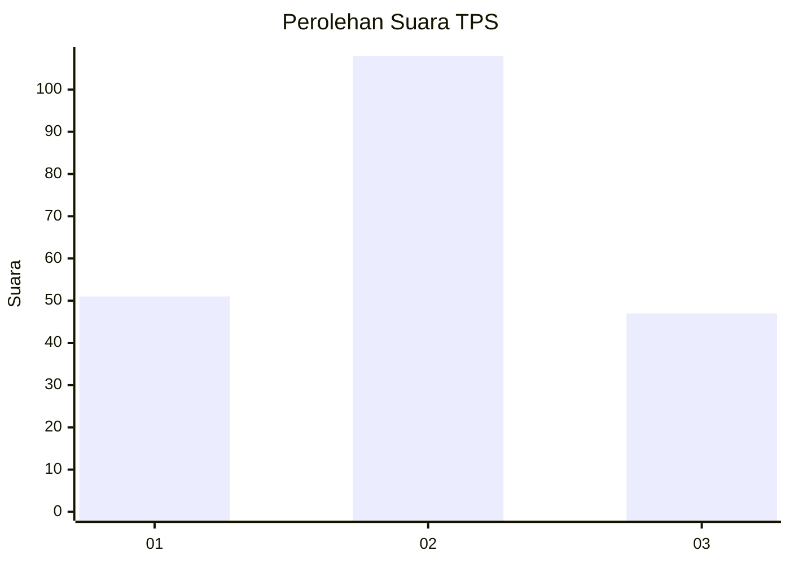
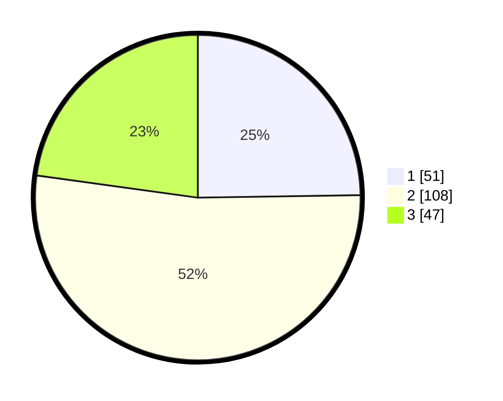

# Hasil

## Grafik

## Tabel

| No. | Nama Paslon    | Suara | Suara (raw) | Persentase |
|:--- |:-------------- | -----:| -----------:| ----------:|
| 1   | ANIES MUHAIMIN | 51    | [51][p-1]   | 24,76      |
| 2   | PRABOWO GIBRAN | 108   | [108][p-2]  | 52,43      |
| 3   | GANJAR MAHFUD  | 47    | [47][p-3]   | 22,82      |

[p-1]: https://github.com/gigit-pemilu/pemilu-2024-34-di-yogyakarta/blob/main/pilpres/hitung-suara/sub/34-di-yogyakarta/sub/02-bantul/sub/04-pundong/sub/2003-srihardono/sub/014-tps/sub/paslon-1.txt
[p-2]: https://github.com/gigit-pemilu/pemilu-2024-34-di-yogyakarta/blob/main/pilpres/hitung-suara/sub/34-di-yogyakarta/sub/02-bantul/sub/04-pundong/sub/2003-srihardono/sub/014-tps/sub/paslon-2.txt
[p-3]: https://github.com/gigit-pemilu/pemilu-2024-34-di-yogyakarta/blob/main/pilpres/hitung-suara/sub/34-di-yogyakarta/sub/02-bantul/sub/04-pundong/sub/2003-srihardono/sub/014-tps/sub/paslon-3.txt

## Foto C Plano

https://sirekap-obj-formc.kpu.go.id/4963/pemilu/ppwp/34/02/04/20/03/3402042003014-20240214-213648--c6220713-ce59-4c49-8ad5-a55b5eec1d73.jpg

https://sirekap-obj-formc.kpu.go.id/4963/pemilu/ppwp/34/02/04/20/03/3402042003014-20240214-223948--c25b6134-e44c-40db-9362-2690fbcb29e0.jpg

https://sirekap-obj-formc.kpu.go.id/4963/pemilu/ppwp/34/02/04/20/03/3402042003014-20240214-214204--1602096a-cc98-452a-b367-5c111038fe97.jpg

## Metadata

| Key        | Value               |
| ---------- | ------------------- |
| Time Stamp | 2024-02-24 22:31:28 |

