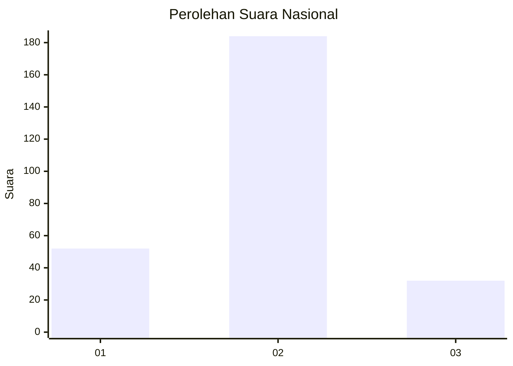
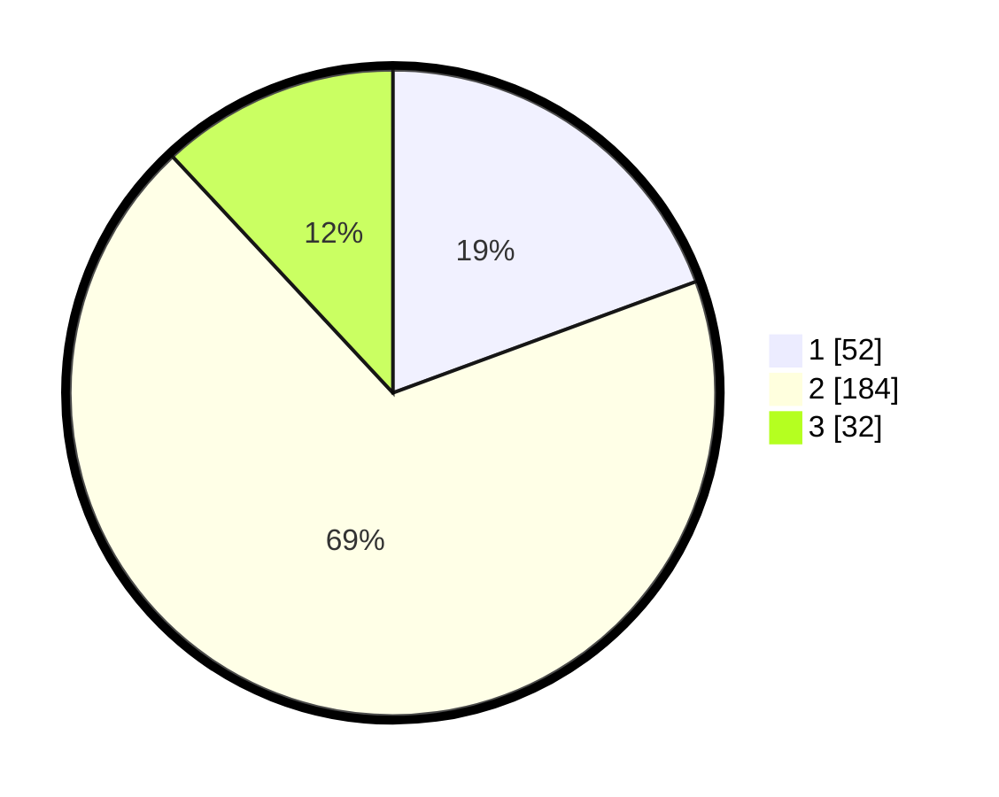

# Hasil

## Grafik

## Tabel

| No. | Nama Paslon    | Suara | Suara (raw) | Persentase |
|:--- |:-------------- | -----:| -----------:| ----------:|
| 1   | ANIES MUHAIMIN | 52    | [52][p-1]   | 19,40      |
| 2   | PRABOWO GIBRAN | 184   | [184][p-2]  | 68,66      |
| 3   | GANJAR MAHFUD  | 32    | [32][p-3]   | 11,94      |

[p-1]: https://github.com/gigit-pemilu/pemilu-2024/blob/main/pilpres/hitung-suara/sub/34-di-yogyakarta/sub/02-bantul/sub/04-pundong/sub/2003-srihardono/sub/017-tps/sub/paslon-1.txt
[p-2]: https://github.com/gigit-pemilu/pemilu-2024/blob/main/pilpres/hitung-suara/sub/34-di-yogyakarta/sub/02-bantul/sub/04-pundong/sub/2003-srihardono/sub/017-tps/sub/paslon-2.txt
[p-3]: https://github.com/gigit-pemilu/pemilu-2024/blob/main/pilpres/hitung-suara/sub/34-di-yogyakarta/sub/02-bantul/sub/04-pundong/sub/2003-srihardono/sub/017-tps/sub/paslon-3.txt

## Foto C Plano

https://sirekap-obj-formc.kpu.go.id/6488/pemilu/ppwp/34/02/04/20/03/3402042003017-20240215-005623--1ed97c8c-aa7f-4d5f-8242-8619acf82b58.jpg

https://sirekap-obj-formc.kpu.go.id/6488/pemilu/ppwp/34/02/04/20/03/3402042003017-20240214-223313--63bb73b4-335c-4f8c-9977-74dce6671752.jpg

https://sirekap-obj-formc.kpu.go.id/6488/pemilu/ppwp/34/02/04/20/03/3402042003017-20240214-223459--ddb04a4d-5029-400d-989d-769554a1d813.jpg

## Metadata

| Key        | Value               |
| ---------- | ------------------- |
| Time Stamp | 2024-02-25 11:00:00 |

