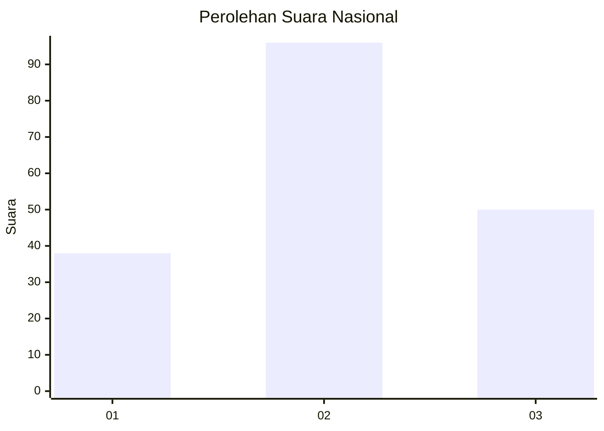
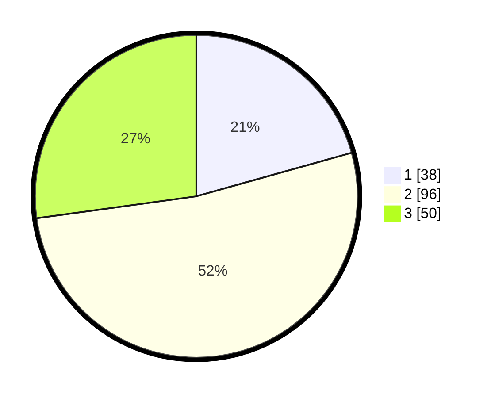

# Hasil

## Grafik

## Tabel

| No. | Nama Paslon    | Suara | Suara (raw) | Persentase |
|:--- |:-------------- | -----:| -----------:| ----------:|
| 1   | ANIES MUHAIMIN | 38    | [38][p-1]   | 20,65      |
| 2   | PRABOWO GIBRAN | 96    | [96][p-2]   | 52,17      |
| 3   | GANJAR MAHFUD  | 50    | [50][p-3]   | 27,17      |

[p-1]: https://github.com/gigit-pemilu/pemilu-2024/blob/main/pilpres/hitung-suara/sub/34-di-yogyakarta/sub/02-bantul/sub/04-pundong/sub/2003-srihardono/sub/019-tps/sub/paslon-1.txt
[p-2]: https://github.com/gigit-pemilu/pemilu-2024/blob/main/pilpres/hitung-suara/sub/34-di-yogyakarta/sub/02-bantul/sub/04-pundong/sub/2003-srihardono/sub/019-tps/sub/paslon-2.txt
[p-3]: https://github.com/gigit-pemilu/pemilu-2024/blob/main/pilpres/hitung-suara/sub/34-di-yogyakarta/sub/02-bantul/sub/04-pundong/sub/2003-srihardono/sub/019-tps/sub/paslon-3.txt

## Foto C Plano

https://sirekap-obj-formc.kpu.go.id/2e80/pemilu/ppwp/34/02/04/20/03/3402042003019-20240214-225929--de3741d3-ff4e-46b3-8129-c18966749a17.jpg

https://sirekap-obj-formc.kpu.go.id/2e80/pemilu/ppwp/34/02/04/20/03/3402042003019-20240214-230152--18dfb5a0-b428-4b48-8b29-fc1fb0617faa.jpg

https://sirekap-obj-formc.kpu.go.id/2e80/pemilu/ppwp/34/02/04/20/03/3402042003019-20240214-230229--be9357fa-8c53-490e-a959-81ded4adbe2d.jpg

## Metadata

| Key        | Value               |
| ---------- | ------------------- |
| Time Stamp | 2024-02-15 17:00:25 |

