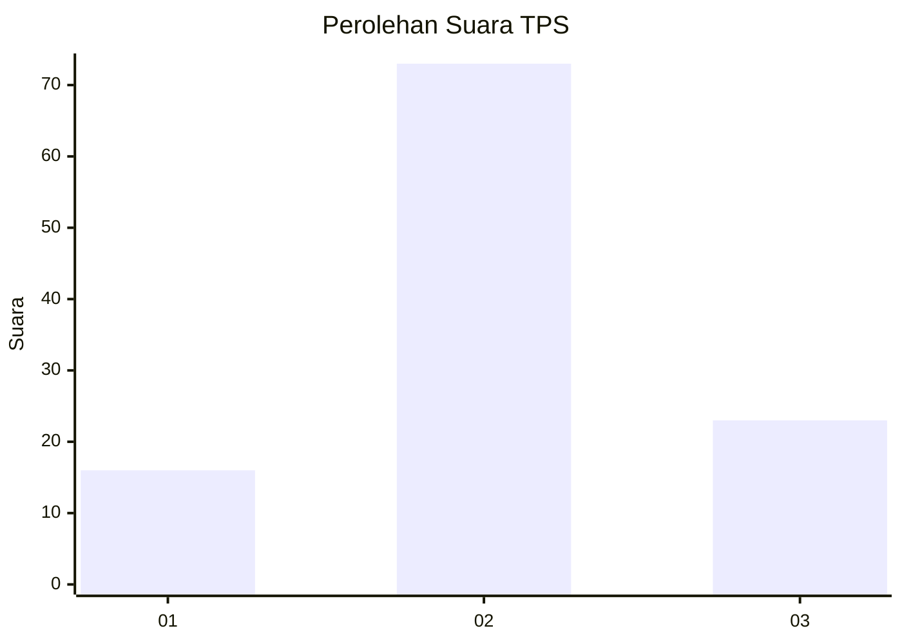
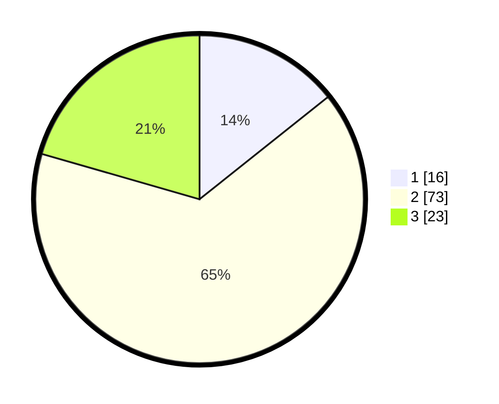

# Hasil

## Grafik

## Tabel

| No. | Nama Paslon    | Suara | Suara (raw) | Persentase |
|:--- |:-------------- | -----:| -----------:| ----------:|
| 1   | ANIES MUHAIMIN | 16    | [16][p-1]   | 14,29      |
| 2   | PRABOWO GIBRAN | 73    | [73][p-2]   | 65,18      |
| 3   | GANJAR MAHFUD  | 23    | [23][p-3]   | 20,54      |

[p-1]: https://github.com/gigit-pemilu/pemilu-2024-34-di-yogyakarta/blob/main/pilpres/hitung-suara/sub/34-di-yogyakarta/sub/02-bantul/sub/04-pundong/sub/2003-srihardono/sub/023-tps/sub/paslon-1.txt
[p-2]: https://github.com/gigit-pemilu/pemilu-2024-34-di-yogyakarta/blob/main/pilpres/hitung-suara/sub/34-di-yogyakarta/sub/02-bantul/sub/04-pundong/sub/2003-srihardono/sub/023-tps/sub/paslon-2.txt
[p-3]: https://github.com/gigit-pemilu/pemilu-2024-34-di-yogyakarta/blob/main/pilpres/hitung-suara/sub/34-di-yogyakarta/sub/02-bantul/sub/04-pundong/sub/2003-srihardono/sub/023-tps/sub/paslon-3.txt

## Foto C Plano

https://sirekap-obj-formc.kpu.go.id/c4bc/pemilu/ppwp/34/02/04/20/03/3402042003023-20240216-055202--2ec69dc6-a13f-45fc-b709-b079e3b31a04.jpg

https://sirekap-obj-formc.kpu.go.id/c4bc/pemilu/ppwp/34/02/04/20/03/3402042003023-20240216-055219--86dd7fff-7a7f-4017-8d37-cf1a5be448b6.jpg

https://sirekap-obj-formc.kpu.go.id/c4bc/pemilu/ppwp/34/02/04/20/03/3402042003023-20240216-055211--f95fe7b8-b221-49fd-8c62-6e1b47976a32.jpg

## Metadata

| Key        | Value               |
| ---------- | ------------------- |
| Time Stamp | 2024-02-20 09:00:00 |

## DATA PEMILIH TETAP

Jumlah pemilih dalam DPT: **124**.
 * L: **58**.
 * P: **66**.

## DATA PENGGUNA HAK PILIH

Jumlah pengguna hak pilih dalam DPT: **113**.
 * L: **51**.
 * P: **62**.

Jumlah pengguna hak pilih dalam DPTb: **0**.
 * L: **0**.
 * P: **0**.

Jumlah pengguna hak pilih dalam DPK: **2**.
 * L: **1**.
 * P: **1**.

Jumlah pengguna hak pilih: **115**.
 * L: **52**.
 * P: **63**.

## JUMLAH SUARA SAH DAN TIDAK SAH

JUMLAH SELURUH SUARA SAH: **112**.

JUMLAH SUARA TIDAK SAH: **3**.

JUMLAH SELURUH SUARA SAH DAN SUARA TIDAK SAH: **115**.

