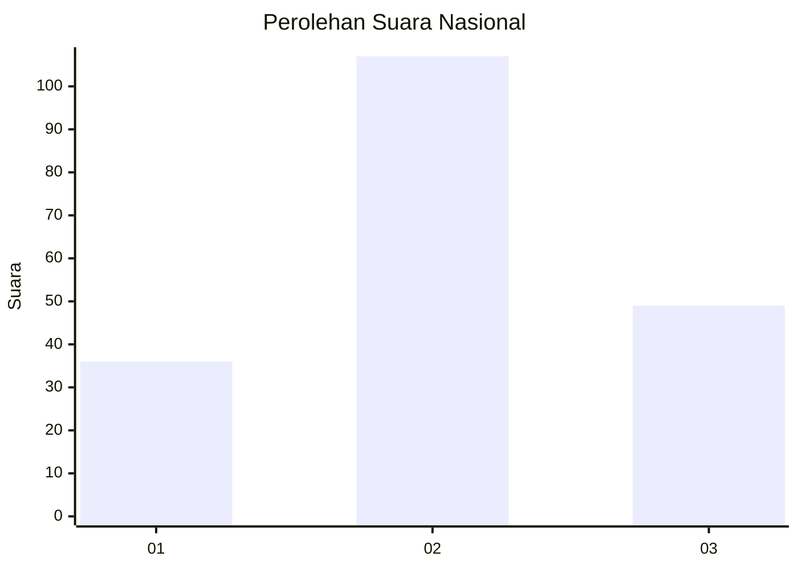
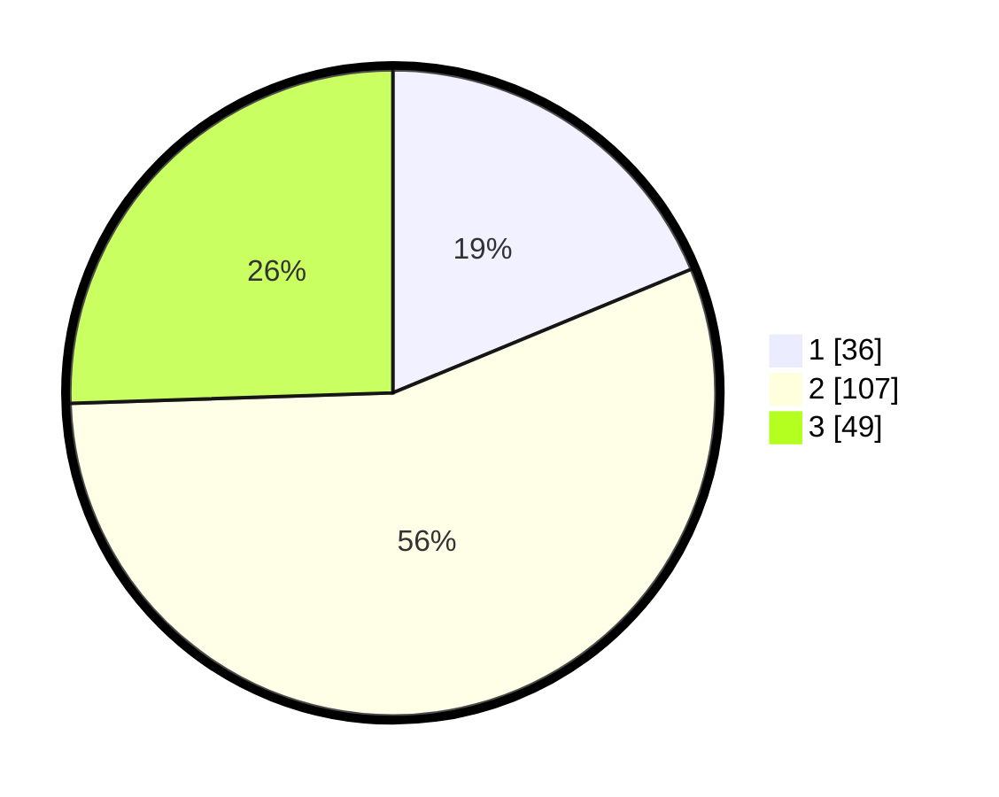

# Hasil

## Grafik

## Tabel

| No. | Nama Paslon    | Suara | Suara (raw) | Persentase |
|:--- |:-------------- | -----:| -----------:| ----------:|
| 1   | ANIES MUHAIMIN | 36    | [36][p-1]   | 18,75      |
| 2   | PRABOWO GIBRAN | 107   | [107][p-2]  | 55,73      |
| 3   | GANJAR MAHFUD  | 49    | [49][p-3]   | 25,52      |

[p-1]: https://github.com/gigit-pemilu/pemilu-2024/blob/main/pilpres/hitung-suara/sub/34-di-yogyakarta/sub/02-bantul/sub/04-pundong/sub/2003-srihardono/sub/024-tps/sub/paslon-1.txt
[p-2]: https://github.com/gigit-pemilu/pemilu-2024/blob/main/pilpres/hitung-suara/sub/34-di-yogyakarta/sub/02-bantul/sub/04-pundong/sub/2003-srihardono/sub/024-tps/sub/paslon-2.txt
[p-3]: https://github.com/gigit-pemilu/pemilu-2024/blob/main/pilpres/hitung-suara/sub/34-di-yogyakarta/sub/02-bantul/sub/04-pundong/sub/2003-srihardono/sub/024-tps/sub/paslon-3.txt

## Foto C Plano

https://sirekap-obj-formc.kpu.go.id/3ce5/pemilu/ppwp/34/02/04/20/03/3402042003024-20240214-235029--b49acf6a-fc86-4394-967c-f4bb3f989c7d.jpg

https://sirekap-obj-formc.kpu.go.id/3ce5/pemilu/ppwp/34/02/04/20/03/3402042003024-20240214-231858--8a227609-d3ec-4c89-b31f-681c8bd13783.jpg

https://sirekap-obj-formc.kpu.go.id/3ce5/pemilu/ppwp/34/02/04/20/03/3402042003024-20240214-235608--b1b21edc-530e-456e-bf70-064f93f8cca1.jpg

## Metadata

| Key        | Value               |
| ---------- | ------------------- |
| Time Stamp | 2024-02-25 12:00:00 |

