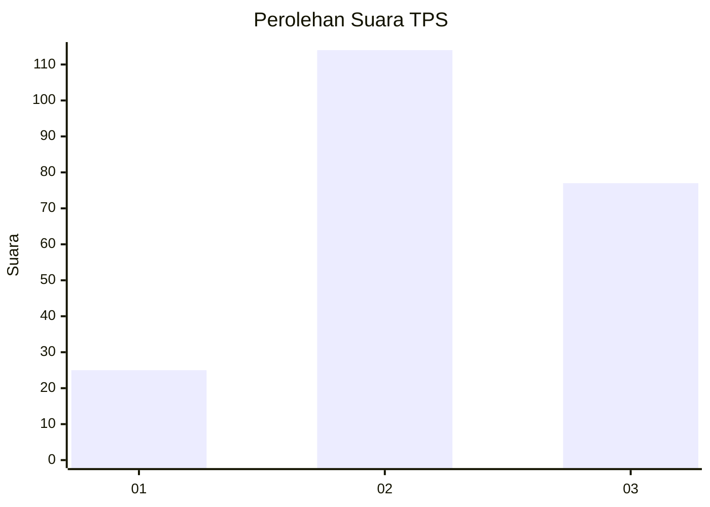
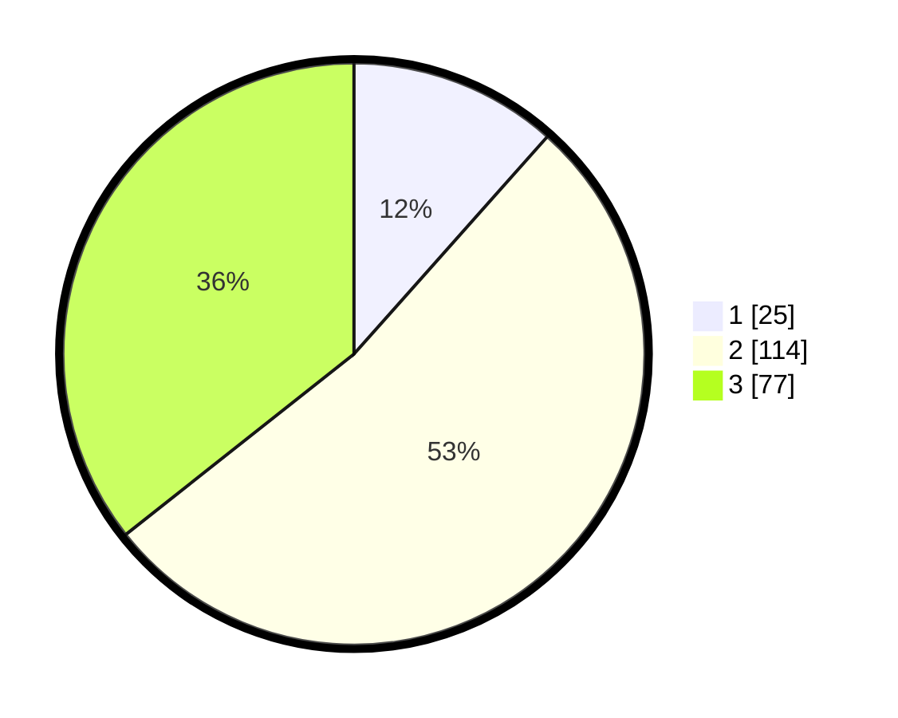

# Hasil

## Grafik

## Tabel

| No. | Nama Paslon    | Suara | Suara (raw) | Persentase |
|:--- |:-------------- | -----:| -----------:| ----------:|
| 1   | ANIES MUHAIMIN | 25    | [25][p-1]   | 11,57      |
| 2   | PRABOWO GIBRAN | 114   | [114][p-2]  | 52,78      |
| 3   | GANJAR MAHFUD  | 77    | [77][p-3]   | 35,65      |

[p-1]: https://github.com/gigit-pemilu/pemilu-2024-34-di-yogyakarta/blob/main/pilpres/hitung-suara/sub/34-di-yogyakarta/sub/02-bantul/sub/04-pundong/sub/2003-srihardono/sub/036-tps/sub/paslon-1.txt
[p-2]: https://github.com/gigit-pemilu/pemilu-2024-34-di-yogyakarta/blob/main/pilpres/hitung-suara/sub/34-di-yogyakarta/sub/02-bantul/sub/04-pundong/sub/2003-srihardono/sub/036-tps/sub/paslon-2.txt
[p-3]: https://github.com/gigit-pemilu/pemilu-2024-34-di-yogyakarta/blob/main/pilpres/hitung-suara/sub/34-di-yogyakarta/sub/02-bantul/sub/04-pundong/sub/2003-srihardono/sub/036-tps/sub/paslon-3.txt

## Foto C Plano

https://sirekap-obj-formc.kpu.go.id/e567/pemilu/ppwp/34/02/04/20/03/3402042003036-20240214-155750--4e69b5eb-830d-451d-8448-591f6839a91d.jpg

https://sirekap-obj-formc.kpu.go.id/e567/pemilu/ppwp/34/02/04/20/03/3402042003036-20240214-160124--52e9b88c-9edd-4589-a343-463ac2185ddf.jpg

https://sirekap-obj-formc.kpu.go.id/e567/pemilu/ppwp/34/02/04/20/03/3402042003036-20240214-160059--7472d985-76c6-4250-81d0-1106c72ba316.jpg

## Metadata

| Key        | Value               |
| ---------- | ------------------- |
| Time Stamp | 2024-02-24 22:31:28 |

