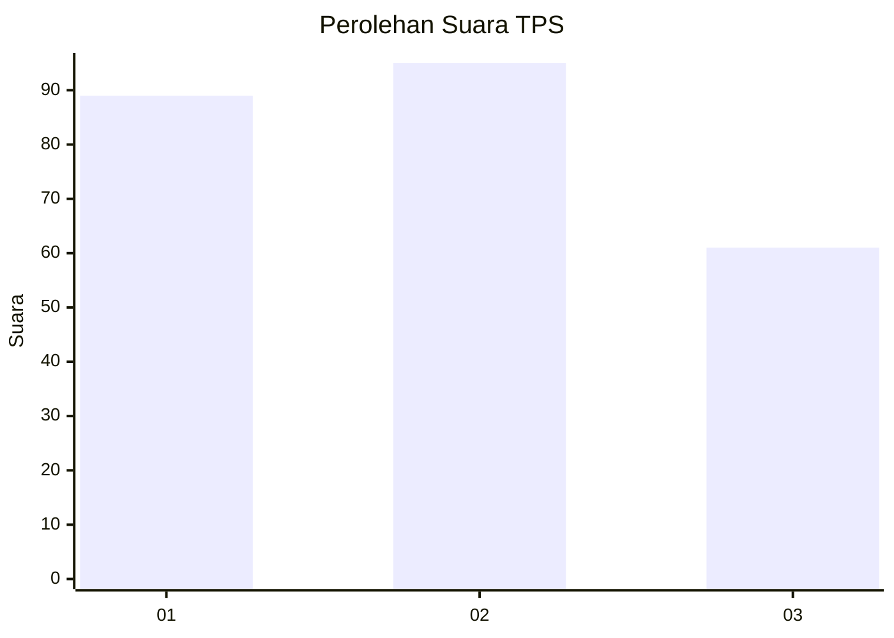
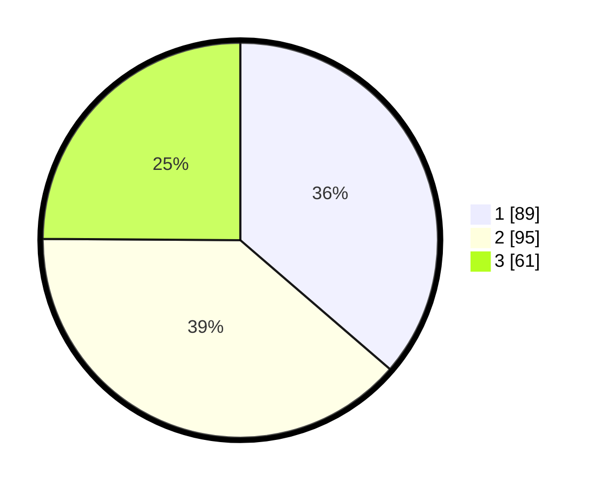

# Hasil

## Grafik

## Tabel

| No. | Nama Paslon    | Suara | Suara (raw) | Persentase |
|:--- |:-------------- | -----:| -----------:| ----------:|
| 1   | ANIES MUHAIMIN | 89    | [89][p-1]   | 36,33      |
| 2   | PRABOWO GIBRAN | 95    | [95][p-2]   | 38,78      |
| 3   | GANJAR MAHFUD  | 61    | [61][p-3]   | 24,90      |

[p-1]: https://github.com/gigit-pemilu/pemilu-2024-34-di-yogyakarta/blob/main/pilpres/hitung-suara/sub/34-di-yogyakarta/sub/02-bantul/sub/04-pundong/sub/2003-srihardono/sub/039-tps/sub/paslon-1.txt
[p-2]: https://github.com/gigit-pemilu/pemilu-2024-34-di-yogyakarta/blob/main/pilpres/hitung-suara/sub/34-di-yogyakarta/sub/02-bantul/sub/04-pundong/sub/2003-srihardono/sub/039-tps/sub/paslon-2.txt
[p-3]: https://github.com/gigit-pemilu/pemilu-2024-34-di-yogyakarta/blob/main/pilpres/hitung-suara/sub/34-di-yogyakarta/sub/02-bantul/sub/04-pundong/sub/2003-srihardono/sub/039-tps/sub/paslon-3.txt

## Foto C Plano

https://sirekap-obj-formc.kpu.go.id/fd61/pemilu/ppwp/34/02/04/20/03/3402042003039-20240214-160056--54d1c67f-f8f5-4ed3-a445-43f4bdd80fe9.jpg

https://sirekap-obj-formc.kpu.go.id/fd61/pemilu/ppwp/34/02/04/20/03/3402042003039-20240214-155313--815348a3-dcc5-4973-b41d-240593c1833d.jpg

## Metadata

| Key        | Value               |
| ---------- | ------------------- |
| Time Stamp | 2024-02-15 07:00:44 |

