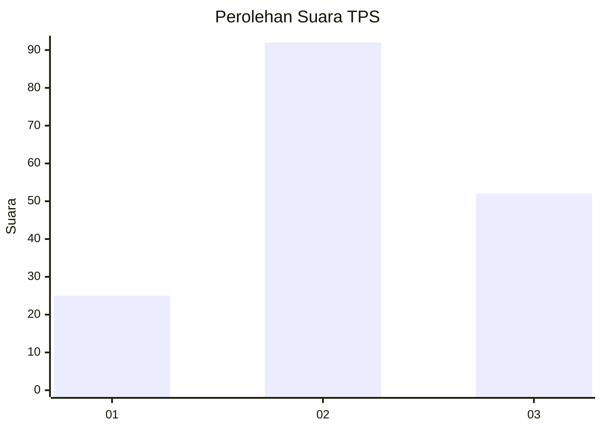
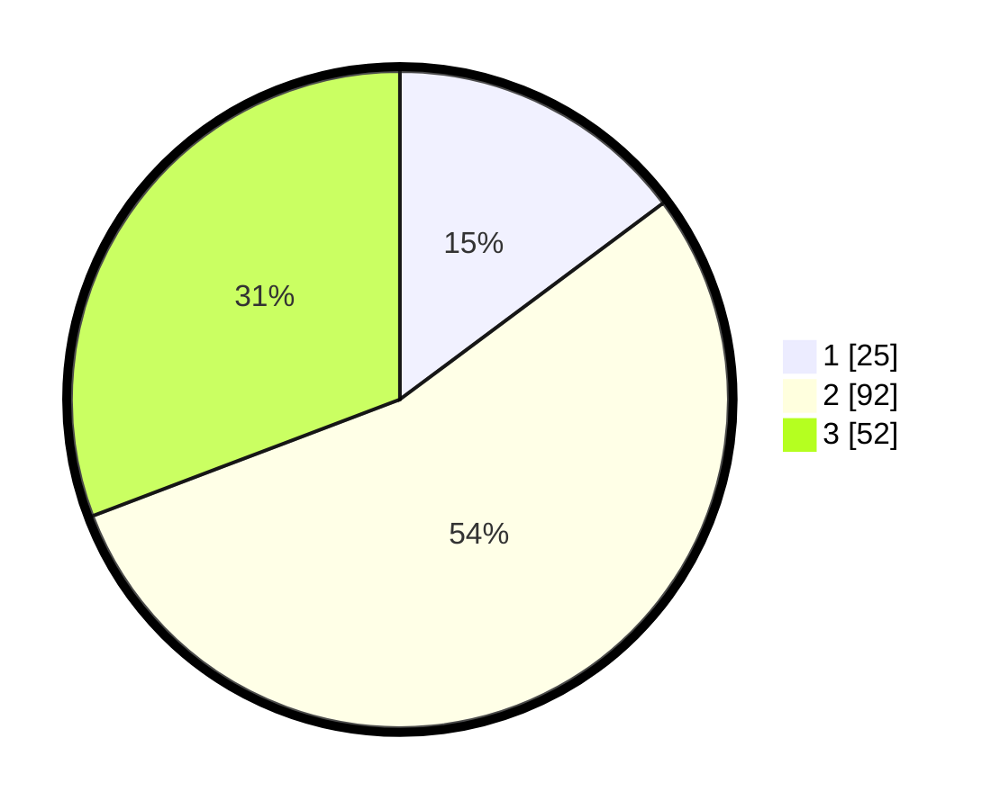

# Hasil

## Grafik

## Tabel

| No. | Nama Paslon    | Suara | Suara (raw) | Persentase |
|:--- |:-------------- | -----:| -----------:| ----------:|
| 1   | ANIES MUHAIMIN | 25    | [25][p-1]   | 14,79      |
| 2   | PRABOWO GIBRAN | 92    | [92][p-2]   | 54,44      |
| 3   | GANJAR MAHFUD  | 52    | [52][p-3]   | 30,77      |

[p-1]: https://github.com/gigit-pemilu/pemilu-2024-34-di-yogyakarta/blob/main/pilpres/hitung-suara/sub/34-di-yogyakarta/sub/02-bantul/sub/04-pundong/sub/2003-srihardono/sub/046-tps/sub/paslon-1.txt
[p-2]: https://github.com/gigit-pemilu/pemilu-2024-34-di-yogyakarta/blob/main/pilpres/hitung-suara/sub/34-di-yogyakarta/sub/02-bantul/sub/04-pundong/sub/2003-srihardono/sub/046-tps/sub/paslon-2.txt
[p-3]: https://github.com/gigit-pemilu/pemilu-2024-34-di-yogyakarta/blob/main/pilpres/hitung-suara/sub/34-di-yogyakarta/sub/02-bantul/sub/04-pundong/sub/2003-srihardono/sub/046-tps/sub/paslon-3.txt

## Foto C Plano

https://sirekap-obj-formc.kpu.go.id/d053/pemilu/ppwp/34/02/04/20/03/3402042003046-20240220-213739--ea68e37b-f359-49fa-a2ac-7fa9d2a9e5c6.jpg

https://sirekap-obj-formc.kpu.go.id/d053/pemilu/ppwp/34/02/04/20/03/3402042003046-20240220-213831--adc76269-e691-41eb-91f0-78c4a559088c.jpg

https://sirekap-obj-formc.kpu.go.id/d053/pemilu/ppwp/34/02/04/20/03/3402042003046-20240220-214008--34e6b421-0adc-4115-b3ce-9af4187f6d70.jpg

## Metadata

| Key        | Value               |
| ---------- | ------------------- |
| Time Stamp | 2024-02-20 22:00:00 |

