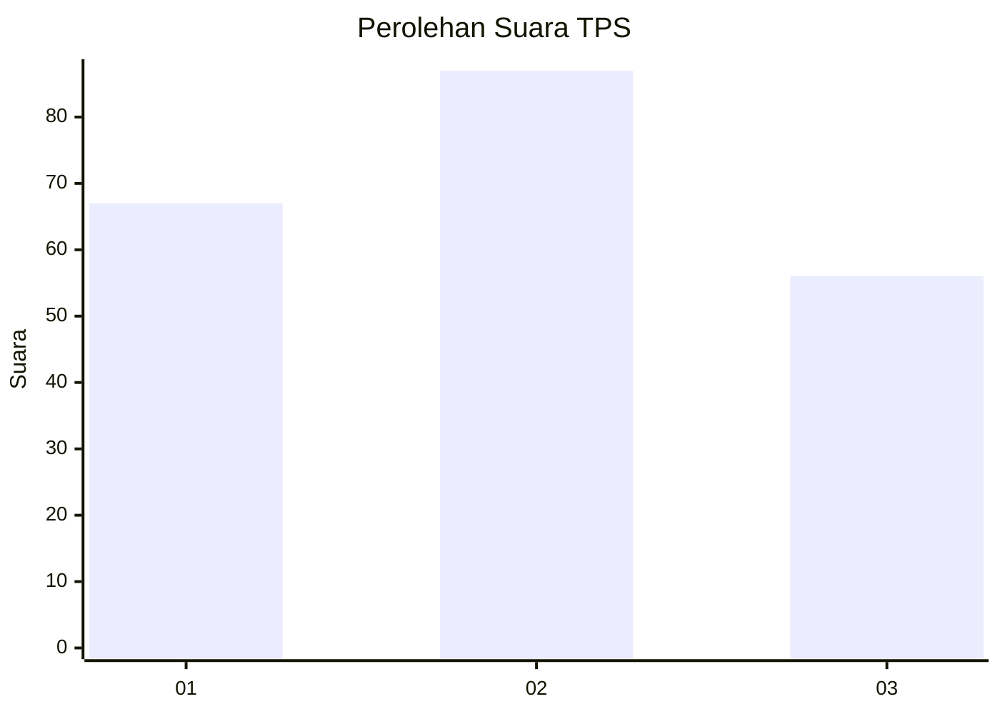
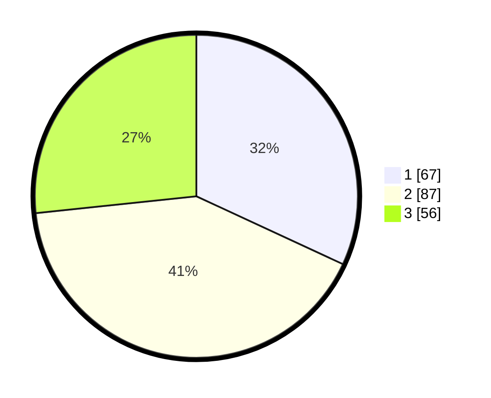

# Hasil

## Grafik

## Tabel

| No. | Nama Paslon    | Suara | Suara (raw) | Persentase |
|:--- |:-------------- | -----:| -----------:| ----------:|
| 1   | ANIES MUHAIMIN | 67    | [67][p-1]   | 31,90      |
| 2   | PRABOWO GIBRAN | 87    | [87][p-2]   | 41,43      |
| 3   | GANJAR MAHFUD  | 56    | [56][p-3]   | 26,67      |

[p-1]: https://github.com/gigit-pemilu/pemilu-2024-34-di-yogyakarta/blob/main/pilpres/hitung-suara/sub/34-di-yogyakarta/sub/02-bantul/sub/05-bambanglipuro/sub/2001-sidomulyo/sub/001-tps/sub/paslon-1.txt
[p-2]: https://github.com/gigit-pemilu/pemilu-2024-34-di-yogyakarta/blob/main/pilpres/hitung-suara/sub/34-di-yogyakarta/sub/02-bantul/sub/05-bambanglipuro/sub/2001-sidomulyo/sub/001-tps/sub/paslon-2.txt
[p-3]: https://github.com/gigit-pemilu/pemilu-2024-34-di-yogyakarta/blob/main/pilpres/hitung-suara/sub/34-di-yogyakarta/sub/02-bantul/sub/05-bambanglipuro/sub/2001-sidomulyo/sub/001-tps/sub/paslon-3.txt

## Foto C Plano

https://sirekap-obj-formc.kpu.go.id/7957/pemilu/ppwp/34/02/05/20/01/3402052001001-20240219-221953--e3b0f983-22db-426b-9bec-e533e486ef92.jpg

https://sirekap-obj-formc.kpu.go.id/7957/pemilu/ppwp/34/02/05/20/01/3402052001001-20240219-222216--9110fc3b-e0b4-450f-9fac-73b20df9e328.jpg

https://sirekap-obj-formc.kpu.go.id/7957/pemilu/ppwp/34/02/05/20/01/3402052001001-20240219-222445--5e30d136-37f0-40ed-a3b0-13403ed33a3a.jpg

## Metadata

| Key        | Value               |
| ---------- | ------------------- |
| Time Stamp | 2024-02-25 15:00:00 |

