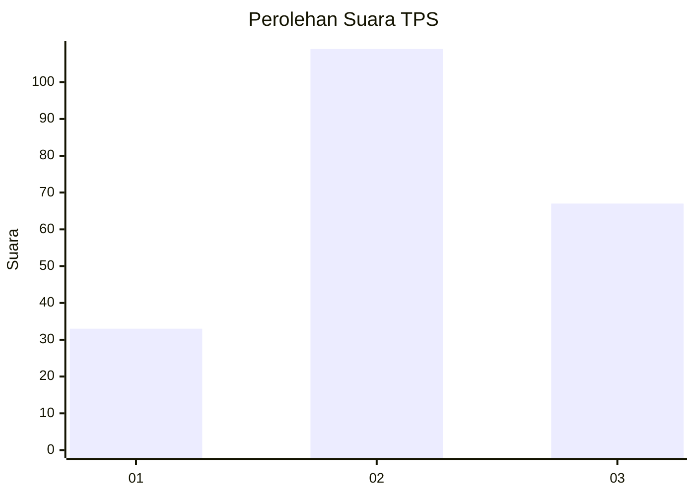
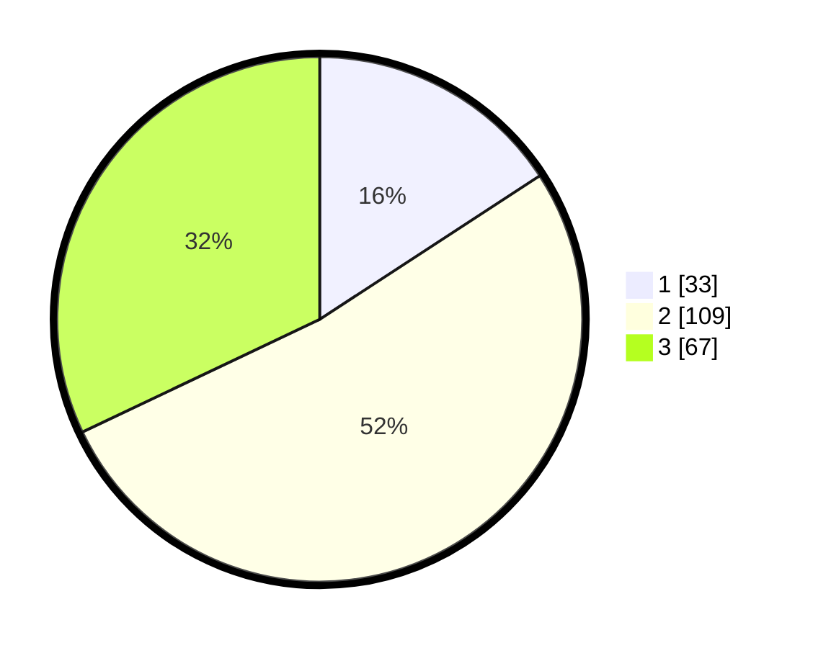

# Hasil

## Grafik

## Tabel

| No. | Nama Paslon    | Suara | Suara (raw) | Persentase |
|:--- |:-------------- | -----:| -----------:| ----------:|
| 1   | ANIES MUHAIMIN | 33    | [33][p-1]   | 15,79      |
| 2   | PRABOWO GIBRAN | 109   | [109][p-2]  | 52,15      |
| 3   | GANJAR MAHFUD  | 67    | [67][p-3]   | 32,06      |

[p-1]: https://github.com/gigit-pemilu/pemilu-2024-34-di-yogyakarta/blob/main/pilpres/hitung-suara/sub/34-di-yogyakarta/sub/02-bantul/sub/05-bambanglipuro/sub/2001-sidomulyo/sub/003-tps/sub/paslon-1.txt
[p-2]: https://github.com/gigit-pemilu/pemilu-2024-34-di-yogyakarta/blob/main/pilpres/hitung-suara/sub/34-di-yogyakarta/sub/02-bantul/sub/05-bambanglipuro/sub/2001-sidomulyo/sub/003-tps/sub/paslon-2.txt
[p-3]: https://github.com/gigit-pemilu/pemilu-2024-34-di-yogyakarta/blob/main/pilpres/hitung-suara/sub/34-di-yogyakarta/sub/02-bantul/sub/05-bambanglipuro/sub/2001-sidomulyo/sub/003-tps/sub/paslon-3.txt

## Foto C Plano

https://sirekap-obj-formc.kpu.go.id/03bc/pemilu/ppwp/34/02/05/20/01/3402052001003-20240214-185126--f48e367a-4e9e-4dd0-9f4a-7e47cad01540.jpg

https://sirekap-obj-formc.kpu.go.id/03bc/pemilu/ppwp/34/02/05/20/01/3402052001003-20240214-194730--a159387d-e079-43d5-9f21-5486fc76700a.jpg

https://sirekap-obj-formc.kpu.go.id/03bc/pemilu/ppwp/34/02/05/20/01/3402052001003-20240216-034619--e5ee6397-a055-4b2a-9962-af713b6c2022.jpg

## Metadata

| Key        | Value               |
| ---------- | ------------------- |
| Time Stamp | 2024-02-16 04:00:27 |

## DATA PEMILIH TETAP

Jumlah pemilih dalam DPT: **228**.
 * L: **116**.
 * P: **112**.

## DATA PENGGUNA HAK PILIH

Jumlah pengguna hak pilih dalam DPT: **210**.
 * L: **107**.
 * P: **103**.

Jumlah pengguna hak pilih dalam DPTb: **3**.
 * L: **0**.
 * P: **3**.

Jumlah pengguna hak pilih dalam DPK: **2**.
 * L: **1**.
 * P: **1**.

Jumlah pengguna hak pilih: **215**.
 * L: **108**.
 * P: **107**.

## JUMLAH SUARA SAH DAN TIDAK SAH

JUMLAH SELURUH SUARA SAH: **209**.

JUMLAH SUARA TIDAK SAH: **6**.

JUMLAH SELURUH SUARA SAH DAN SUARA TIDAK SAH: **215**.

