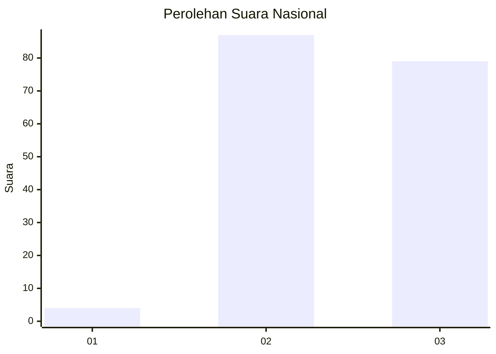
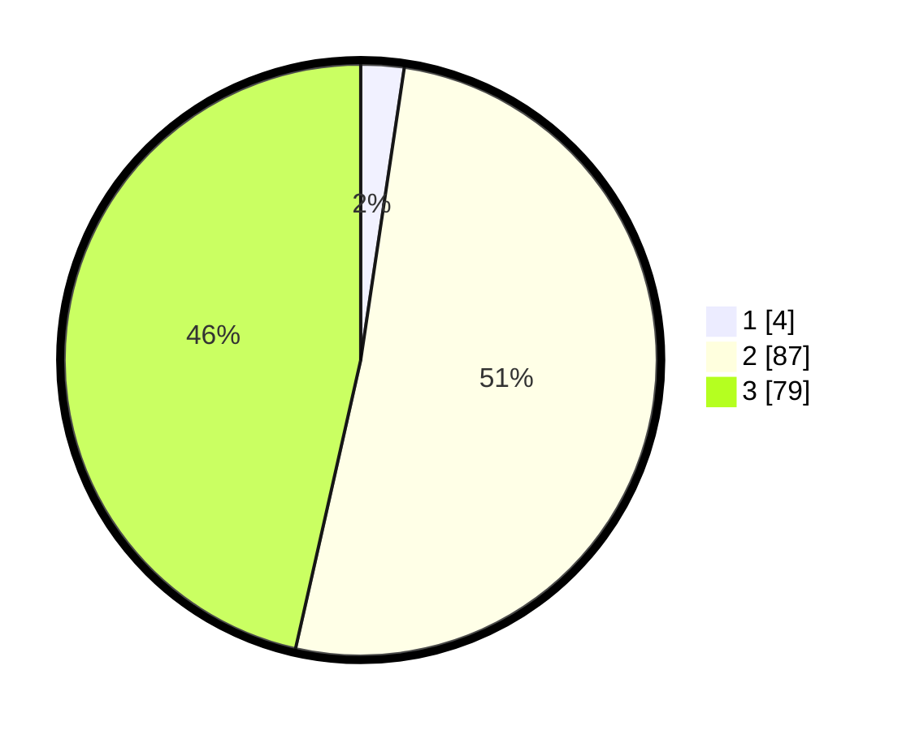

# Hasil

## Grafik

## Tabel

| No. | Nama Paslon    | Suara | Suara (raw) | Persentase |
|:--- |:-------------- | -----:| -----------:| ----------:|
| 1   | ANIES MUHAIMIN | 4     | [4][p-1]    | 2,35       |
| 2   | PRABOWO GIBRAN | 87    | [87][p-2]   | 51,18      |
| 3   | GANJAR MAHFUD  | 79    | [79][p-3]   | 46,47      |

[p-1]: https://github.com/gigit-pemilu/pemilu-2024/blob/main/pilpres/hitung-suara/sub/34-di-yogyakarta/sub/02-bantul/sub/05-bambanglipuro/sub/2001-sidomulyo/sub/006-tps/sub/paslon-1.txt
[p-2]: https://github.com/gigit-pemilu/pemilu-2024/blob/main/pilpres/hitung-suara/sub/34-di-yogyakarta/sub/02-bantul/sub/05-bambanglipuro/sub/2001-sidomulyo/sub/006-tps/sub/paslon-2.txt
[p-3]: https://github.com/gigit-pemilu/pemilu-2024/blob/main/pilpres/hitung-suara/sub/34-di-yogyakarta/sub/02-bantul/sub/05-bambanglipuro/sub/2001-sidomulyo/sub/006-tps/sub/paslon-3.txt

## Foto C Plano

https://sirekap-obj-formc.kpu.go.id/5613/pemilu/ppwp/34/02/05/20/01/3402052001006-20240215-015510--4449d41a-f480-4abd-a1bc-ca1beb8df26e.jpg

https://sirekap-obj-formc.kpu.go.id/5613/pemilu/ppwp/34/02/05/20/01/3402052001006-20240215-015531--92c6f4b2-3b12-476e-85e7-2b324e3f8f67.jpg

https://sirekap-obj-formc.kpu.go.id/5613/pemilu/ppwp/34/02/05/20/01/3402052001006-20240215-015534--fb191362-99b1-4429-9012-99b207e44d1f.jpg

## Metadata

| Key        | Value               |
| ---------- | ------------------- |
| Time Stamp | 2024-02-24 22:31:28 |

## DATA PEMILIH TETAP

Jumlah pemilih dalam DPT: **195**.
 * L: **98**.
 * P: **97**.

## DATA PENGGUNA HAK PILIH

Jumlah pengguna hak pilih dalam DPT: **171**.
 * L: **87**.
 * P: **84**.

Jumlah pengguna hak pilih dalam DPTb: **2**.
 * L: **1**.
 * P: **1**.

Jumlah pengguna hak pilih dalam DPK: **0**.
 * L: **0**.
 * P: **0**.

Jumlah pengguna hak pilih: **173**.
 * L: **88**.
 * P: **85**.

## JUMLAH SUARA SAH DAN TIDAK SAH

JUMLAH SELURUH SUARA SAH: **170**.

JUMLAH SUARA TIDAK SAH: **3**.

JUMLAH SELURUH SUARA SAH DAN SUARA TIDAK SAH: **173**.

