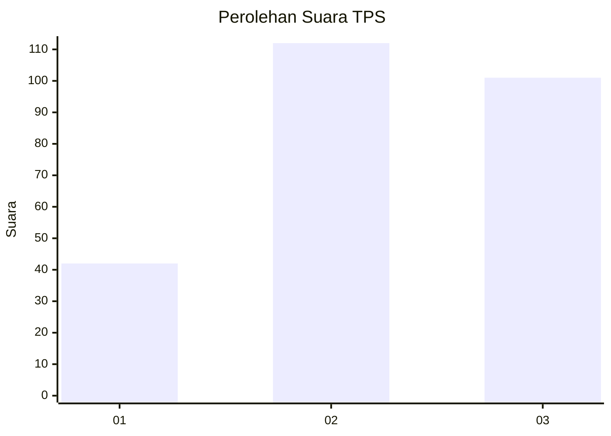
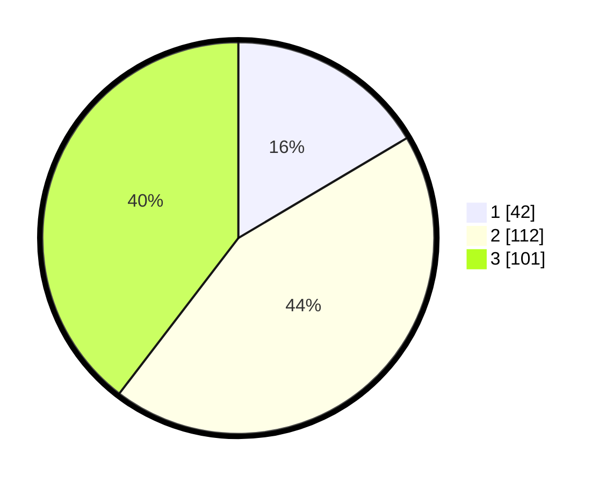

# Hasil

## Grafik

## Tabel

| No. | Nama Paslon    | Suara | Suara (raw) | Persentase |
|:--- |:-------------- | -----:| -----------:| ----------:|
| 1   | ANIES MUHAIMIN | 42    | [42][p-1]   | 16,47      |
| 2   | PRABOWO GIBRAN | 112   | [112][p-2]  | 43,92      |
| 3   | GANJAR MAHFUD  | 101   | [101][p-3]  | 39,61      |

[p-1]: https://github.com/gigit-pemilu/pemilu-2024-34-di-yogyakarta/blob/main/pilpres/hitung-suara/sub/34-di-yogyakarta/sub/02-bantul/sub/05-bambanglipuro/sub/2001-sidomulyo/sub/007-tps/sub/paslon-1.txt
[p-2]: https://github.com/gigit-pemilu/pemilu-2024-34-di-yogyakarta/blob/main/pilpres/hitung-suara/sub/34-di-yogyakarta/sub/02-bantul/sub/05-bambanglipuro/sub/2001-sidomulyo/sub/007-tps/sub/paslon-2.txt
[p-3]: https://github.com/gigit-pemilu/pemilu-2024-34-di-yogyakarta/blob/main/pilpres/hitung-suara/sub/34-di-yogyakarta/sub/02-bantul/sub/05-bambanglipuro/sub/2001-sidomulyo/sub/007-tps/sub/paslon-3.txt

## Foto C Plano

https://sirekap-obj-formc.kpu.go.id/e7ed/pemilu/ppwp/34/02/05/20/01/3402052001007-20240217-101534--cfd35b42-6821-4584-9e07-74ab50c6209a.jpg

https://sirekap-obj-formc.kpu.go.id/e7ed/pemilu/ppwp/34/02/05/20/01/3402052001007-20240214-200405--fd45b3e8-8b61-4655-b3b3-d0cc10321495.jpg

https://sirekap-obj-formc.kpu.go.id/e7ed/pemilu/ppwp/34/02/05/20/01/3402052001007-20240215-022719--10ed31ca-9c6e-4c76-a031-2d5c03f3746f.jpg

## Metadata

| Key        | Value               |
| ---------- | ------------------- |
| Time Stamp | 2024-02-17 10:30:03 |

