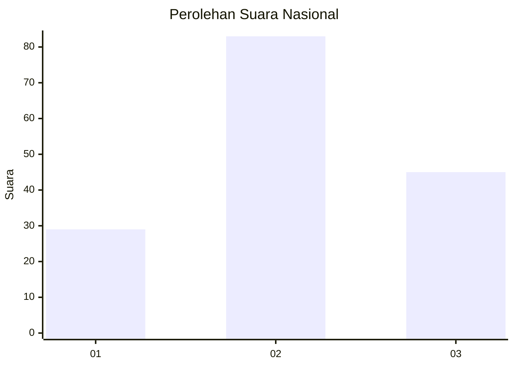
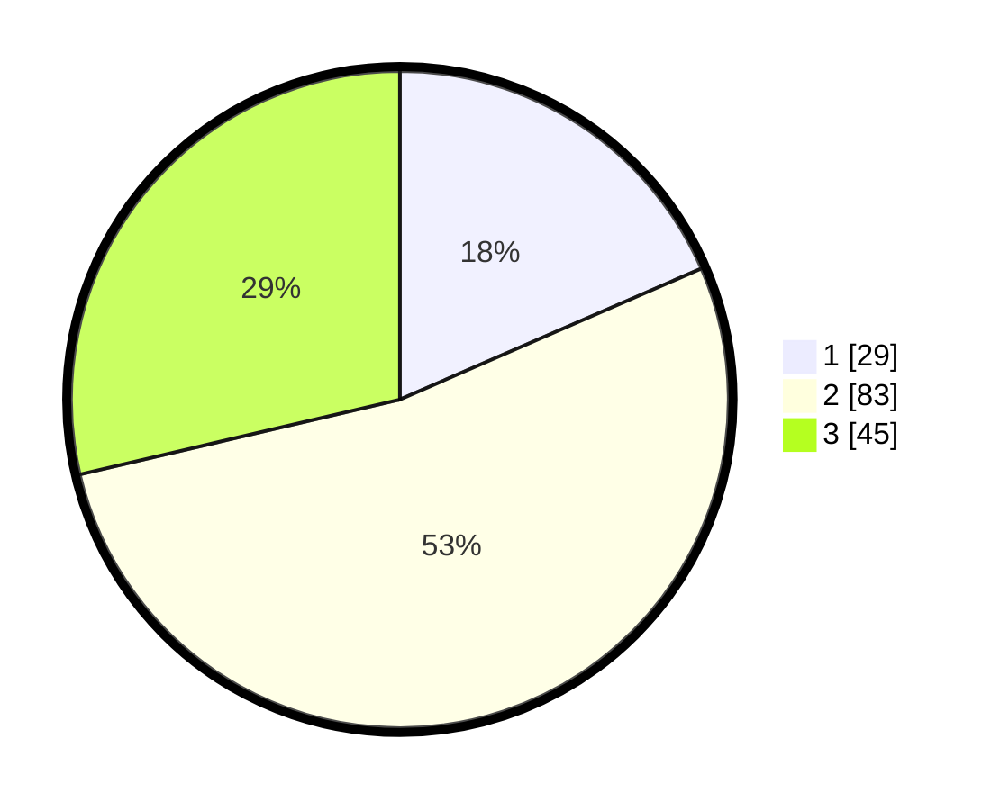

# Hasil

## Grafik

## Tabel

| No. | Nama Paslon    | Suara | Suara (raw) | Persentase |
|:--- |:-------------- | -----:| -----------:| ----------:|
| 1   | ANIES MUHAIMIN | 29    | [29][p-1]   | 18,47      |
| 2   | PRABOWO GIBRAN | 83    | [83][p-2]   | 52,87      |
| 3   | GANJAR MAHFUD  | 45    | [45][p-3]   | 28,66      |

[p-1]: https://github.com/gigit-pemilu/pemilu-2024/blob/main/pilpres/hitung-suara/sub/34-di-yogyakarta/sub/02-bantul/sub/05-bambanglipuro/sub/2001-sidomulyo/sub/008-tps/sub/paslon-1.txt
[p-2]: https://github.com/gigit-pemilu/pemilu-2024/blob/main/pilpres/hitung-suara/sub/34-di-yogyakarta/sub/02-bantul/sub/05-bambanglipuro/sub/2001-sidomulyo/sub/008-tps/sub/paslon-2.txt
[p-3]: https://github.com/gigit-pemilu/pemilu-2024/blob/main/pilpres/hitung-suara/sub/34-di-yogyakarta/sub/02-bantul/sub/05-bambanglipuro/sub/2001-sidomulyo/sub/008-tps/sub/paslon-3.txt

## Foto C Plano

https://sirekap-obj-formc.kpu.go.id/d711/pemilu/ppwp/34/02/05/20/01/3402052001008-20240217-112859--b01d97b0-2348-446a-9676-720b02e6b5f9.jpg

https://sirekap-obj-formc.kpu.go.id/d711/pemilu/ppwp/34/02/05/20/01/3402052001008-20240217-112958--ee9437ae-3988-4d38-ab48-e4cb8a197870.jpg

https://sirekap-obj-formc.kpu.go.id/d711/pemilu/ppwp/34/02/05/20/01/3402052001008-20240217-113107--2b4b53d1-47bc-4222-9220-bdb187822e4e.jpg

## Metadata

| Key        | Value               |
| ---------- | ------------------- |
| Time Stamp | 2024-02-24 22:31:28 |

