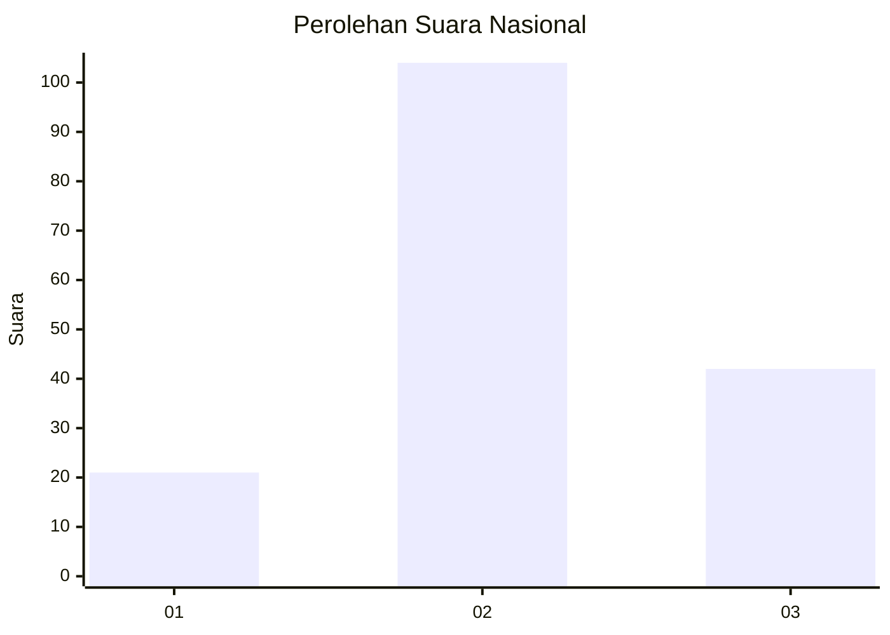
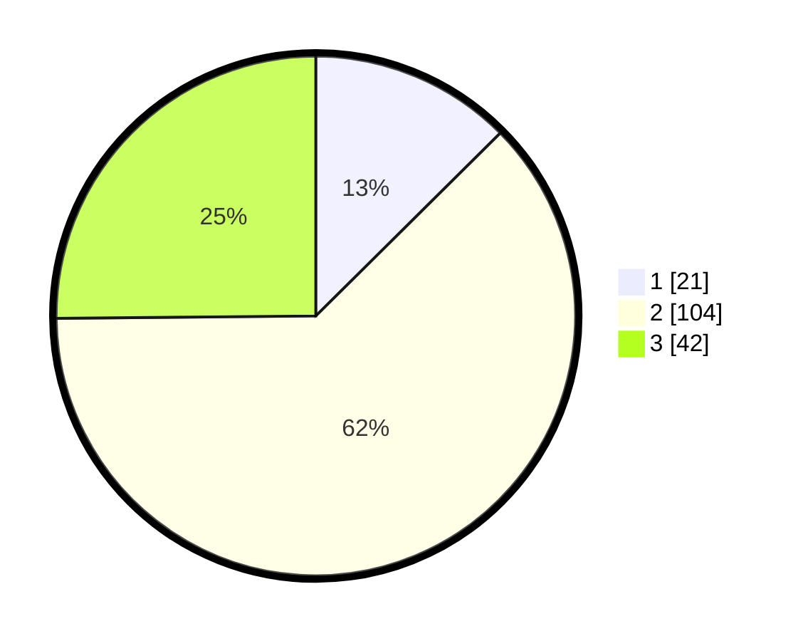

# Hasil

## Grafik

## Tabel

| No. | Nama Paslon    | Suara | Suara (raw) | Persentase |
|:--- |:-------------- | -----:| -----------:| ----------:|
| 1   | ANIES MUHAIMIN | 21    | [21][p-1]   | 12,57      |
| 2   | PRABOWO GIBRAN | 104   | [104][p-2]  | 62,28      |
| 3   | GANJAR MAHFUD  | 42    | [42][p-3]   | 25,15      |

[p-1]: https://github.com/gigit-pemilu/pemilu-2024/blob/main/pilpres/hitung-suara/sub/34-di-yogyakarta/sub/02-bantul/sub/05-bambanglipuro/sub/2001-sidomulyo/sub/009-tps/sub/paslon-1.txt
[p-2]: https://github.com/gigit-pemilu/pemilu-2024/blob/main/pilpres/hitung-suara/sub/34-di-yogyakarta/sub/02-bantul/sub/05-bambanglipuro/sub/2001-sidomulyo/sub/009-tps/sub/paslon-2.txt
[p-3]: https://github.com/gigit-pemilu/pemilu-2024/blob/main/pilpres/hitung-suara/sub/34-di-yogyakarta/sub/02-bantul/sub/05-bambanglipuro/sub/2001-sidomulyo/sub/009-tps/sub/paslon-3.txt

## Foto C Plano

https://sirekap-obj-formc.kpu.go.id/305e/pemilu/ppwp/34/02/05/20/01/3402052001009-20240214-141133--0a41c118-17d3-431f-a074-dce853e6d818.jpg

https://sirekap-obj-formc.kpu.go.id/305e/pemilu/ppwp/34/02/05/20/01/3402052001009-20240214-140926--fe8e14aa-2adf-4930-87b2-444b9dce8e85.jpg

https://sirekap-obj-formc.kpu.go.id/305e/pemilu/ppwp/34/02/05/20/01/3402052001009-20240214-141109--dcd9c103-03bc-4e36-a7d6-1e905b17b903.jpg

## Metadata

| Key        | Value               |
| ---------- | ------------------- |
| Time Stamp | 2024-02-24 22:31:28 |

