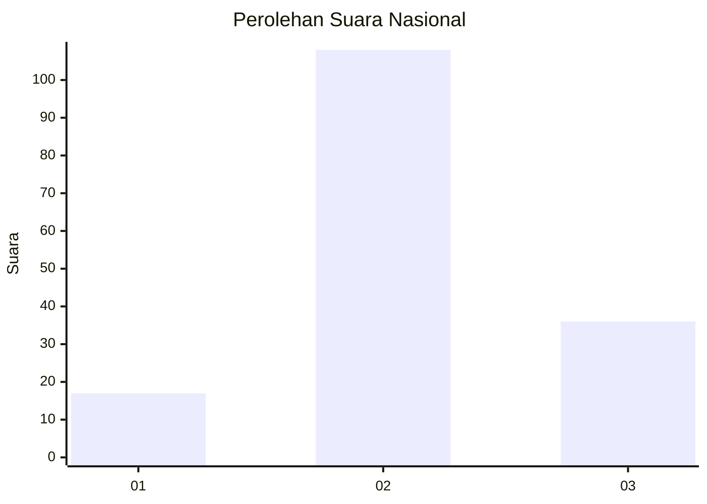
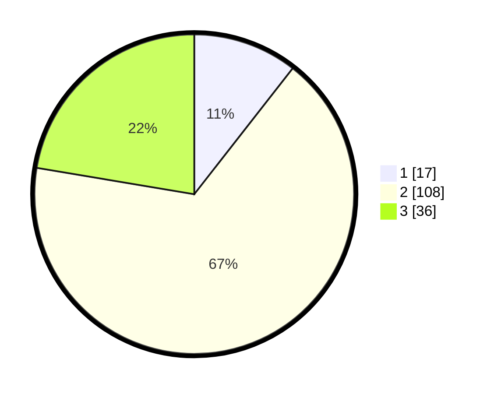

# Hasil

## Grafik

## Tabel

| No. | Nama Paslon    | Suara | Suara (raw) | Persentase |
|:--- |:-------------- | -----:| -----------:| ----------:|
| 1   | ANIES MUHAIMIN | 17    | [17][p-1]   | 10,56      |
| 2   | PRABOWO GIBRAN | 108   | [108][p-2]  | 67,08      |
| 3   | GANJAR MAHFUD  | 36    | [36][p-3]   | 22,36      |

[p-1]: https://github.com/gigit-pemilu/pemilu-2024/blob/main/pilpres/hitung-suara/sub/34-di-yogyakarta/sub/02-bantul/sub/05-bambanglipuro/sub/2001-sidomulyo/sub/012-tps/sub/paslon-1.txt
[p-2]: https://github.com/gigit-pemilu/pemilu-2024/blob/main/pilpres/hitung-suara/sub/34-di-yogyakarta/sub/02-bantul/sub/05-bambanglipuro/sub/2001-sidomulyo/sub/012-tps/sub/paslon-2.txt
[p-3]: https://github.com/gigit-pemilu/pemilu-2024/blob/main/pilpres/hitung-suara/sub/34-di-yogyakarta/sub/02-bantul/sub/05-bambanglipuro/sub/2001-sidomulyo/sub/012-tps/sub/paslon-3.txt

## Foto C Plano

https://sirekap-obj-formc.kpu.go.id/db58/pemilu/ppwp/34/02/05/20/01/3402052001012-20240214-214456--788cc3e1-75c8-4552-9df3-a8a7180a4668.jpg

https://sirekap-obj-formc.kpu.go.id/db58/pemilu/ppwp/34/02/05/20/01/3402052001012-20240214-214628--d9e98745-f0b0-4be0-941e-5160aff488b9.jpg

https://sirekap-obj-formc.kpu.go.id/db58/pemilu/ppwp/34/02/05/20/01/3402052001012-20240214-214811--d8664774-4e53-4b1b-a290-0b0dda6ef4eb.jpg

## Metadata

| Key        | Value               |
| ---------- | ------------------- |
| Time Stamp | 2024-02-25 18:00:00 |

