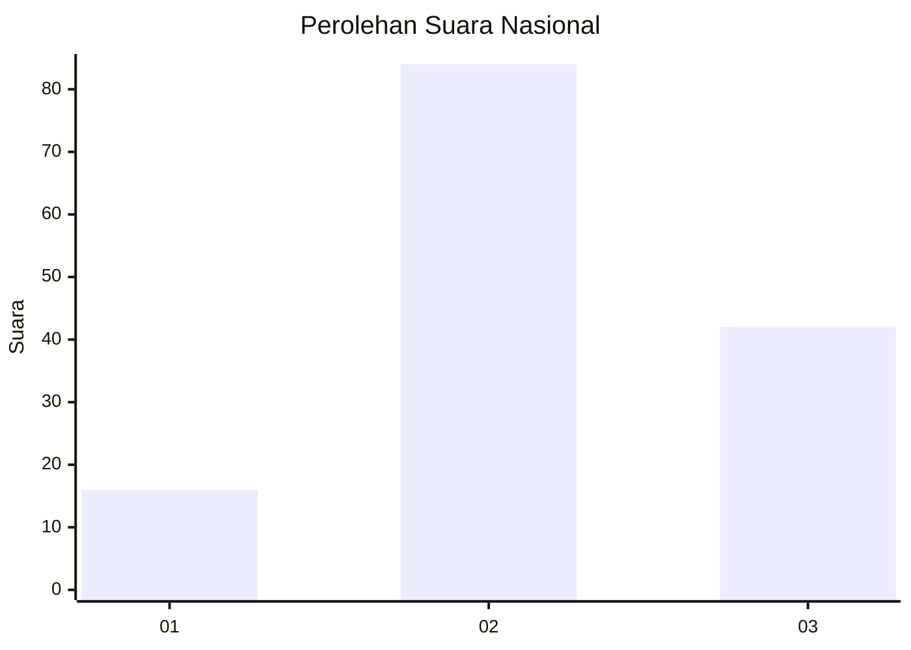
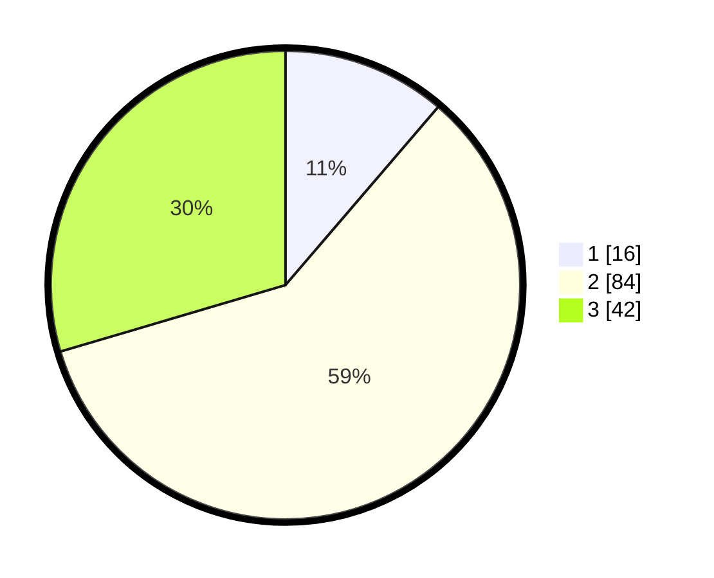

# Hasil

## Grafik

## Tabel

| No. | Nama Paslon    | Suara | Suara (raw) | Persentase |
|:--- |:-------------- | -----:| -----------:| ----------:|
| 1   | ANIES MUHAIMIN | 16    | [16][p-1]   | 11,27      |
| 2   | PRABOWO GIBRAN | 84    | [84][p-2]   | 59,15      |
| 3   | GANJAR MAHFUD  | 42    | [42][p-3]   | 29,58      |

[p-1]: https://github.com/gigit-pemilu/pemilu-2024/blob/main/pilpres/hitung-suara/sub/34-di-yogyakarta/sub/02-bantul/sub/05-bambanglipuro/sub/2001-sidomulyo/sub/013-tps/sub/paslon-1.txt
[p-2]: https://github.com/gigit-pemilu/pemilu-2024/blob/main/pilpres/hitung-suara/sub/34-di-yogyakarta/sub/02-bantul/sub/05-bambanglipuro/sub/2001-sidomulyo/sub/013-tps/sub/paslon-2.txt
[p-3]: https://github.com/gigit-pemilu/pemilu-2024/blob/main/pilpres/hitung-suara/sub/34-di-yogyakarta/sub/02-bantul/sub/05-bambanglipuro/sub/2001-sidomulyo/sub/013-tps/sub/paslon-3.txt

## Foto C Plano

https://sirekap-obj-formc.kpu.go.id/8881/pemilu/ppwp/34/02/05/20/01/3402052001013-20240216-050342--bda85a85-e43b-4b73-b996-182d90dfaf65.jpg

https://sirekap-obj-formc.kpu.go.id/8881/pemilu/ppwp/34/02/05/20/01/3402052001013-20240214-193439--00b18ce6-6630-4f2b-a99e-2be9be295644.jpg

https://sirekap-obj-formc.kpu.go.id/8881/pemilu/ppwp/34/02/05/20/01/3402052001013-20240214-213715--7ecd45ae-fd1a-4220-bf4d-af9799597516.jpg

## Metadata

| Key        | Value               |
| ---------- | ------------------- |
| Time Stamp | 2024-02-16 05:30:26 |

## DATA PEMILIH TETAP

Jumlah pemilih dalam DPT: **152**.
 * L: **76**.
 * P: **76**.

## DATA PENGGUNA HAK PILIH

Jumlah pengguna hak pilih dalam DPT: **138**.
 * L: **70**.
 * P: **68**.

Jumlah pengguna hak pilih dalam DPTb: **7**.
 * L: **3**.
 * P: **4**.

Jumlah pengguna hak pilih dalam DPK: **1**.
 * L: **0**.
 * P: **1**.

Jumlah pengguna hak pilih: **146**.
 * L: **73**.
 * P: **73**.

## JUMLAH SUARA SAH DAN TIDAK SAH

JUMLAH SELURUH SUARA SAH: **142**.

JUMLAH SUARA TIDAK SAH: **4**.

JUMLAH SELURUH SUARA SAH DAN SUARA TIDAK SAH: **146**.

