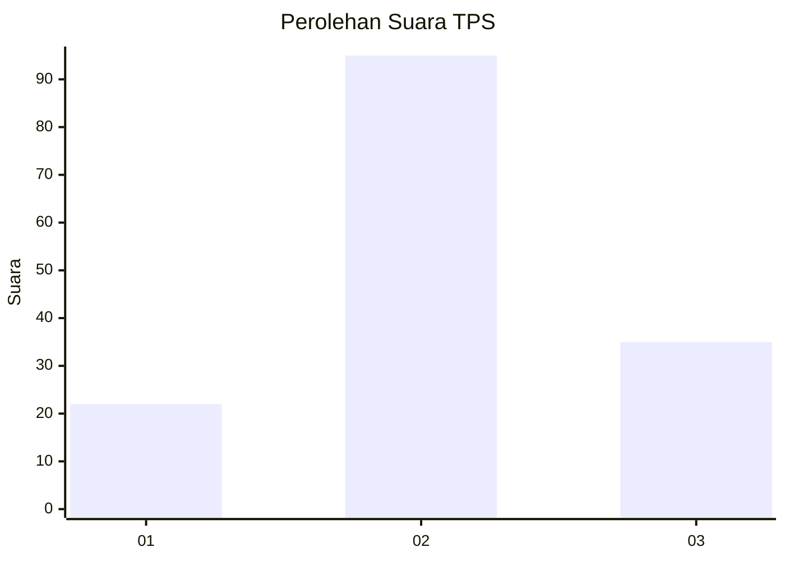
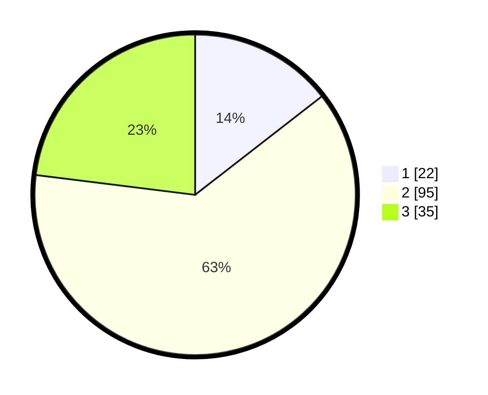

# Hasil

## Grafik

## Tabel

| No. | Nama Paslon    | Suara | Suara (raw) | Persentase |
|:--- |:-------------- | -----:| -----------:| ----------:|
| 1   | ANIES MUHAIMIN | 22    | [22][p-1]   | 14,47      |
| 2   | PRABOWO GIBRAN | 95    | [95][p-2]   | 62,50      |
| 3   | GANJAR MAHFUD  | 35    | [35][p-3]   | 23,03      |

[p-1]: https://github.com/gigit-pemilu/pemilu-2024-34-di-yogyakarta/blob/main/pilpres/hitung-suara/sub/34-di-yogyakarta/sub/02-bantul/sub/05-bambanglipuro/sub/2001-sidomulyo/sub/014-tps/sub/paslon-1.txt
[p-2]: https://github.com/gigit-pemilu/pemilu-2024-34-di-yogyakarta/blob/main/pilpres/hitung-suara/sub/34-di-yogyakarta/sub/02-bantul/sub/05-bambanglipuro/sub/2001-sidomulyo/sub/014-tps/sub/paslon-2.txt
[p-3]: https://github.com/gigit-pemilu/pemilu-2024-34-di-yogyakarta/blob/main/pilpres/hitung-suara/sub/34-di-yogyakarta/sub/02-bantul/sub/05-bambanglipuro/sub/2001-sidomulyo/sub/014-tps/sub/paslon-3.txt

## Foto C Plano

https://sirekap-obj-formc.kpu.go.id/4344/pemilu/ppwp/34/02/05/20/01/3402052001014-20240216-033519--c7535a00-979e-42ab-aa70-82ea76c2189d.jpg

https://sirekap-obj-formc.kpu.go.id/4344/pemilu/ppwp/34/02/05/20/01/3402052001014-20240216-033525--53fba6ea-f5f7-40cb-bd8b-ee1af3a574c9.jpg

https://sirekap-obj-formc.kpu.go.id/4344/pemilu/ppwp/34/02/05/20/01/3402052001014-20240216-033522--90766739-13b0-4526-b800-a6e806a90053.jpg

## Metadata

| Key        | Value               |
| ---------- | ------------------- |
| Time Stamp | 2024-02-20 10:00:00 |

## DATA PEMILIH TETAP

Jumlah pemilih dalam DPT: **170**.
 * L: **81**.
 * P: **89**.

## DATA PENGGUNA HAK PILIH

Jumlah pengguna hak pilih dalam DPT: **155**.
 * L: **74**.
 * P: **81**.

Jumlah pengguna hak pilih dalam DPTb: **2**.
 * L: **0**.
 * P: **2**.

Jumlah pengguna hak pilih dalam DPK: **157**.
 * L: **74**.
 * P: **83**.

Jumlah pengguna hak pilih: **157**.
 * L: **74**.
 * P: **83**.

## JUMLAH SUARA SAH DAN TIDAK SAH

JUMLAH SELURUH SUARA SAH: **152**.

JUMLAH SUARA TIDAK SAH: **5**.

JUMLAH SELURUH SUARA SAH DAN SUARA TIDAK SAH: **157**.

