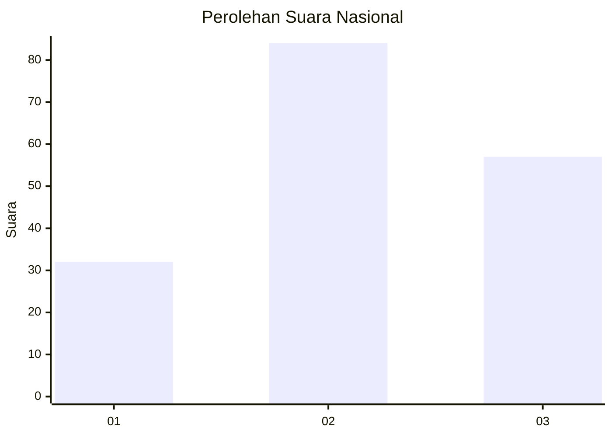
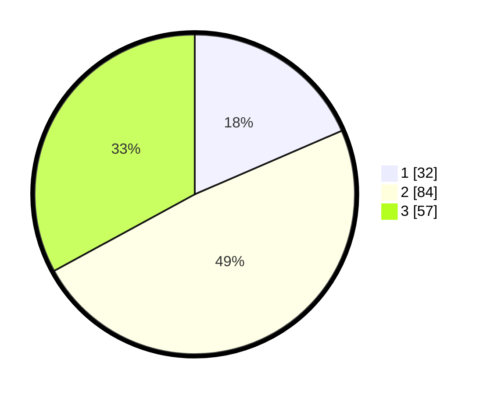

# Hasil

## Grafik

## Tabel

| No. | Nama Paslon    | Suara | Suara (raw) | Persentase |
|:--- |:-------------- | -----:| -----------:| ----------:|
| 1   | ANIES MUHAIMIN | 32    | [32][p-1]   | 18,50      |
| 2   | PRABOWO GIBRAN | 84    | [84][p-2]   | 48,55      |
| 3   | GANJAR MAHFUD  | 57    | [57][p-3]   | 32,95      |

[p-1]: https://github.com/gigit-pemilu/pemilu-2024/blob/main/pilpres/hitung-suara/sub/34-di-yogyakarta/sub/02-bantul/sub/05-bambanglipuro/sub/2001-sidomulyo/sub/021-tps/sub/paslon-1.txt
[p-2]: https://github.com/gigit-pemilu/pemilu-2024/blob/main/pilpres/hitung-suara/sub/34-di-yogyakarta/sub/02-bantul/sub/05-bambanglipuro/sub/2001-sidomulyo/sub/021-tps/sub/paslon-2.txt
[p-3]: https://github.com/gigit-pemilu/pemilu-2024/blob/main/pilpres/hitung-suara/sub/34-di-yogyakarta/sub/02-bantul/sub/05-bambanglipuro/sub/2001-sidomulyo/sub/021-tps/sub/paslon-3.txt

## Foto C Plano

https://sirekap-obj-formc.kpu.go.id/8377/pemilu/ppwp/34/02/05/20/01/3402052001021-20240215-024208--9827435e-a698-4c45-980d-2ff0aaa2ae57.jpg

https://sirekap-obj-formc.kpu.go.id/8377/pemilu/ppwp/34/02/05/20/01/3402052001021-20240214-194036--16eb93f0-40d0-4695-a14a-7d2e23bd8be8.jpg

https://sirekap-obj-formc.kpu.go.id/8377/pemilu/ppwp/34/02/05/20/01/3402052001021-20240215-024505--50e4cfbc-3d7e-4216-b36a-24f3809ed98f.jpg

## Metadata

| Key        | Value               |
| ---------- | ------------------- |
| Time Stamp | 2024-02-15 12:00:28 |

