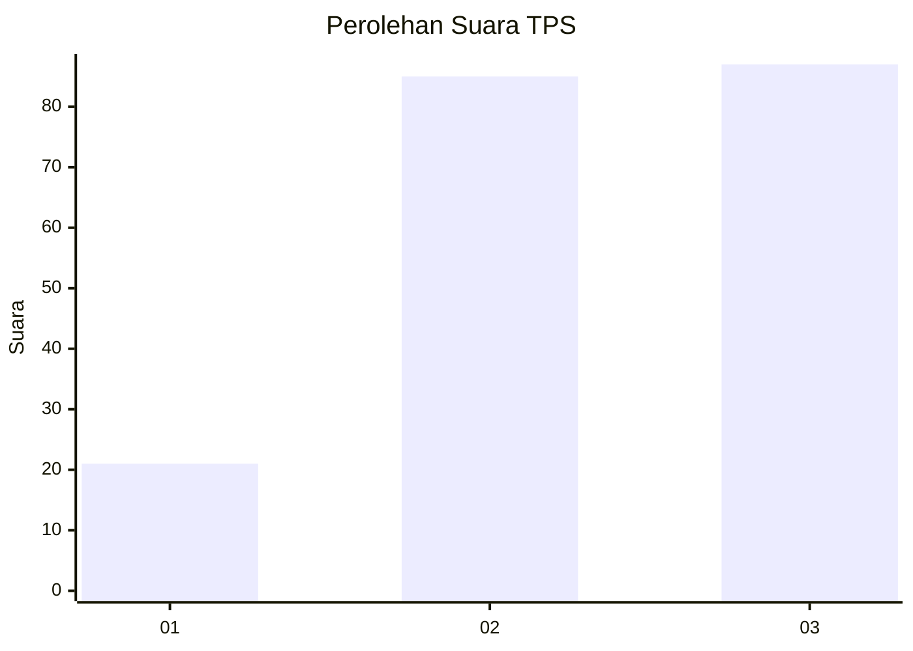
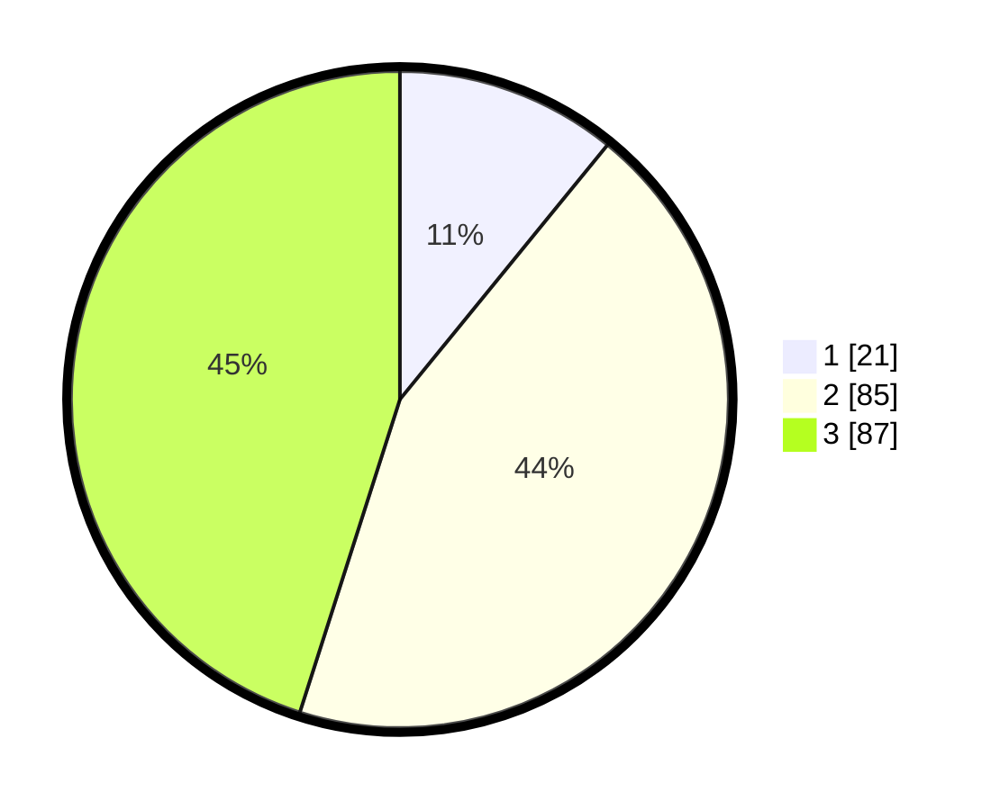

# Hasil

## Grafik

## Tabel

| No. | Nama Paslon    | Suara | Suara (raw) | Persentase |
|:--- |:-------------- | -----:| -----------:| ----------:|
| 1   | ANIES MUHAIMIN | 21    | [21][p-1]   | 10,88      |
| 2   | PRABOWO GIBRAN | 85    | [85][p-2]   | 44,04      |
| 3   | GANJAR MAHFUD  | 87    | [87][p-3]   | 45,08      |

[p-1]: https://github.com/gigit-pemilu/pemilu-2024-34-di-yogyakarta/blob/main/pilpres/hitung-suara/sub/34-di-yogyakarta/sub/02-bantul/sub/05-bambanglipuro/sub/2001-sidomulyo/sub/026-tps/sub/paslon-1.txt
[p-2]: https://github.com/gigit-pemilu/pemilu-2024-34-di-yogyakarta/blob/main/pilpres/hitung-suara/sub/34-di-yogyakarta/sub/02-bantul/sub/05-bambanglipuro/sub/2001-sidomulyo/sub/026-tps/sub/paslon-2.txt
[p-3]: https://github.com/gigit-pemilu/pemilu-2024-34-di-yogyakarta/blob/main/pilpres/hitung-suara/sub/34-di-yogyakarta/sub/02-bantul/sub/05-bambanglipuro/sub/2001-sidomulyo/sub/026-tps/sub/paslon-3.txt

## Foto C Plano

https://sirekap-obj-formc.kpu.go.id/0d06/pemilu/ppwp/34/02/05/20/01/3402052001026-20240215-193620--54ad8c95-83db-4538-9bff-d65919a14dc8.jpg

https://sirekap-obj-formc.kpu.go.id/0d06/pemilu/ppwp/34/02/05/20/01/3402052001026-20240215-194824--dd790416-6a2f-4fa1-9c18-9560b1950c47.jpg

https://sirekap-obj-formc.kpu.go.id/0d06/pemilu/ppwp/34/02/05/20/01/3402052001026-20240215-202939--51b20a2e-00a1-4ece-a06b-2b3102f14154.jpg

## Metadata

| Key        | Value               |
| ---------- | ------------------- |
| Time Stamp | 2024-02-24 22:31:28 |

