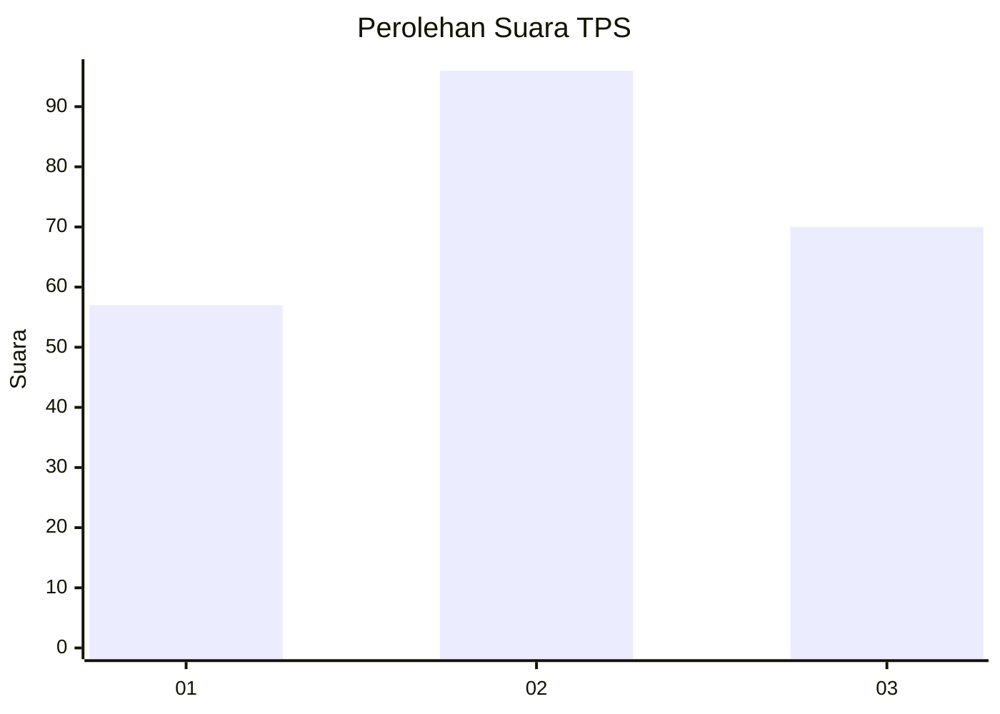
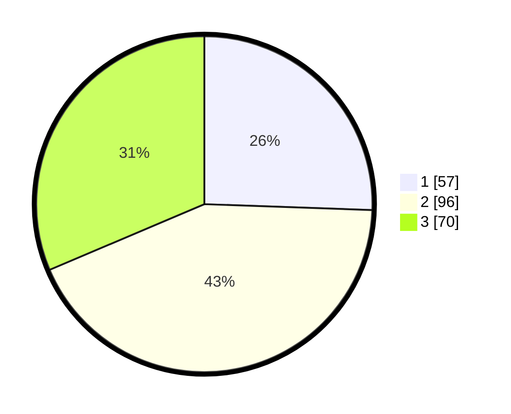

# Hasil

## Grafik

## Tabel

| No. | Nama Paslon    | Suara | Suara (raw) | Persentase |
|:--- |:-------------- | -----:| -----------:| ----------:|
| 1   | ANIES MUHAIMIN | 57    | [57][p-1]   | 25,56      |
| 2   | PRABOWO GIBRAN | 96    | [96][p-2]   | 43,05      |
| 3   | GANJAR MAHFUD  | 70    | [70][p-3]   | 31,39      |

[p-1]: https://github.com/gigit-pemilu/pemilu-2024-34-di-yogyakarta/blob/main/pilpres/hitung-suara/sub/34-di-yogyakarta/sub/02-bantul/sub/05-bambanglipuro/sub/2001-sidomulyo/sub/029-tps/sub/paslon-1.txt
[p-2]: https://github.com/gigit-pemilu/pemilu-2024-34-di-yogyakarta/blob/main/pilpres/hitung-suara/sub/34-di-yogyakarta/sub/02-bantul/sub/05-bambanglipuro/sub/2001-sidomulyo/sub/029-tps/sub/paslon-2.txt
[p-3]: https://github.com/gigit-pemilu/pemilu-2024-34-di-yogyakarta/blob/main/pilpres/hitung-suara/sub/34-di-yogyakarta/sub/02-bantul/sub/05-bambanglipuro/sub/2001-sidomulyo/sub/029-tps/sub/paslon-3.txt

## Foto C Plano

https://sirekap-obj-formc.kpu.go.id/170a/pemilu/ppwp/34/02/05/20/01/3402052001029-20240214-235444--934f1485-5b88-4b3e-83dc-b77a5a181346.jpg

https://sirekap-obj-formc.kpu.go.id/170a/pemilu/ppwp/34/02/05/20/01/3402052001029-20240214-235601--31b93a6d-eacd-4c2a-bc08-c9a0f3ac4683.jpg

https://sirekap-obj-formc.kpu.go.id/170a/pemilu/ppwp/34/02/05/20/01/3402052001029-20240214-235703--2d3a87f8-6fc3-408d-aba3-7a61f7585db3.jpg

## Metadata

| Key        | Value               |
| ---------- | ------------------- |
| Time Stamp | 2024-02-24 22:31:28 |

