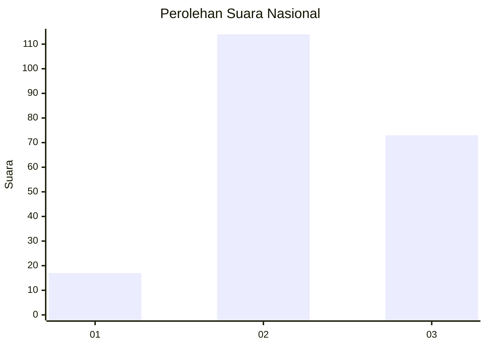
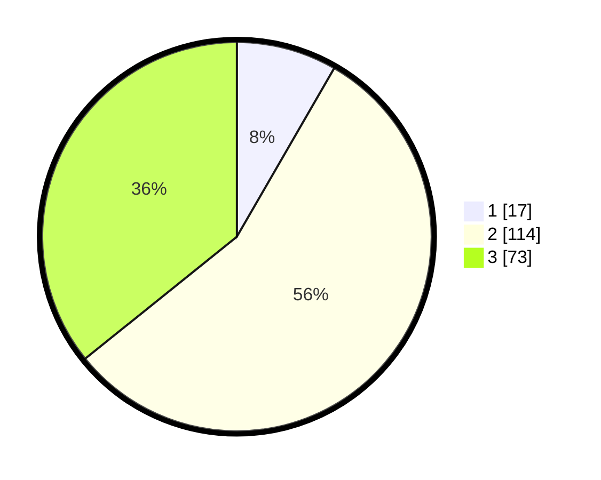

# Hasil

## Grafik

## Tabel

| No. | Nama Paslon    | Suara | Suara (raw) | Persentase |
|:--- |:-------------- | -----:| -----------:| ----------:|
| 1   | ANIES MUHAIMIN | 17    | [17][p-1]   | 8,33       |
| 2   | PRABOWO GIBRAN | 114   | [114][p-2]  | 55,88      |
| 3   | GANJAR MAHFUD  | 73    | [73][p-3]   | 35,78      |

[p-1]: https://github.com/gigit-pemilu/pemilu-2024/blob/main/pilpres/hitung-suara/sub/34-di-yogyakarta/sub/02-bantul/sub/05-bambanglipuro/sub/2001-sidomulyo/sub/034-tps/sub/paslon-1.txt
[p-2]: https://github.com/gigit-pemilu/pemilu-2024/blob/main/pilpres/hitung-suara/sub/34-di-yogyakarta/sub/02-bantul/sub/05-bambanglipuro/sub/2001-sidomulyo/sub/034-tps/sub/paslon-2.txt
[p-3]: https://github.com/gigit-pemilu/pemilu-2024/blob/main/pilpres/hitung-suara/sub/34-di-yogyakarta/sub/02-bantul/sub/05-bambanglipuro/sub/2001-sidomulyo/sub/034-tps/sub/paslon-3.txt

## Foto C Plano

https://sirekap-obj-formc.kpu.go.id/aa67/pemilu/ppwp/34/02/05/20/01/3402052001034-20240214-232249--80719a90-76db-4557-b89c-c5fa77805d81.jpg

https://sirekap-obj-formc.kpu.go.id/aa67/pemilu/ppwp/34/02/05/20/01/3402052001034-20240214-232406--7f7d659f-d6f6-416d-9ef2-c89a68c6177a.jpg

https://sirekap-obj-formc.kpu.go.id/aa67/pemilu/ppwp/34/02/05/20/01/3402052001034-20240214-232509--8ab4ecac-8038-4552-8aeb-a7edd80e8b45.jpg

## Metadata

| Key        | Value               |
| ---------- | ------------------- |
| Time Stamp | 2024-02-25 15:00:00 |

