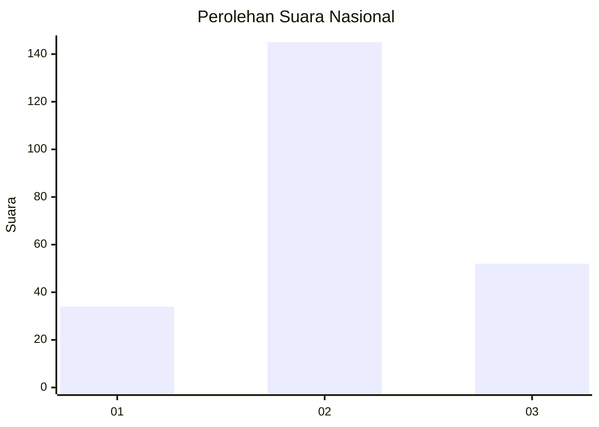
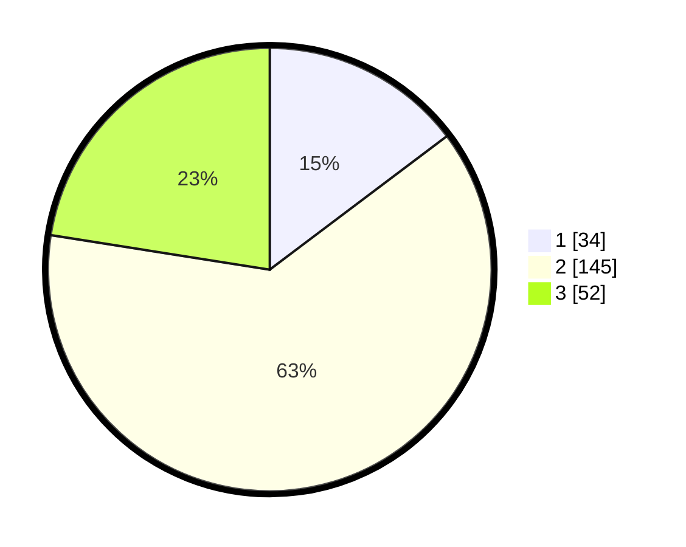

# Hasil

## Grafik

## Tabel

| No. | Nama Paslon    | Suara | Suara (raw) | Persentase |
|:--- |:-------------- | -----:| -----------:| ----------:|
| 1   | ANIES MUHAIMIN | 34    | [34][p-1]   | 14,72      |
| 2   | PRABOWO GIBRAN | 145   | [145][p-2]  | 62,77      |
| 3   | GANJAR MAHFUD  | 52    | [52][p-3]   | 22,51      |

[p-1]: https://github.com/gigit-pemilu/pemilu-2024/blob/main/pilpres/hitung-suara/sub/34-di-yogyakarta/sub/02-bantul/sub/05-bambanglipuro/sub/2001-sidomulyo/sub/039-tps/sub/paslon-1.txt
[p-2]: https://github.com/gigit-pemilu/pemilu-2024/blob/main/pilpres/hitung-suara/sub/34-di-yogyakarta/sub/02-bantul/sub/05-bambanglipuro/sub/2001-sidomulyo/sub/039-tps/sub/paslon-2.txt
[p-3]: https://github.com/gigit-pemilu/pemilu-2024/blob/main/pilpres/hitung-suara/sub/34-di-yogyakarta/sub/02-bantul/sub/05-bambanglipuro/sub/2001-sidomulyo/sub/039-tps/sub/paslon-3.txt

## Foto C Plano

https://sirekap-obj-formc.kpu.go.id/9865/pemilu/ppwp/34/02/05/20/01/3402052001039-20240214-214703--0267a4a6-43d3-4bc9-9489-e507d6f740e0.jpg

https://sirekap-obj-formc.kpu.go.id/9865/pemilu/ppwp/34/02/05/20/01/3402052001039-20240214-214721--37d57be2-5974-45e5-93ef-8814baccb01d.jpg

https://sirekap-obj-formc.kpu.go.id/9865/pemilu/ppwp/34/02/05/20/01/3402052001039-20240214-214726--2672a8f0-1981-418f-87ad-1d7df7987a97.jpg

## Metadata

| Key        | Value               |
| ---------- | ------------------- |
| Time Stamp | 2024-02-25 14:00:00 |

