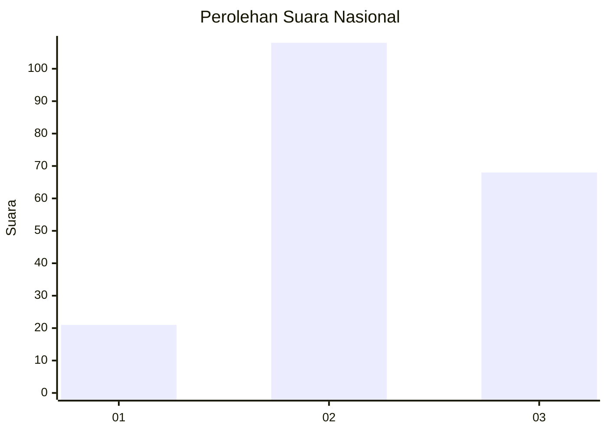
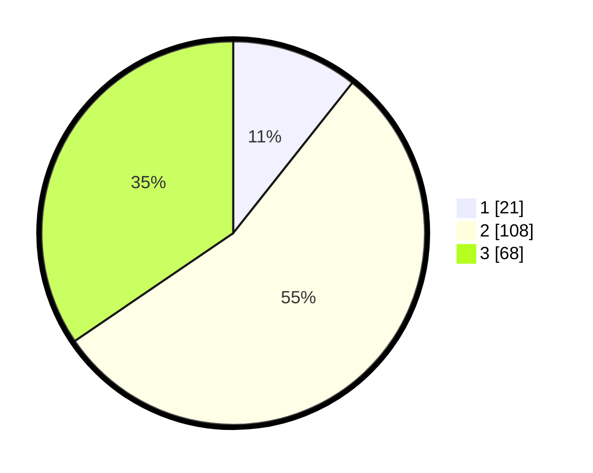

# Hasil

## Grafik

## Tabel

| No. | Nama Paslon    | Suara | Suara (raw) | Persentase |
|:--- |:-------------- | -----:| -----------:| ----------:|
| 1   | ANIES MUHAIMIN | 21    | [21][p-1]   | 10,66      |
| 2   | PRABOWO GIBRAN | 108   | [108][p-2]  | 54,82      |
| 3   | GANJAR MAHFUD  | 68    | [68][p-3]   | 34,52      |

[p-1]: https://github.com/gigit-pemilu/pemilu-2024/blob/main/pilpres/hitung-suara/sub/34-di-yogyakarta/sub/02-bantul/sub/05-bambanglipuro/sub/2001-sidomulyo/sub/047-tps/sub/paslon-1.txt
[p-2]: https://github.com/gigit-pemilu/pemilu-2024/blob/main/pilpres/hitung-suara/sub/34-di-yogyakarta/sub/02-bantul/sub/05-bambanglipuro/sub/2001-sidomulyo/sub/047-tps/sub/paslon-2.txt
[p-3]: https://github.com/gigit-pemilu/pemilu-2024/blob/main/pilpres/hitung-suara/sub/34-di-yogyakarta/sub/02-bantul/sub/05-bambanglipuro/sub/2001-sidomulyo/sub/047-tps/sub/paslon-3.txt

## Foto C Plano

https://sirekap-obj-formc.kpu.go.id/5764/pemilu/ppwp/34/02/05/20/01/3402052001047-20240214-231902--4a30716d-0836-4613-87b0-d85febe3eae1.jpg

https://sirekap-obj-formc.kpu.go.id/5764/pemilu/ppwp/34/02/05/20/01/3402052001047-20240214-232025--0a70c7f1-13c7-4a10-8e1d-bac7eb9e085c.jpg

https://sirekap-obj-formc.kpu.go.id/5764/pemilu/ppwp/34/02/05/20/01/3402052001047-20240214-232151--6ee0e333-1197-4007-8341-a0b88dd61f30.jpg

## Metadata

| Key        | Value               |
| ---------- | ------------------- |
| Time Stamp | 2024-02-24 22:31:28 |

