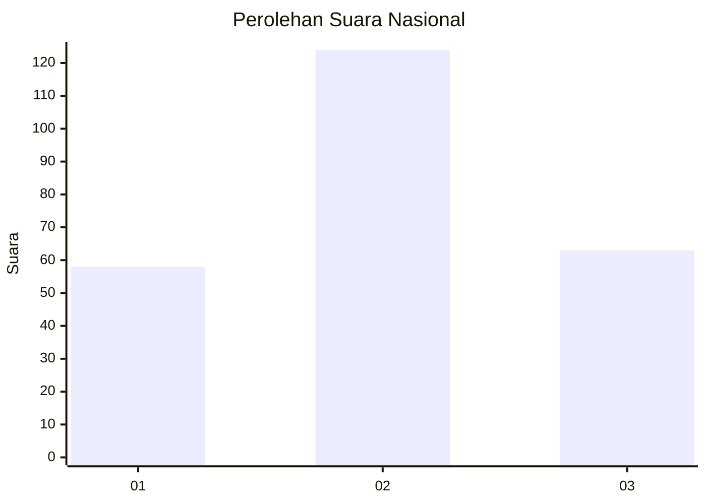
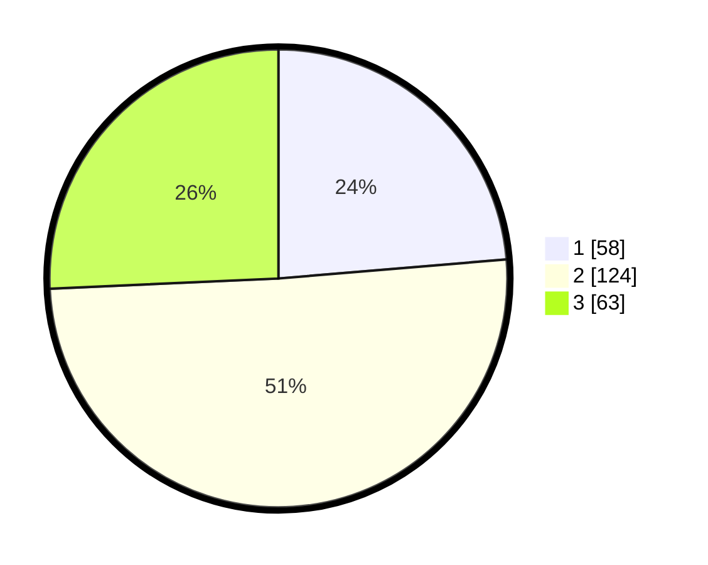

# Hasil

## Grafik

## Tabel

| No. | Nama Paslon    | Suara | Suara (raw) | Persentase |
|:--- |:-------------- | -----:| -----------:| ----------:|
| 1   | ANIES MUHAIMIN | 58    | [58][p-1]   | 23,67      |
| 2   | PRABOWO GIBRAN | 124   | [124][p-2]  | 50,61      |
| 3   | GANJAR MAHFUD  | 63    | [63][p-3]   | 25,71      |

[p-1]: https://github.com/gigit-pemilu/pemilu-2024/blob/main/pilpres/hitung-suara/sub/34-di-yogyakarta/sub/02-bantul/sub/05-bambanglipuro/sub/2002-mulyodadi/sub/004-tps/sub/paslon-1.txt
[p-2]: https://github.com/gigit-pemilu/pemilu-2024/blob/main/pilpres/hitung-suara/sub/34-di-yogyakarta/sub/02-bantul/sub/05-bambanglipuro/sub/2002-mulyodadi/sub/004-tps/sub/paslon-2.txt
[p-3]: https://github.com/gigit-pemilu/pemilu-2024/blob/main/pilpres/hitung-suara/sub/34-di-yogyakarta/sub/02-bantul/sub/05-bambanglipuro/sub/2002-mulyodadi/sub/004-tps/sub/paslon-3.txt

## Foto C Plano

https://sirekap-obj-formc.kpu.go.id/34e5/pemilu/ppwp/34/02/05/20/02/3402052002004-20240214-215105--c34cd707-c32e-4919-9176-db360cb04ccb.jpg

https://sirekap-obj-formc.kpu.go.id/34e5/pemilu/ppwp/34/02/05/20/02/3402052002004-20240214-200543--a02bd3f8-c285-4aae-8520-7b5917a02b2a.jpg

https://sirekap-obj-formc.kpu.go.id/34e5/pemilu/ppwp/34/02/05/20/02/3402052002004-20240214-200650--41fa1355-d70f-48f2-b7db-d30e553aea5d.jpg

## Metadata

| Key        | Value               |
| ---------- | ------------------- |
| Time Stamp | 2024-02-24 22:31:28 |

