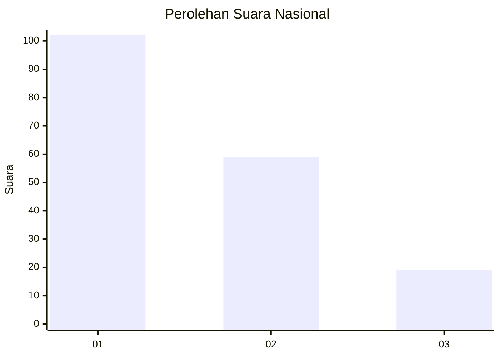
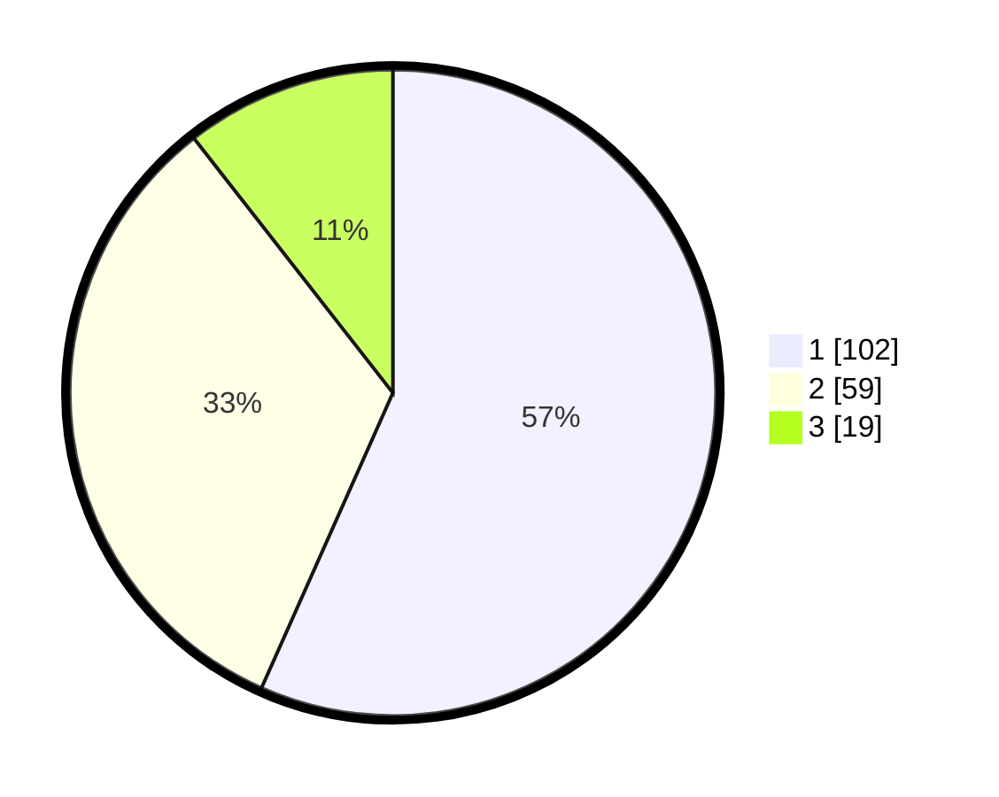

# Hasil

## Grafik

## Tabel

| No. | Nama Paslon    | Suara | Suara (raw) | Persentase |
|:--- |:-------------- | -----:| -----------:| ----------:|
| 1   | ANIES MUHAIMIN | 102   | [102][p-1]  | 56,67      |
| 2   | PRABOWO GIBRAN | 59    | [59][p-2]   | 32,78      |
| 3   | GANJAR MAHFUD  | 19    | [19][p-3]   | 10,56      |

[p-1]: https://github.com/gigit-pemilu/pemilu-2024/blob/main/pilpres/hitung-suara/sub/34-di-yogyakarta/sub/02-bantul/sub/05-bambanglipuro/sub/2002-mulyodadi/sub/005-tps/sub/paslon-1.txt
[p-2]: https://github.com/gigit-pemilu/pemilu-2024/blob/main/pilpres/hitung-suara/sub/34-di-yogyakarta/sub/02-bantul/sub/05-bambanglipuro/sub/2002-mulyodadi/sub/005-tps/sub/paslon-2.txt
[p-3]: https://github.com/gigit-pemilu/pemilu-2024/blob/main/pilpres/hitung-suara/sub/34-di-yogyakarta/sub/02-bantul/sub/05-bambanglipuro/sub/2002-mulyodadi/sub/005-tps/sub/paslon-3.txt

## Foto C Plano

https://sirekap-obj-formc.kpu.go.id/2a3b/pemilu/ppwp/34/02/05/20/02/3402052002005-20240214-141420--4d9e9b79-95c8-44ba-98e3-e5e0867a6a61.jpg

https://sirekap-obj-formc.kpu.go.id/2a3b/pemilu/ppwp/34/02/05/20/02/3402052002005-20240214-141353--c188eaff-5961-47ed-bed1-9972a17f5837.jpg

https://sirekap-obj-formc.kpu.go.id/2a3b/pemilu/ppwp/34/02/05/20/02/3402052002005-20240214-141120--ca34a273-0bc0-4c43-9c24-a827d0ac4914.jpg

## Metadata

| Key        | Value               |
| ---------- | ------------------- |
| Time Stamp | 2024-02-24 22:31:28 |

