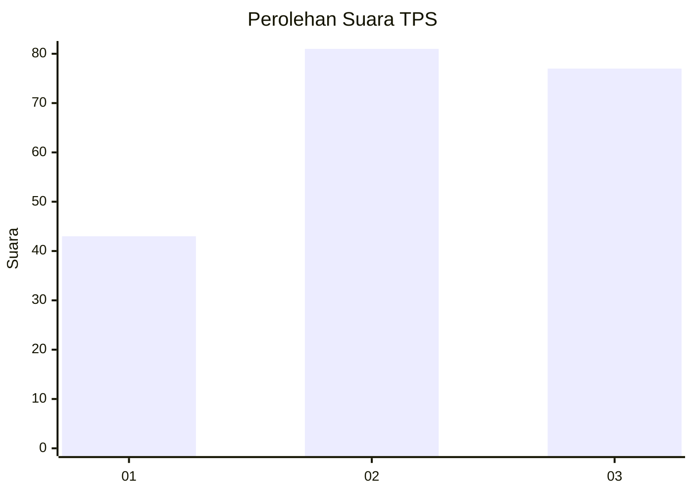
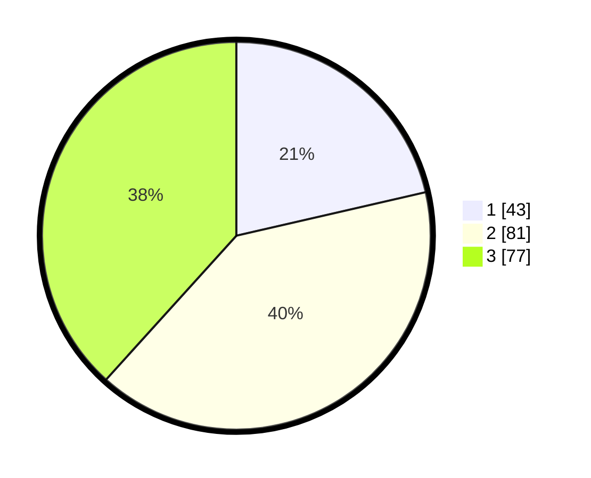

# Hasil

## Grafik

## Tabel

| No. | Nama Paslon    | Suara | Suara (raw) | Persentase |
|:--- |:-------------- | -----:| -----------:| ----------:|
| 1   | ANIES MUHAIMIN | 43    | [43][p-1]   | 21,39      |
| 2   | PRABOWO GIBRAN | 81    | [81][p-2]   | 40,30      |
| 3   | GANJAR MAHFUD  | 77    | [77][p-3]   | 38,31      |

[p-1]: https://github.com/gigit-pemilu/pemilu-2024-34-di-yogyakarta/blob/main/pilpres/hitung-suara/sub/34-di-yogyakarta/sub/02-bantul/sub/05-bambanglipuro/sub/2002-mulyodadi/sub/013-tps/sub/paslon-1.txt
[p-2]: https://github.com/gigit-pemilu/pemilu-2024-34-di-yogyakarta/blob/main/pilpres/hitung-suara/sub/34-di-yogyakarta/sub/02-bantul/sub/05-bambanglipuro/sub/2002-mulyodadi/sub/013-tps/sub/paslon-2.txt
[p-3]: https://github.com/gigit-pemilu/pemilu-2024-34-di-yogyakarta/blob/main/pilpres/hitung-suara/sub/34-di-yogyakarta/sub/02-bantul/sub/05-bambanglipuro/sub/2002-mulyodadi/sub/013-tps/sub/paslon-3.txt

## Foto C Plano

https://sirekap-obj-formc.kpu.go.id/53b6/pemilu/ppwp/34/02/05/20/02/3402052002013-20240214-204637--324aace1-0d0b-4127-a8b7-92ae2ad2365d.jpg

https://sirekap-obj-formc.kpu.go.id/53b6/pemilu/ppwp/34/02/05/20/02/3402052002013-20240214-215228--37228451-e742-4bc6-a95f-eac22a249f66.jpg

https://sirekap-obj-formc.kpu.go.id/53b6/pemilu/ppwp/34/02/05/20/02/3402052002013-20240214-214726--5ec3b485-f6c8-426a-b3d7-3033fbd5fed2.jpg

## Metadata

| Key        | Value               |
| ---------- | ------------------- |
| Time Stamp | 2024-02-15 16:30:25 |

