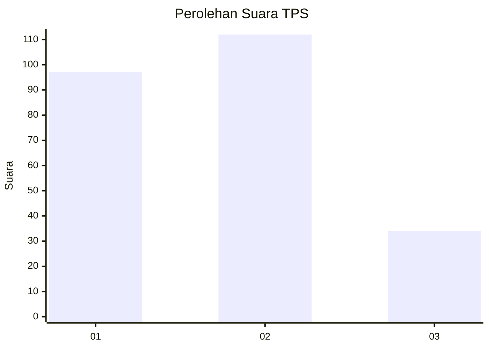
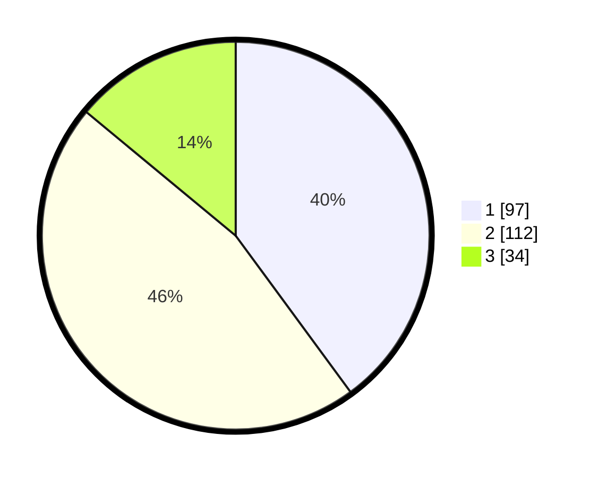

# Hasil

## Grafik

## Tabel

| No. | Nama Paslon    | Suara | Suara (raw) | Persentase |
|:--- |:-------------- | -----:| -----------:| ----------:|
| 1   | ANIES MUHAIMIN | 97    | [97][p-1]   | 39,92      |
| 2   | PRABOWO GIBRAN | 112   | [112][p-2]  | 46,09      |
| 3   | GANJAR MAHFUD  | 34    | [34][p-3]   | 13,99      |

[p-1]: https://github.com/gigit-pemilu/pemilu-2024-34-di-yogyakarta/blob/main/pilpres/hitung-suara/sub/34-di-yogyakarta/sub/02-bantul/sub/05-bambanglipuro/sub/2002-mulyodadi/sub/016-tps/sub/paslon-1.txt
[p-2]: https://github.com/gigit-pemilu/pemilu-2024-34-di-yogyakarta/blob/main/pilpres/hitung-suara/sub/34-di-yogyakarta/sub/02-bantul/sub/05-bambanglipuro/sub/2002-mulyodadi/sub/016-tps/sub/paslon-2.txt
[p-3]: https://github.com/gigit-pemilu/pemilu-2024-34-di-yogyakarta/blob/main/pilpres/hitung-suara/sub/34-di-yogyakarta/sub/02-bantul/sub/05-bambanglipuro/sub/2002-mulyodadi/sub/016-tps/sub/paslon-3.txt

## Foto C Plano

https://sirekap-obj-formc.kpu.go.id/d30a/pemilu/ppwp/34/02/05/20/02/3402052002016-20240215-002256--4e162090-7a3e-438f-b977-eeb958c8aaff.jpg

https://sirekap-obj-formc.kpu.go.id/d30a/pemilu/ppwp/34/02/05/20/02/3402052002016-20240214-201021--9e9968aa-146d-44e2-ac3f-64ad85ed75d6.jpg

https://sirekap-obj-formc.kpu.go.id/d30a/pemilu/ppwp/34/02/05/20/02/3402052002016-20240214-201218--8a01f7bc-0d75-4702-8f83-cbe2fb65a83e.jpg

## Metadata

| Key        | Value               |
| ---------- | ------------------- |
| Time Stamp | 2024-02-24 22:31:28 |

