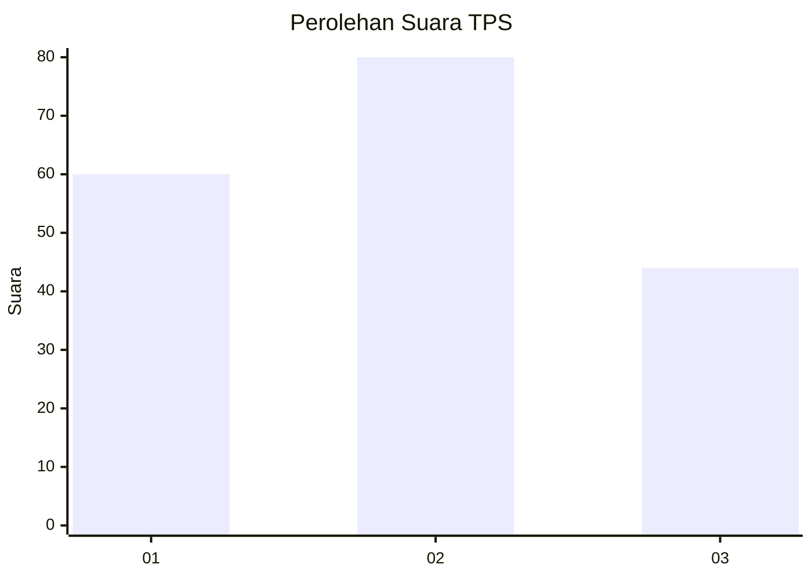
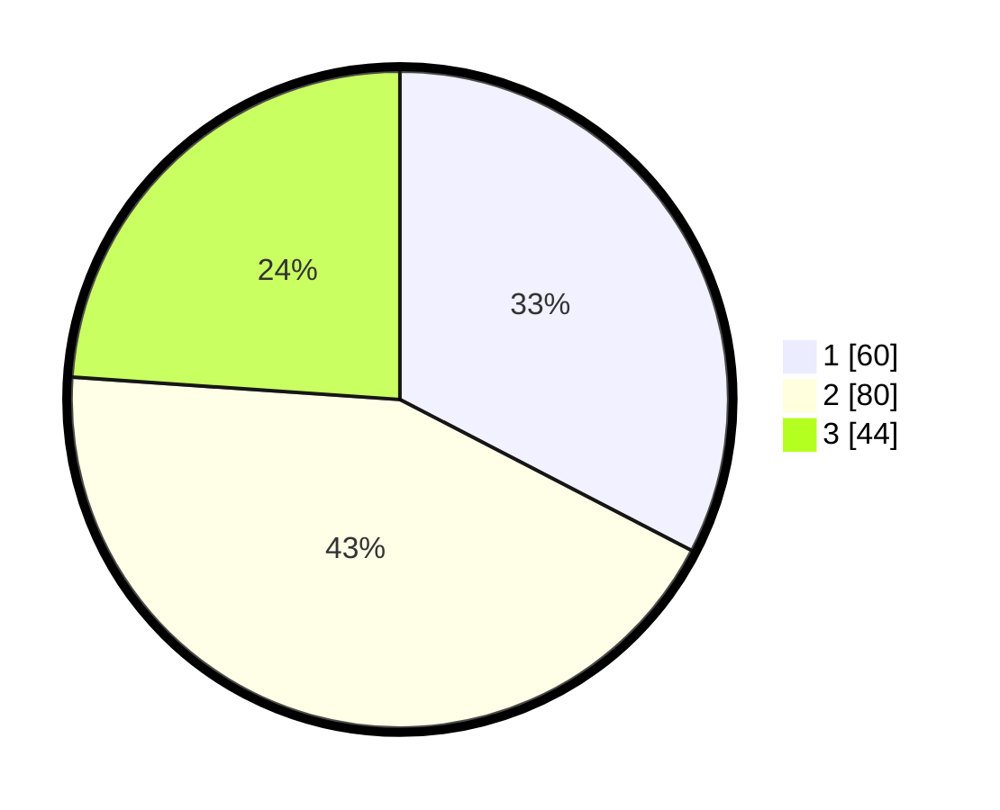

# Hasil

## Grafik

## Tabel

| No. | Nama Paslon    | Suara | Suara (raw) | Persentase |
|:--- |:-------------- | -----:| -----------:| ----------:|
| 1   | ANIES MUHAIMIN | 60    | [60][p-1]   | 32,61      |
| 2   | PRABOWO GIBRAN | 80    | [80][p-2]   | 43,48      |
| 3   | GANJAR MAHFUD  | 44    | [44][p-3]   | 23,91      |

[p-1]: https://github.com/gigit-pemilu/pemilu-2024-34-di-yogyakarta/blob/main/pilpres/hitung-suara/sub/34-di-yogyakarta/sub/02-bantul/sub/05-bambanglipuro/sub/2002-mulyodadi/sub/017-tps/sub/paslon-1.txt
[p-2]: https://github.com/gigit-pemilu/pemilu-2024-34-di-yogyakarta/blob/main/pilpres/hitung-suara/sub/34-di-yogyakarta/sub/02-bantul/sub/05-bambanglipuro/sub/2002-mulyodadi/sub/017-tps/sub/paslon-2.txt
[p-3]: https://github.com/gigit-pemilu/pemilu-2024-34-di-yogyakarta/blob/main/pilpres/hitung-suara/sub/34-di-yogyakarta/sub/02-bantul/sub/05-bambanglipuro/sub/2002-mulyodadi/sub/017-tps/sub/paslon-3.txt

## Foto C Plano

https://sirekap-obj-formc.kpu.go.id/1b0b/pemilu/ppwp/34/02/05/20/02/3402052002017-20240215-003036--e84ee863-4ca7-431b-bf85-777f36adc248.jpg

https://sirekap-obj-formc.kpu.go.id/1b0b/pemilu/ppwp/34/02/05/20/02/3402052002017-20240215-003136--e1f66775-d7d4-4cfc-aa07-d864d9001d77.jpg

https://sirekap-obj-formc.kpu.go.id/1b0b/pemilu/ppwp/34/02/05/20/02/3402052002017-20240215-003256--85683118-6fe4-4655-ae52-e431c5fa33e5.jpg

## Metadata

| Key        | Value               |
| ---------- | ------------------- |
| Time Stamp | 2024-02-24 22:31:28 |

