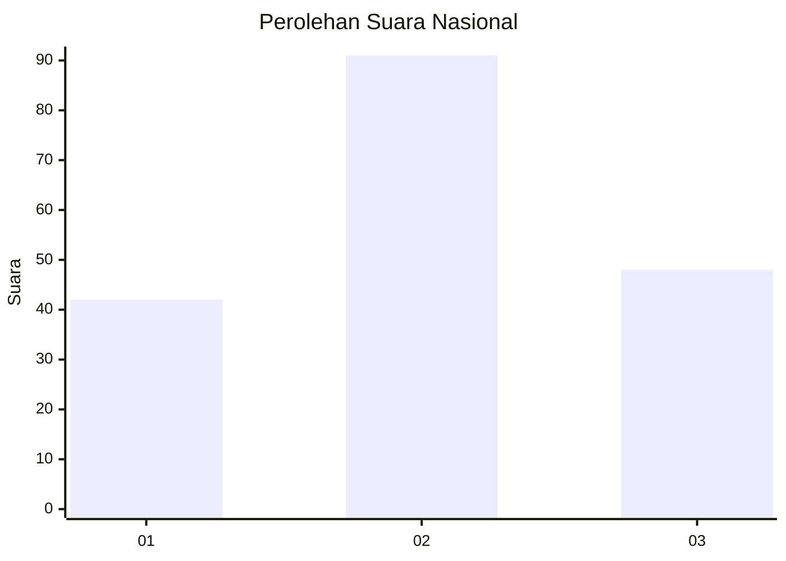
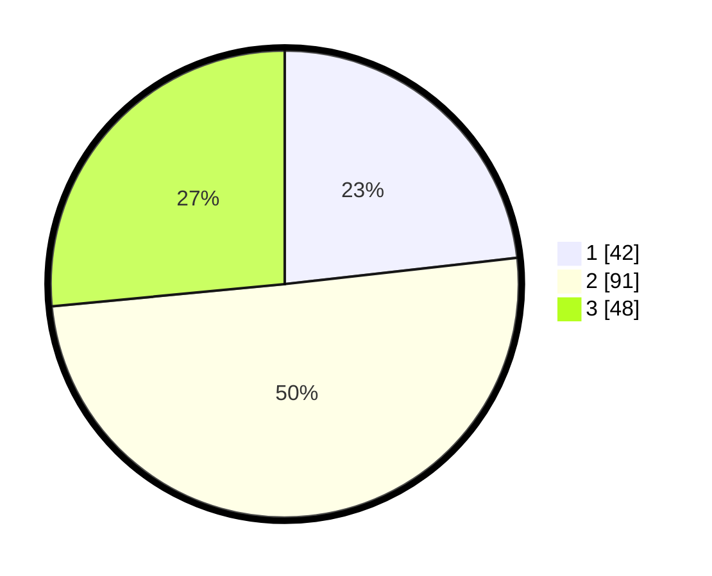

# Hasil

## Grafik

## Tabel

| No. | Nama Paslon    | Suara | Suara (raw) | Persentase |
|:--- |:-------------- | -----:| -----------:| ----------:|
| 1   | ANIES MUHAIMIN | 42    | [42][p-1]   | 23,20      |
| 2   | PRABOWO GIBRAN | 91    | [91][p-2]   | 50,28      |
| 3   | GANJAR MAHFUD  | 48    | [48][p-3]   | 26,52      |

[p-1]: https://github.com/gigit-pemilu/pemilu-2024/blob/main/pilpres/hitung-suara/sub/34-di-yogyakarta/sub/02-bantul/sub/05-bambanglipuro/sub/2002-mulyodadi/sub/026-tps/sub/paslon-1.txt
[p-2]: https://github.com/gigit-pemilu/pemilu-2024/blob/main/pilpres/hitung-suara/sub/34-di-yogyakarta/sub/02-bantul/sub/05-bambanglipuro/sub/2002-mulyodadi/sub/026-tps/sub/paslon-2.txt
[p-3]: https://github.com/gigit-pemilu/pemilu-2024/blob/main/pilpres/hitung-suara/sub/34-di-yogyakarta/sub/02-bantul/sub/05-bambanglipuro/sub/2002-mulyodadi/sub/026-tps/sub/paslon-3.txt

## Foto C Plano

https://sirekap-obj-formc.kpu.go.id/5578/pemilu/ppwp/34/02/05/20/02/3402052002026-20240215-002637--cb6f9807-8656-4b89-be70-d6565a572a84.jpg

https://sirekap-obj-formc.kpu.go.id/5578/pemilu/ppwp/34/02/05/20/02/3402052002026-20240215-002554--78db56ad-0d80-4d5c-836a-c41b0a7cf50e.jpg

https://sirekap-obj-formc.kpu.go.id/5578/pemilu/ppwp/34/02/05/20/02/3402052002026-20240214-220729--bac3c858-dbad-4b45-85b1-bbfe76911175.jpg

## Metadata

| Key        | Value               |
| ---------- | ------------------- |
| Time Stamp | 2024-02-24 22:31:28 |

