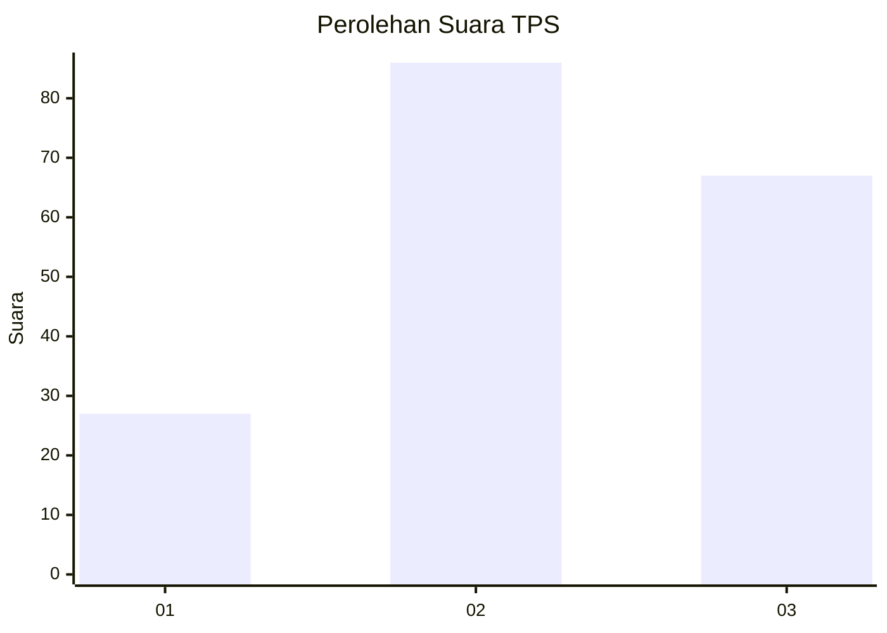
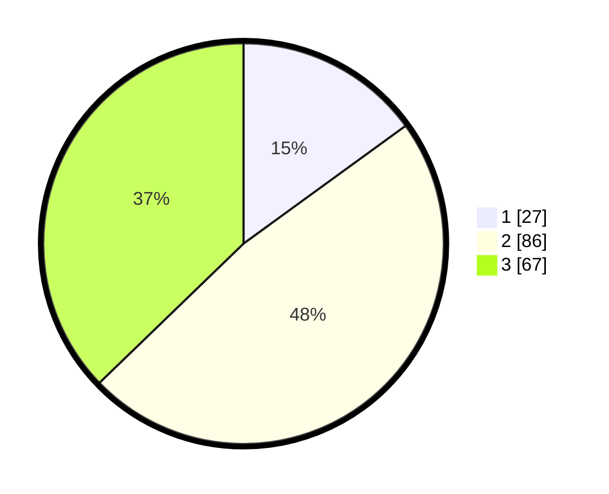

# Hasil

## Grafik

## Tabel

| No. | Nama Paslon    | Suara | Suara (raw) | Persentase |
|:--- |:-------------- | -----:| -----------:| ----------:|
| 1   | ANIES MUHAIMIN | 27    | [27][p-1]   | 15,00      |
| 2   | PRABOWO GIBRAN | 86    | [86][p-2]   | 47,78      |
| 3   | GANJAR MAHFUD  | 67    | [67][p-3]   | 37,22      |

[p-1]: https://github.com/gigit-pemilu/pemilu-2024-34-di-yogyakarta/blob/main/pilpres/hitung-suara/sub/34-di-yogyakarta/sub/02-bantul/sub/05-bambanglipuro/sub/2002-mulyodadi/sub/032-tps/sub/paslon-1.txt
[p-2]: https://github.com/gigit-pemilu/pemilu-2024-34-di-yogyakarta/blob/main/pilpres/hitung-suara/sub/34-di-yogyakarta/sub/02-bantul/sub/05-bambanglipuro/sub/2002-mulyodadi/sub/032-tps/sub/paslon-2.txt
[p-3]: https://github.com/gigit-pemilu/pemilu-2024-34-di-yogyakarta/blob/main/pilpres/hitung-suara/sub/34-di-yogyakarta/sub/02-bantul/sub/05-bambanglipuro/sub/2002-mulyodadi/sub/032-tps/sub/paslon-3.txt

## Foto C Plano

https://sirekap-obj-formc.kpu.go.id/2cb5/pemilu/ppwp/34/02/05/20/02/3402052002032-20240215-031920--9f017f7c-f247-4891-88aa-8095eed4fb41.jpg

https://sirekap-obj-formc.kpu.go.id/2cb5/pemilu/ppwp/34/02/05/20/02/3402052002032-20240215-032114--f20cece9-f1dc-409c-8022-139ed4dcc4be.jpg

https://sirekap-obj-formc.kpu.go.id/2cb5/pemilu/ppwp/34/02/05/20/02/3402052002032-20240215-032222--01b71f5c-0123-4b03-a8de-574a0edc509f.jpg

## Metadata

| Key        | Value               |
| ---------- | ------------------- |
| Time Stamp | 2024-02-24 22:31:28 |

