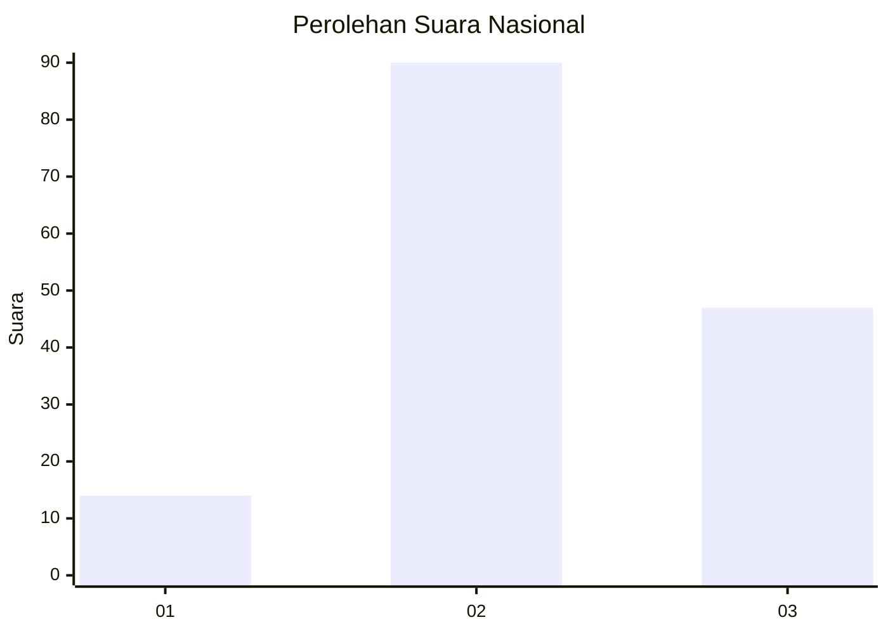
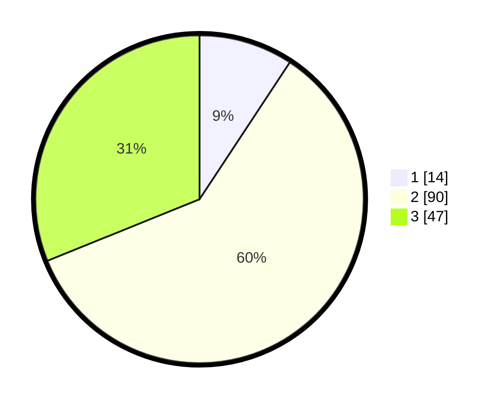

# Hasil

## Grafik

## Tabel

| No. | Nama Paslon    | Suara | Suara (raw) | Persentase |
|:--- |:-------------- | -----:| -----------:| ----------:|
| 1   | ANIES MUHAIMIN | 14    | [14][p-1]   | 9,27       |
| 2   | PRABOWO GIBRAN | 90    | [90][p-2]   | 59,60      |
| 3   | GANJAR MAHFUD  | 47    | [47][p-3]   | 31,13      |

[p-1]: https://github.com/gigit-pemilu/pemilu-2024/blob/main/pilpres/hitung-suara/sub/34-di-yogyakarta/sub/02-bantul/sub/05-bambanglipuro/sub/2002-mulyodadi/sub/038-tps/sub/paslon-1.txt
[p-2]: https://github.com/gigit-pemilu/pemilu-2024/blob/main/pilpres/hitung-suara/sub/34-di-yogyakarta/sub/02-bantul/sub/05-bambanglipuro/sub/2002-mulyodadi/sub/038-tps/sub/paslon-2.txt
[p-3]: https://github.com/gigit-pemilu/pemilu-2024/blob/main/pilpres/hitung-suara/sub/34-di-yogyakarta/sub/02-bantul/sub/05-bambanglipuro/sub/2002-mulyodadi/sub/038-tps/sub/paslon-3.txt

## Foto C Plano

https://sirekap-obj-formc.kpu.go.id/b42c/pemilu/ppwp/34/02/05/20/02/3402052002038-20240214-233641--28bbeeb7-5604-4618-809c-25c6c237fd27.jpg

https://sirekap-obj-formc.kpu.go.id/b42c/pemilu/ppwp/34/02/05/20/02/3402052002038-20240214-233716--c9eec4ce-189e-4c34-8bd2-04c96e6176ef.jpg

https://sirekap-obj-formc.kpu.go.id/b42c/pemilu/ppwp/34/02/05/20/02/3402052002038-20240214-233722--ef59692a-0b19-435a-b8c4-02c809b95c48.jpg

## Metadata

| Key        | Value               |
| ---------- | ------------------- |
| Time Stamp | 2024-02-24 22:31:28 |

