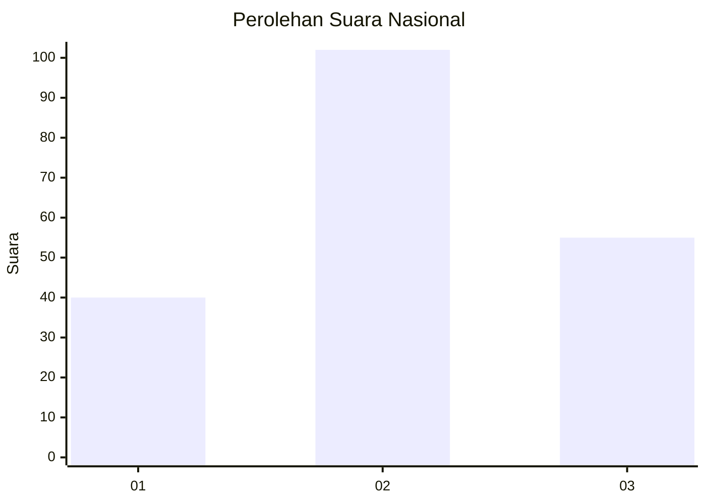
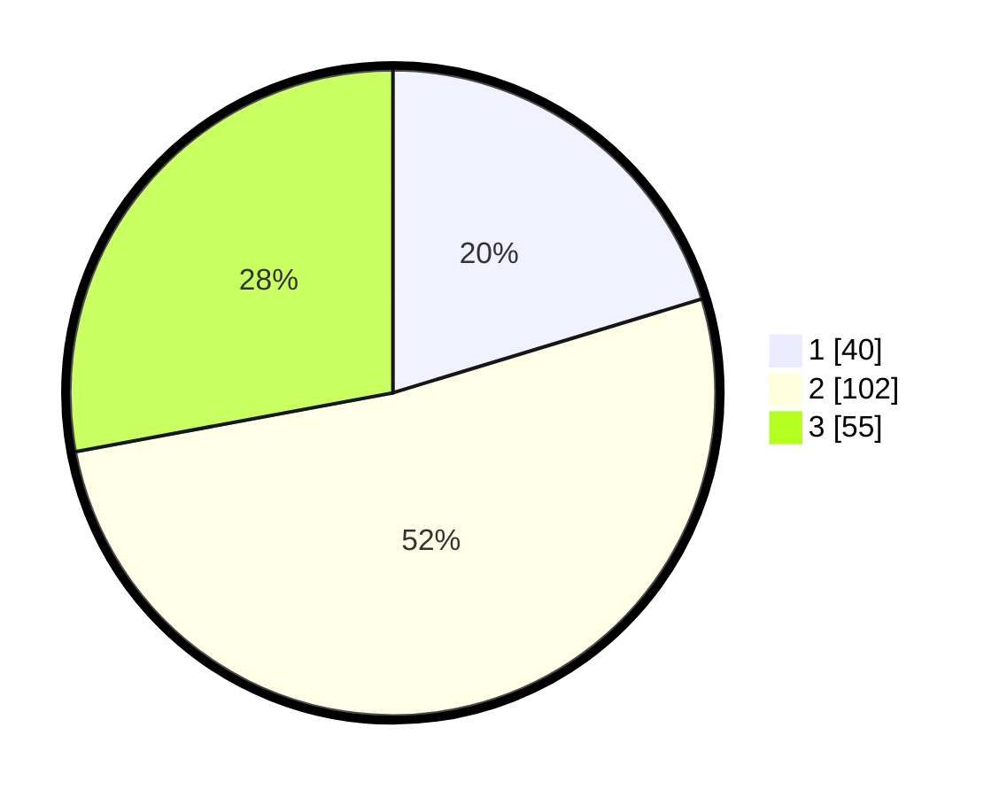

# Hasil

## Grafik

## Tabel

| No. | Nama Paslon    | Suara | Suara (raw) | Persentase |
|:--- |:-------------- | -----:| -----------:| ----------:|
| 1   | ANIES MUHAIMIN | 40    | [40][p-1]   | 20,30      |
| 2   | PRABOWO GIBRAN | 102   | [102][p-2]  | 51,78      |
| 3   | GANJAR MAHFUD  | 55    | [55][p-3]   | 27,92      |

[p-1]: https://github.com/gigit-pemilu/pemilu-2024/blob/main/pilpres/hitung-suara/sub/34-di-yogyakarta/sub/02-bantul/sub/05-bambanglipuro/sub/2002-mulyodadi/sub/040-tps/sub/paslon-1.txt
[p-2]: https://github.com/gigit-pemilu/pemilu-2024/blob/main/pilpres/hitung-suara/sub/34-di-yogyakarta/sub/02-bantul/sub/05-bambanglipuro/sub/2002-mulyodadi/sub/040-tps/sub/paslon-2.txt
[p-3]: https://github.com/gigit-pemilu/pemilu-2024/blob/main/pilpres/hitung-suara/sub/34-di-yogyakarta/sub/02-bantul/sub/05-bambanglipuro/sub/2002-mulyodadi/sub/040-tps/sub/paslon-3.txt

## Foto C Plano

https://sirekap-obj-formc.kpu.go.id/b6c1/pemilu/ppwp/34/02/05/20/02/3402052002040-20240214-141643--274847e2-cd93-49ff-84e5-7ec7a6a3a52f.jpg

https://sirekap-obj-formc.kpu.go.id/b6c1/pemilu/ppwp/34/02/05/20/02/3402052002040-20240214-141429--bcede10e-c31d-4f1d-9ac2-1a4a294b6b24.jpg

https://sirekap-obj-formc.kpu.go.id/b6c1/pemilu/ppwp/34/02/05/20/02/3402052002040-20240214-141746--a8f1d7ec-b4ed-418a-9c2e-347fc3968d09.jpg

## Metadata

| Key        | Value               |
| ---------- | ------------------- |
| Time Stamp | 2024-02-24 22:31:28 |

