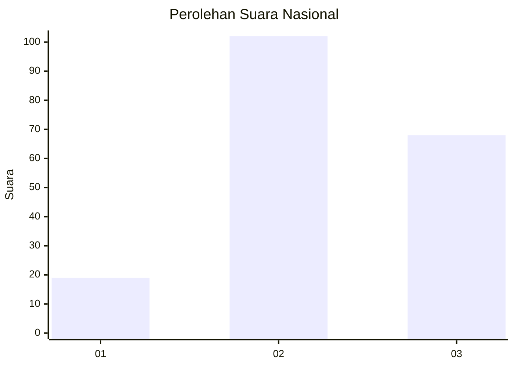
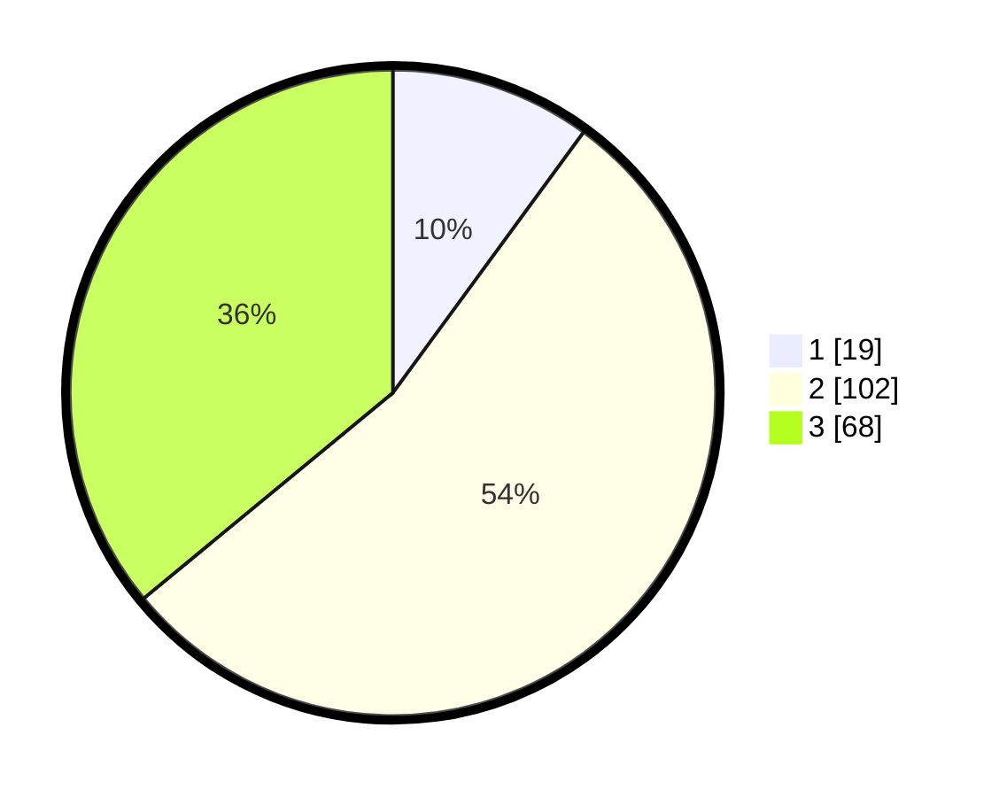

# Hasil

## Grafik

## Tabel

| No. | Nama Paslon    | Suara | Suara (raw) | Persentase |
|:--- |:-------------- | -----:| -----------:| ----------:|
| 1   | ANIES MUHAIMIN | 19    | [19][p-1]   | 10,05      |
| 2   | PRABOWO GIBRAN | 102   | [102][p-2]  | 53,97      |
| 3   | GANJAR MAHFUD  | 68    | [68][p-3]   | 35,98      |

[p-1]: https://github.com/gigit-pemilu/pemilu-2024/blob/main/pilpres/hitung-suara/sub/34-di-yogyakarta/sub/02-bantul/sub/05-bambanglipuro/sub/2003-sumbermulyo/sub/001-tps/sub/paslon-1.txt
[p-2]: https://github.com/gigit-pemilu/pemilu-2024/blob/main/pilpres/hitung-suara/sub/34-di-yogyakarta/sub/02-bantul/sub/05-bambanglipuro/sub/2003-sumbermulyo/sub/001-tps/sub/paslon-2.txt
[p-3]: https://github.com/gigit-pemilu/pemilu-2024/blob/main/pilpres/hitung-suara/sub/34-di-yogyakarta/sub/02-bantul/sub/05-bambanglipuro/sub/2003-sumbermulyo/sub/001-tps/sub/paslon-3.txt

## Foto C Plano

https://sirekap-obj-formc.kpu.go.id/d3bc/pemilu/ppwp/34/02/05/20/03/3402052003001-20240214-222003--5209d1b0-8e82-48e7-9bcf-2c401425cf7d.jpg

https://sirekap-obj-formc.kpu.go.id/d3bc/pemilu/ppwp/34/02/05/20/03/3402052003001-20240214-195905--b0d0a6f4-867e-40ad-9aca-103a1095ab0c.jpg

https://sirekap-obj-formc.kpu.go.id/d3bc/pemilu/ppwp/34/02/05/20/03/3402052003001-20240214-220055--43f8f7f1-4544-4671-96f5-29c7fdf5fa75.jpg

## Metadata

| Key        | Value               |
| ---------- | ------------------- |
| Time Stamp | 2024-02-15 09:00:24 |

