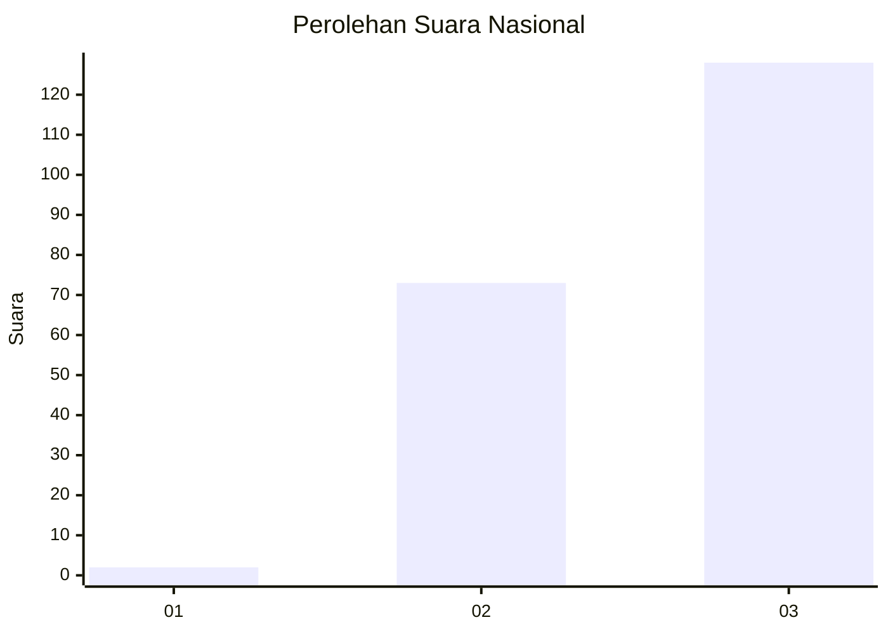
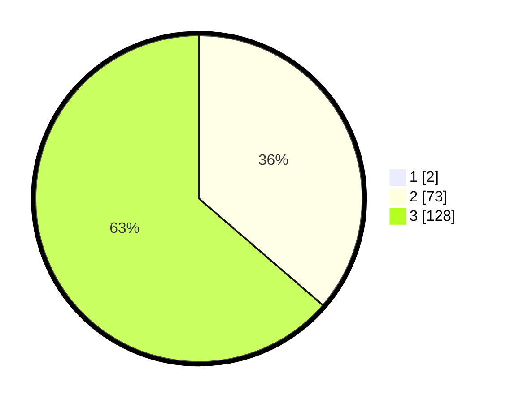

# Hasil

## Grafik

## Tabel

| No. | Nama Paslon    | Suara | Suara (raw) | Persentase |
|:--- |:-------------- | -----:| -----------:| ----------:|
| 1   | ANIES MUHAIMIN | 2     | [2][p-1]    | 0,99       |
| 2   | PRABOWO GIBRAN | 73    | [73][p-2]   | 35,96      |
| 3   | GANJAR MAHFUD  | 128   | [128][p-3]  | 63,05      |

[p-1]: https://github.com/gigit-pemilu/pemilu-2024/blob/main/pilpres/hitung-suara/sub/34-di-yogyakarta/sub/02-bantul/sub/05-bambanglipuro/sub/2003-sumbermulyo/sub/002-tps/sub/paslon-1.txt
[p-2]: https://github.com/gigit-pemilu/pemilu-2024/blob/main/pilpres/hitung-suara/sub/34-di-yogyakarta/sub/02-bantul/sub/05-bambanglipuro/sub/2003-sumbermulyo/sub/002-tps/sub/paslon-2.txt
[p-3]: https://github.com/gigit-pemilu/pemilu-2024/blob/main/pilpres/hitung-suara/sub/34-di-yogyakarta/sub/02-bantul/sub/05-bambanglipuro/sub/2003-sumbermulyo/sub/002-tps/sub/paslon-3.txt

## Foto C Plano

https://sirekap-obj-formc.kpu.go.id/a357/pemilu/ppwp/34/02/05/20/03/3402052003002-20240214-205539--11f48bf7-e457-46ce-9c99-956f294dc977.jpg

https://sirekap-obj-formc.kpu.go.id/a357/pemilu/ppwp/34/02/05/20/03/3402052003002-20240214-155143--e43e5aef-7572-4db9-a8ad-0376c4d8023e.jpg

https://sirekap-obj-formc.kpu.go.id/a357/pemilu/ppwp/34/02/05/20/03/3402052003002-20240214-215847--fd1c24fe-d24d-4943-8061-288c69fdf05d.jpg

## Metadata

| Key        | Value               |
| ---------- | ------------------- |
| Time Stamp | 2024-02-15 00:41:44 |

