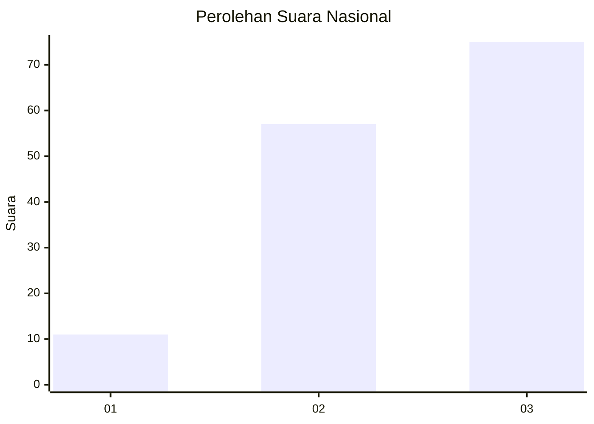
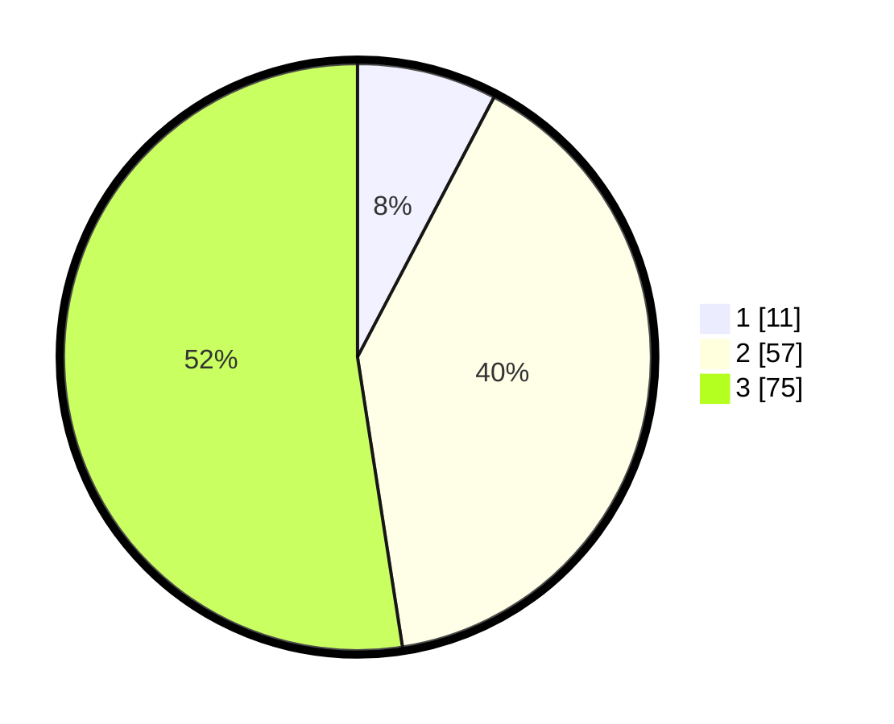

# Hasil

## Grafik

## Tabel

| No. | Nama Paslon    | Suara | Suara (raw) | Persentase |
|:--- |:-------------- | -----:| -----------:| ----------:|
| 1   | ANIES MUHAIMIN | 11    | [11][p-1]   | 7,69       |
| 2   | PRABOWO GIBRAN | 57    | [57][p-2]   | 39,86      |
| 3   | GANJAR MAHFUD  | 75    | [75][p-3]   | 52,45      |

[p-1]: https://github.com/gigit-pemilu/pemilu-2024/blob/main/pilpres/hitung-suara/sub/34-di-yogyakarta/sub/02-bantul/sub/05-bambanglipuro/sub/2003-sumbermulyo/sub/004-tps/sub/paslon-1.txt
[p-2]: https://github.com/gigit-pemilu/pemilu-2024/blob/main/pilpres/hitung-suara/sub/34-di-yogyakarta/sub/02-bantul/sub/05-bambanglipuro/sub/2003-sumbermulyo/sub/004-tps/sub/paslon-2.txt
[p-3]: https://github.com/gigit-pemilu/pemilu-2024/blob/main/pilpres/hitung-suara/sub/34-di-yogyakarta/sub/02-bantul/sub/05-bambanglipuro/sub/2003-sumbermulyo/sub/004-tps/sub/paslon-3.txt

## Foto C Plano

https://sirekap-obj-formc.kpu.go.id/d91f/pemilu/ppwp/34/02/05/20/03/3402052003004-20240214-141050--a8483943-ba41-4fbb-b8d3-6fa715ea138d.jpg

https://sirekap-obj-formc.kpu.go.id/d91f/pemilu/ppwp/34/02/05/20/03/3402052003004-20240214-141201--ec9cfe63-1ee9-4242-b5ad-3cd63cd3a105.jpg

https://sirekap-obj-formc.kpu.go.id/d91f/pemilu/ppwp/34/02/05/20/03/3402052003004-20240214-162209--e6413969-4077-4bb6-8c8e-15e6b9fd75d1.jpg

## Metadata

| Key        | Value               |
| ---------- | ------------------- |
| Time Stamp | 2024-02-14 21:46:01 |

## DATA PEMILIH TETAP

Jumlah pemilih dalam DPT: **174**.
 * L: **85**.
 * P: **89**.

## DATA PENGGUNA HAK PILIH

Jumlah pengguna hak pilih dalam DPT: **141**.
 * L: **68**.
 * P: **73**.

Jumlah pengguna hak pilih dalam DPTb: **4**.
 * L: **1**.
 * P: **3**.

Jumlah pengguna hak pilih dalam DPK: **1**.
 * L: **0**.
 * P: **1**.

Jumlah pengguna hak pilih: **146**.
 * L: **69**.
 * P: **77**.

## JUMLAH SUARA SAH DAN TIDAK SAH

JUMLAH SELURUH SUARA SAH: **143**.

JUMLAH SUARA TIDAK SAH: **3**.

JUMLAH SELURUH SUARA SAH DAN SUARA TIDAK SAH: **146**.

