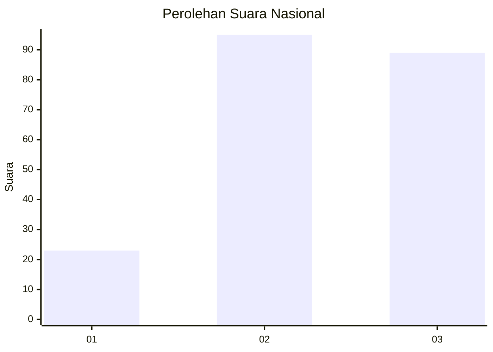
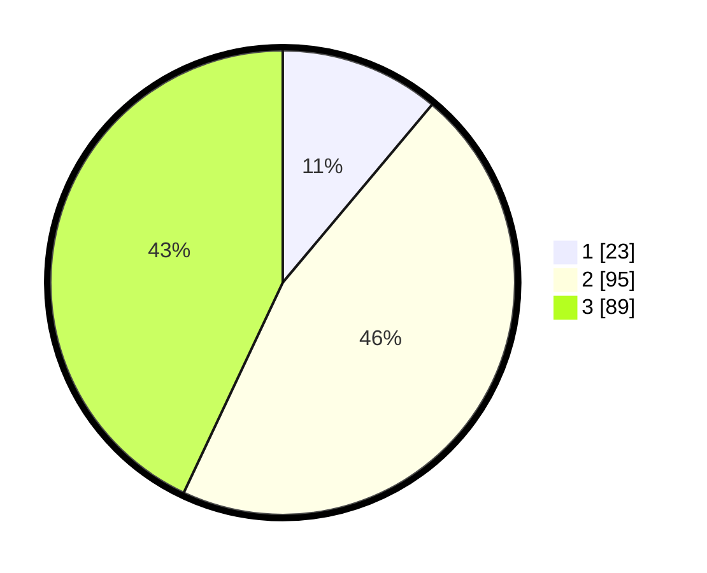

# Hasil

## Grafik

## Tabel

| No. | Nama Paslon    | Suara | Suara (raw) | Persentase |
|:--- |:-------------- | -----:| -----------:| ----------:|
| 1   | ANIES MUHAIMIN | 23    | [23][p-1]   | 11,11      |
| 2   | PRABOWO GIBRAN | 95    | [95][p-2]   | 45,89      |
| 3   | GANJAR MAHFUD  | 89    | [89][p-3]   | 43,00      |

[p-1]: https://github.com/gigit-pemilu/pemilu-2024/blob/main/pilpres/hitung-suara/sub/34-di-yogyakarta/sub/02-bantul/sub/05-bambanglipuro/sub/2003-sumbermulyo/sub/005-tps/sub/paslon-1.txt
[p-2]: https://github.com/gigit-pemilu/pemilu-2024/blob/main/pilpres/hitung-suara/sub/34-di-yogyakarta/sub/02-bantul/sub/05-bambanglipuro/sub/2003-sumbermulyo/sub/005-tps/sub/paslon-2.txt
[p-3]: https://github.com/gigit-pemilu/pemilu-2024/blob/main/pilpres/hitung-suara/sub/34-di-yogyakarta/sub/02-bantul/sub/05-bambanglipuro/sub/2003-sumbermulyo/sub/005-tps/sub/paslon-3.txt

## Foto C Plano

https://sirekap-obj-formc.kpu.go.id/c259/pemilu/ppwp/34/02/05/20/03/3402052003005-20240217-123700--c7fb475c-16fc-4a83-b7aa-95fdaf2f174e.jpg

https://sirekap-obj-formc.kpu.go.id/c259/pemilu/ppwp/34/02/05/20/03/3402052003005-20240217-123516--2be81f37-f4bb-40ac-9475-8e66b3969379.jpg

https://sirekap-obj-formc.kpu.go.id/c259/pemilu/ppwp/34/02/05/20/03/3402052003005-20240217-115254--116a5a64-75b0-49a5-8320-d418512ee8df.jpg

## Metadata

| Key        | Value               |
| ---------- | ------------------- |
| Time Stamp | 2024-02-19 06:16:00 |

