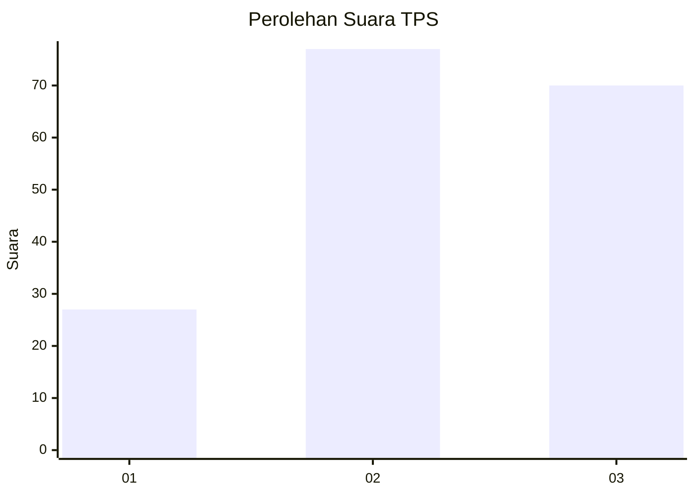
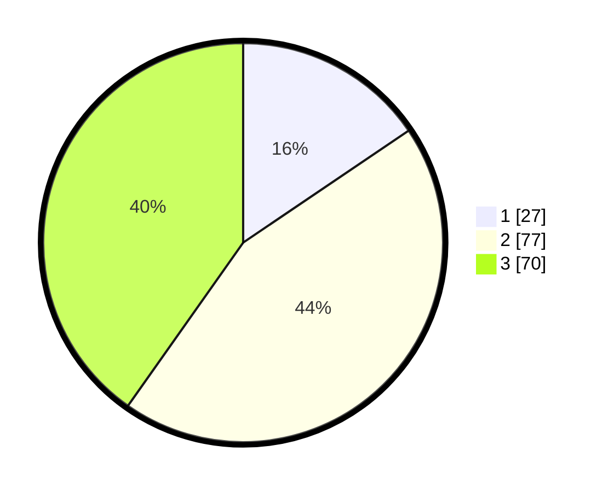

# Hasil

## Grafik

## Tabel

| No. | Nama Paslon    | Suara | Suara (raw) | Persentase |
|:--- |:-------------- | -----:| -----------:| ----------:|
| 1   | ANIES MUHAIMIN | 27    | [27][p-1]   | 15,52      |
| 2   | PRABOWO GIBRAN | 77    | [77][p-2]   | 44,25      |
| 3   | GANJAR MAHFUD  | 70    | [70][p-3]   | 40,23      |

[p-1]: https://github.com/gigit-pemilu/pemilu-2024-34-di-yogyakarta/blob/main/pilpres/hitung-suara/sub/34-di-yogyakarta/sub/02-bantul/sub/05-bambanglipuro/sub/2003-sumbermulyo/sub/006-tps/sub/paslon-1.txt
[p-2]: https://github.com/gigit-pemilu/pemilu-2024-34-di-yogyakarta/blob/main/pilpres/hitung-suara/sub/34-di-yogyakarta/sub/02-bantul/sub/05-bambanglipuro/sub/2003-sumbermulyo/sub/006-tps/sub/paslon-2.txt
[p-3]: https://github.com/gigit-pemilu/pemilu-2024-34-di-yogyakarta/blob/main/pilpres/hitung-suara/sub/34-di-yogyakarta/sub/02-bantul/sub/05-bambanglipuro/sub/2003-sumbermulyo/sub/006-tps/sub/paslon-3.txt

## Foto C Plano

https://sirekap-obj-formc.kpu.go.id/38a4/pemilu/ppwp/34/02/05/20/03/3402052003006-20240214-231343--88680552-70d1-4eb2-b024-e8e7bf545a31.jpg

https://sirekap-obj-formc.kpu.go.id/38a4/pemilu/ppwp/34/02/05/20/03/3402052003006-20240214-231510--f7ca373a-0178-4504-9118-8d41235e3afb.jpg

https://sirekap-obj-formc.kpu.go.id/38a4/pemilu/ppwp/34/02/05/20/03/3402052003006-20240214-231633--e20609d7-16ce-4709-abe0-355329218aa3.jpg

## Metadata

| Key        | Value               |
| ---------- | ------------------- |
| Time Stamp | 2024-02-24 22:31:28 |

